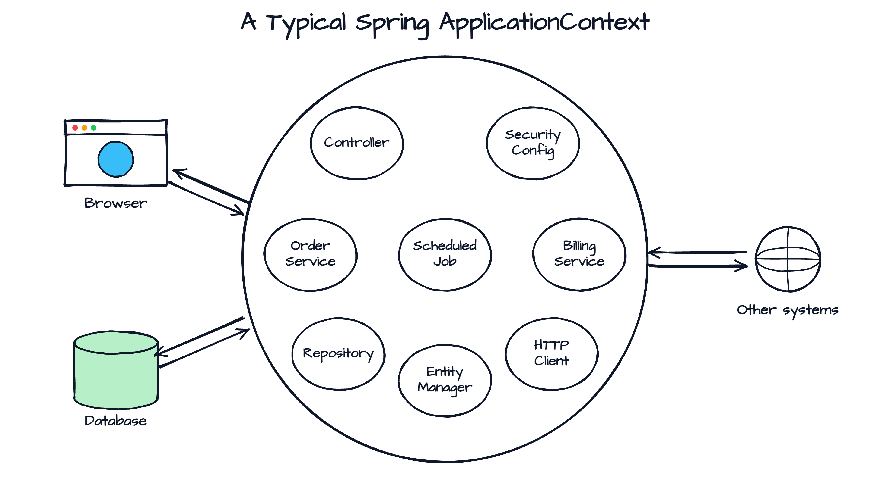
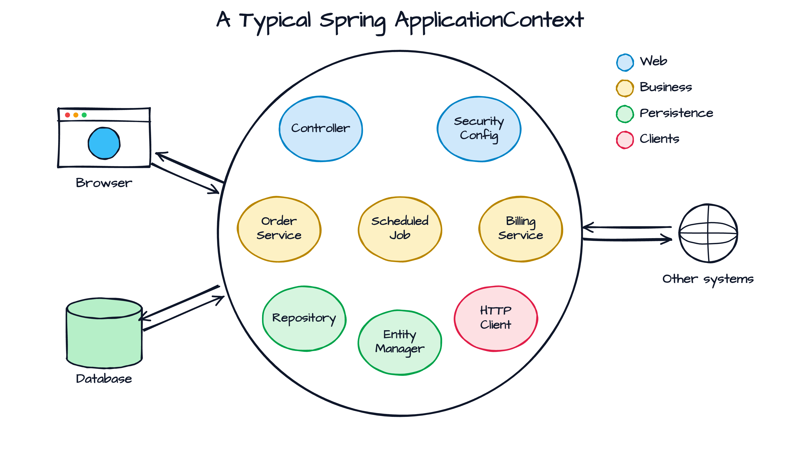
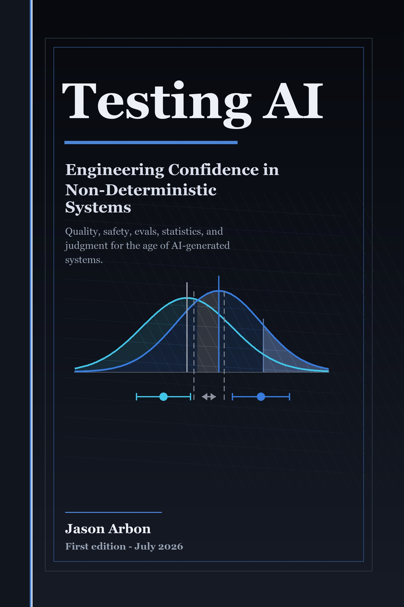

<!--
Menti: https://www.menti.com/ - code 7108 0067
Timeline: see ../TALK-PLAN.md. Search TODO to find open slides.
-->

<!-- _paginate: false -->
<!-- _header: '' -->
<!-- _footer: '' -->

<!--
Notes:
- Opener: Antwerp, the city of this talk. Warm welcome before the title slide.
-->


---

<!-- _class: light title -->
<!-- _paginate: false -->
<!-- _header: '' -->


# Prompt It Right: **Spring Boot Testing** in the AI Era

## AI writes the code. Your test suite decides what ships to production.

A 3-hour deep dive · Devoxx Belgium 2026 · October 5, 09:30

<!--
Notes:
- Welcome. 180 minutes, one break at about 1h15.
-->

---

<!--
Notes:
- This is the session as listed on the Devoxx schedule. Point at the BEGINNER badge.
- Say it: I marked this as beginner on purpose. We cover the fundamentals first, so everyone can follow the agent part.
-->


---


### About Philip

- Software Engineer from Herzogenaurach (HQ of adidas & Puma), Germany 🍻
- Blogging and content creation about testing Java and Spring Boot applications 🍃
- Founder of [PragmaTech GmbH](https://pragmatech.digital/) - **Enabling Developers to Frequently Deliver** Software with **More Confidence**
- Last at Devoxx Belgium 4 years ago, with "Things I Wish I Knew When I Started Testing Spring Boot Applications"

<!--
Notes:
- Herzogenaurach is in Bavaria, north of Munich, near Nuremberg.
-->

---

## Help Me Understand You Better


Go to [menti.com](https://www.menti.com/) and enter the code **7108 0067**.

Please answer all **ten questions** - **anonymously**. Your answers help me tailor this session to you.

I will give you a few minutes before we take a look at the live results.

<!--
Notes:
- Give the room a few minutes to answer all ten questions, then use the results in the opening and in the rationale part of block 2.
- The opening block is planned with 5 minutes. Waiting for the answers eats into it, so keep the about slide short.
-->
---


## Questions? Three Ways to Ask


1. **Live, during the talk** - raise your hand and interrupt me, it is a beginner-friendly session
2. **Dedicated FAQ** - 10 minutes at the end of each block
3. **Devoxx app comments** - scan the QR code, save your question in the comment section of the talk, and I pick up the top ones in the FAQ

<!--
Notes:
- Say it early: interrupting is welcome. Comments in the Devoxx app are the parking lot for questions that come up while you talk.
- Check the comments before each FAQ (10:35 and 12:20), sort by what fits the block.
-->

---

<!-- _class: light -->

<style scoped>
.stack { display: flex; flex-direction: column; align-items: center; gap: 16px; margin-top: 0; }
.stack .sketch { box-sizing: border-box; }
.stack .sketch strong { font-size: 1.05em; }
.stack .sketch small { display: block; font-size: 0.7em; color: var(--pt-heading); margin-top: 0.3em; }
.stack .top   { width: 88%; font-size: 1.32em; padding: 0.7em 0.8em; }
.stack .pause { width: 54%; font-size: 1.2em; padding: 0.45em 0.8em; border-style: dashed; transform: rotate(0.3deg); }
.stack .base  { width: 100%; font-size: 1.5em; border-width: 5px; padding: 0.9em 0.8em; }
</style>

<div class="stack">
  <div class="sketch accent alt top">
    <strong>2 · Agentic Development and Testing (75 min)</strong>
    <small>11:15 - 12:30 · problem · skills · best practices · FAQ</small>
  </div>
  <div class="sketch pause">
    <strong>☕ Break (30 min)</strong>
    <small>10:45 - 11:15</small>
  </div>
  <div class="sketch accent base">
    <strong>1 · Spring Boot Testing in a Nutshell (75 min)</strong>
    <small>09:30 - 10:45 · unit · slice · integration · Testcontainers · context cache · FAQ</small>
  </div>
</div>

<!--
Notes:
- Read it from the bottom up: the fundament comes first, the agent part is built on top of it.
- Block 1 (75 min): get a shared understanding of what makes a good test suite. You need these concepts to judge what an agent produces.
- Break (30 min), then block 2 (75 min): agentic development and testing.
- Beginner level is on purpose: without the fundament the agent part does not hold.
-->

---

<!-- _paginate: false -->


# Why Test Software?

---


---

<!-- _class: light reveal -->

<!--
Notes:
- Revealed step by step (fragmented list, works in the HTML deck only): headline and image first, then the pull request, then the question.
- PDF and PNG exports show everything at once.
-->


### My Northstar for Engineering Excellence

* Imagine seeing this pull request on a Friday afternoon:

  

* How **confident** are you to merge this major Spring Boot upgrade and **deploy** it to production once the pipeline turns green?

---

<!-- _class: light statement -->

# Good tests don't just catch bugs - they give you **fast feedback** and **confident deployments**.

---

<style scoped>
.goals { display: grid; grid-template-columns: repeat(2, 1fr); gap: 24px; margin-top: 0.6em; font-family: 'Architects Daughter', cursive; }
.goals .sketch { box-sizing: border-box; display: flex; flex-direction: column; justify-content: center; min-height: 190px; font-size: 1.3em; padding: 0.6em 0.8em; }
.goals .sketch strong { font-size: 1.2em; }
.goals .sketch small { font-size: 0.85em; color: var(--pt-heading); margin-top: 0.5em; }
</style>

### Goals for Block 1

<div class="goals">
  <div class="sketch accent">
    <strong>A Clear Mental Map</strong>
    <small>Unit, slice or integration test?</small>
  </div>
  <div class="sketch alt">
    <strong>Better Judgment</strong>
    <small>Review AI-written tests with confidence</small>
  </div>
  <div class="sketch alt">
    <strong>The Core Concepts</strong>
    <small>Reason about test strategy and failures</small>
  </div>
  <div class="sketch accent">
    <strong>Ship Fearlessly</strong>
    <small>Build confidence into your daily work</small>
  </div>
</div>

---

<!-- _class: light section -->


## 01 - Spring Boot Testing in a Nutshell

# Know your toolbox

<!--
Notes:
- Block 1 is the fundament: 60 minutes, five topics. Beginner level on purpose.
-->

---

<!-- _class: light statement -->

# Pick the **cheapest test** that proves the behavior.

---

<style scoped>
.shapes { display: flex; justify-content: center; align-items: flex-end; gap: 110px; margin: 0.6em 0 1em; font-family: 'Architects Daughter', cursive; }
.shape-card { display: flex; flex-direction: column; align-items: center; gap: 14px; }
.shape-card strong { font-size: 1.6em; }
.shape-card small { font-size: 1.05em; color: var(--pt-heading); text-align: center; line-height: 1.25; }
.mini-stack { display: flex; flex-direction: column; align-items: center; gap: 10px; }
.mini-bar { height: 38px; border: 3px solid var(--pt-heading); background: #ffffff; border-radius: 8px 4px 8px 4px / 4px 8px 4px 8px; }
.mini-bar.accent { border-color: var(--pt-link); background: #e0f2fe; }
.pyr .b1 { width: 80px; } .pyr .b2 { width: 170px; } .pyr .b3 { width: 270px; }
.tro .b1 { width: 110px; } .tro .b2 { width: 270px; } .tro .b3 { width: 170px; }
.hc { display: flex; gap: 16px; align-items: center; height: 158px; }
.hex { width: 88px; height: 78px; background: var(--pt-heading); clip-path: polygon(25% 0%, 75% 0%, 100% 50%, 75% 100%, 25% 100%, 0% 50%); }
.hex.accent { background: var(--pt-link); }
</style>

## Pyramid, Honeycomb, Trophy: It Depends

<div class="shapes">
  <div class="shape-card">
    <div class="mini-stack pyr">
      <div class="mini-bar b1"></div>
      <div class="mini-bar b2"></div>
      <div class="mini-bar accent b3"></div>
    </div>
    <strong>Pyramid</strong>
    <small>one deployable,<br>layered</small>
  </div>
  <div class="shape-card">
    <div class="hc">
      <div class="hex"></div>
      <div class="hex accent"></div>
      <div class="hex"></div>
    </div>
    <strong>Honeycomb</strong>
    <small>many small<br>services</small>
  </div>
  <div class="shape-card">
    <div class="mini-stack tro">
      <div class="mini-bar b1"></div>
      <div class="mini-bar accent b2"></div>
      <div class="mini-bar b3"></div>
    </div>
    <strong>Trophy</strong>
    <small>integration-<br>heavy</small>
  </div>
</div>

I don't care about the name. The right shape depends on your project. What matters: **confidence** and **fast feedback**.

<!--
Notes:
- There are multiple forms of a test strategy: pyramid, honeycomb, trophy and more. The names do not matter, the project decides.
- Every level has a job. The skill is choosing the cheapest level that proves the behavior.
-->

---

<!--
Notes:
- One question decides most of it: most tests answer "no" and never need Spring.
- Only the "yes" branch splits again. Annotations come on the next slides.
-->

## Three Ways to Write Tests for Spring Boot Applications


---

<style scoped>
.names { display: grid; grid-template-columns: repeat(2, 1fr); gap: 28px; margin-top: 0.8em; font-family: 'Architects Daughter', cursive; }
.names .sketch { box-sizing: border-box; display: flex; flex-direction: column; justify-content: center; min-height: 330px; font-size: 1.2em; padding: 0.8em 0.8em; }
.names .sketch strong { font-size: 1.15em; }
.names .sketch .suffix { font-size: 2.4em; line-height: 1.1; margin: 0.15em 0; }
.names .sketch small { font-size: 0.85em; color: var(--pt-heading); }
</style>

## Naming Tests: Keep It Simple

<div class="names">
  <div class="sketch accent">
    <strong>Unit test</strong>
    <small>no Spring context</small>
    <span class="suffix">*Test</span>
    <small>CustomerServiceTest</small>
  </div>
  <div class="sketch alt">
    <strong>Everything else</strong>
    <small>slice, integration, E2E</small>
    <span class="suffix">*IT</span>
    <small>CustomerControllerIT</small>
  </div>
</div>

<!--
Notes:
- My simplified rule: no context means *Test, anything that starts a context or infrastructure is *IT.
- The suffix drives the build phase on the next slide.
-->

---


## Why Separate the Tests?

- **Different build phases**: Maven Surefire runs `*Test` in the `test` phase, Failsafe runs `*IT` in `integration-test` and `verify`. Gradle: a separate `integrationTest` task
- **Fast feedback first**: unit tests give a verdict in seconds, integration tests run afterwards
- **Configure parallelization differently**: unit tests run fully parallel, integration tests with shared contexts and containers need more care

<!--
Notes:
- The Maven lifecycle image is the one from the demystified talk: ./mvnw verify, Surefire in the test phase, Failsafe in integration-test and verify.
-->

---

## Our Foundation: Spring Boot Starter Test

<!--
Notes:
- Show the `spring-boot-starter-test` dependency and the Maven dependency tree.
- Tips: favor JUnit over JUnit 4. Pick one assertion library or at least do not mix them within the same test class.
-->


- The "Testing Swiss Army Knife"

```xml
<dependency>
  <groupId>org.springframework.boot</groupId>
  <artifactId>spring-boot-starter-test</artifactId>
  <scope>test</scope>
</dependency>
```

- Batteries-included for testing by transitively including popular testing libraries
- Out-of-the-box dependency management to ensure compatibility

---

```shell {4-6,13,15-16,17,25,29}
./mvnw dependency:tree
[INFO] ...
[INFO] +- org.springframework.boot:spring-boot-starter-test:jar:4.0.2:test
[INFO] |  +- org.springframework.boot:spring-boot-test:jar:4.0.2:test
[INFO] |  +- org.springframework.boot:spring-boot-test-autoconfigure:jar:4.0.2:test
[INFO] |  +- com.jayway.jsonpath:json-path:jar:2.10.0:test
[INFO] |  |  \- org.slf4j:slf4j-api:jar:2.0.17:compile
[INFO] |  +- jakarta.xml.bind:jakarta.xml.bind-api:jar:4.0.4:test
[INFO] |  |  \- jakarta.activation:jakarta.activation-api:jar:2.1.4:test
[INFO] |  +- net.minidev:json-smart:jar:2.6.0:test
[INFO] |  |  \- net.minidev:accessors-smart:jar:2.6.0:test
[INFO] |  |     \- org.ow2.asm:asm:jar:9.7.1:test
[INFO] |  +- org.assertj:assertj-core:jar:3.27.6:test
[INFO] |  |  \- net.bytebuddy:byte-buddy:jar:1.17.8:test
[INFO] |  +- org.awaitility:awaitility:jar:4.3.0:test
[INFO] |  +- org.hamcrest:hamcrest:jar:3.0:test
[INFO] |  +- org.junit.jupiter:junit-jupiter:jar:6.0.2:test
[INFO] |  |  +- org.junit.jupiter:junit-jupiter-api:jar:6.0.2:test
[INFO] |  |  |  +- org.opentest4j:opentest4j:jar:1.3.0:test
[INFO] |  |  |  +- org.junit.platform:junit-platform-commons:jar:6.0.2:test
[INFO] |  |  |  \- org.apiguardian:apiguardian-api:jar:1.1.2:test
[INFO] |  |  +- org.junit.jupiter:junit-jupiter-params:jar:6.0.2:test
[INFO] |  |  \- org.junit.jupiter:junit-jupiter-engine:jar:6.0.2:test
[INFO] |  |     \- org.junit.platform:junit-platform-engine:jar:6.0.2:test
[INFO] |  +- org.mockito:mockito-core:jar:5.5.0:test
[INFO] |  |  +- net.bytebuddy:byte-buddy-agent:jar:1.17.8:test
[INFO] |  |  \- org.objenesis:objenesis:jar:3.3:test
[INFO] |  +- org.mockito:mockito-junit-jupiter:jar:5.5.0:test
[INFO] |  +- org.skyscreamer:jsonassert:jar:1.5.3:test
[INFO] |  |  \- com.vaadin.external.google:android-json:jar:0.0.20131108.vaadin1:test
[INFO] |  +- org.springframework:spring-core:jar:7.0.3:compile
[INFO] |  |  +- commons-logging:commons-logging:jar:1.3.5:compile
[INFO] |  |  \- org.jspecify:jspecify:jar:1.0.0:compile
[INFO] |  +- org.springframework:spring-test:jar:7.0.3:test
[INFO] |  \- org.xmlunit:xmlunit-core:jar:2.10.4:test
```

---

## What's Inside the Testing Swiss Army Knife?

- **JUnit**: Java's de-facto standard testing framework and foundation.
- **Mockito**: Creating mock objects to simulate dependencies and verify interactions.
- **AssertJ**: Provides fluent, chainable, and readable assertions.
- **Hamcrest**: Offers flexible matchers for creating custom assertions.
- **JSONAssert**: Compares JSON strings with flexible matching options.
- **JsonPath**: Extracts and queries data from JSON similar to XPath.
- **XMLUnit**: Compares and validates XML documents.
- **Awaitility**: Handles asynchronous testing with fluent conditions.

---

<!-- _class: light section -->

## 01.1 - Unit tests

# Unit Tests: Small, Fast, Isolated Confidence

---

## Unit Testing Java/Spring Boot Applications 101

- **Core Concept**: Test individual components in isolation from dependencies - one unit of work at a time.
- **Confidence Gained**: Fast, high-volume verification that the smallest building blocks behave correctly under various conditions.
- **Pitfall**: Poor class design leads to untestable god classes. Good tests start with good design.
- **Tools**: JUnit, Mockito, AssertJ (or Spock, TestNG, Hamcrest).

---

## Unit Testing has Limits

Consider this sample REST controller, what could we verify with a unit test?

```java
@RestController
@RequestMapping("/api/customers")
public class CustomerController {

  private final CustomerService customerService;

  public CustomerController(CustomerService customerService) {
    this.customerService = customerService;
  }

  @PostMapping
  public ResponseEntity<Void> createNewCustomer(@Validated CustomerCreationRequest payload, UriComponentsBuilder uriBuilder) {

    String customerId = customerService.createNewCustomer(payload.firstName());

    UriComponents uriComponents = uriBuilder
      .path("/api/customers/{id}")
      .buildAndExpand(customerId);

    return ResponseEntity.created(uriComponents.toUri()).build();
  }
}
```

---

```java {1,7,12,13,15-18}
@ExtendWith(MockitoExtension.class)
class CustomerControllerUnitTests {

  @Mock
  private CustomerService customerService;

  @InjectMocks
  private CustomerController customerController;

  @Test
  void shouldCreateCustomerWhenPayloadRequestIsValid() {
    when(customerService.createNewCustomer(anyString()))
      .thenReturn("42");

    ResponseEntity<Void> result = customerController.createNewCustomer(
      new CustomerCreationRequest("Java", "Duke", "duke@spring.io"),
      UriComponentsBuilder.newInstance()
    );

    assertThat(result.getStatusCode().value())
      .isEqualTo(201);
    assertThat(result.getHeaders().getLocation().toString())
      .isEqualTo("/api/customers/42");
  }
}
```

---

## Things a Unit Test Can't Cover: Request Mapping

**Request mapping**: Does HTTP GET `/api/customers/{id}` actually resolve to our desired method?

```java
@Test
void shouldCreateCustomerWhenPayloadRequestIsValid() {

  // ...

  ResponseEntity<Void> result = customerController.createNewCustomer(
    new CustomerCreationRequest("Java", "Duke", "duke@spring.io"),
    UriComponentsBuilder.newInstance()
  );
}
```

---

## Things a Unit Test Can't Cover: Validation

**Validation**: Will an incomplete request body result in a 400 bad request or return an accidental 201?

```java {7}
@Test
void shouldCreateCustomerWhenPayloadRequestIsValid() {

  // ...

  ResponseEntity<Void> result = customerController.createNewCustomer(
    new CustomerCreationRequest("Java", "Duke", "NOT_AN_EMAIL"),
    UriComponentsBuilder.newInstance()
  );
}
```

---

## Things a Unit Test Can't Cover: Serialization

**Serialization**: Are our JSON objects serialized and deserialized correctly?

```java {2}
ResponseEntity<Void> result = customerController.createNewCustomer(
  new CustomerCreationRequest("Java", "Duke", "NOT_AN_EMAIL"),
  UriComponentsBuilder.newInstance());
```

```json
{
  "first-name": "Java",
  "last_Name": "Duke",
  "email": "duke@spring.io"
}
```

---

## Things a Unit Test Can't Cover: Security

**Security**: Are our Spring Security configuration and other authorization checks enforced?

```java {7}
@Test
void shouldCreateCustomerWhenPayloadRequestIsValid() {

  // ...

  ResponseEntity<Void> result = customerController.createNewCustomer(
    new CustomerCreationRequest("Java", "Duke", "NOT_AN_EMAIL"),
    UriComponentsBuilder.newInstance()
  );
}
```

<!--
Notes:
- Each of these needs the framework in the loop. This is where slice tests come in.
-->

---

<!-- _class: light section -->


<style scoped>
section.section h1 { font-size: 1.9em; }
</style>

## 01.2 - Slice tests

# Starting to Test with an ApplicationContext

---



---



---


---


---

### Spring Boot Test Slice Example: `@WebMvcTest`

```java {1,12,6}
@WebMvcTest(CustomerController.class)
@Import(SecurityConfig.class)
class CustomerControllerIT {

  @Autowired
  private MockMvc mockMvc;

  @MockitoBean
  private CustomerService customerService;

  @Test
  @WithMockUser
  void shouldReturnLocationOfNewlyCreatedCustomer() throws Exception {
    // ...
  }
}
```

---

## Common Test Slices

- `@WebMvcTest`/`@WebFluxTest` - Controller layer
- `@DataJpaTest`/`@JdbcTest` - Persistence layer
- `@JsonTest` - JSON serialization/deserialization
- `@RestClientTest` - RestTemplate testing
- etc.

---


---

## Sliced Testing Spring Boot Applications 101

- **Core Concept**: Test a specific "slice" or layer of your application by loading a minimal, relevant part of the Spring `ApplicationContext`.
- **Confidence Gained**: Helps validate parts of your application where pure unit testing is insufficient, like the web, messaging, or data layer.
- **Prominent Examples:** Web layer (`@WebMvcTest`) and database layer (`@DataJpaTest`)
- **Pitfalls**: Requires careful configuration to ensure only the necessary slice of the context is loaded.
- **Tools**: JUnit, Mockito, Spring Test, Spring Boot, Testcontainers

---

<!-- _class: light section -->

## 01.3 - Integration tests

# Starting the Entire Application Context

---


---

## Challenges when Starting the Entire `ApplicationContext`

- **Problem #1**: How to ensure surrounding infrastructure (e.g. database, queues, etc.) is present?
- **Problem #2**: How to interact with our application for integration tests?
- **Problem #3**: How to keep our build time at a reasonable duration?

---

## There's Even More...

- **Problem #4**: How to handle HTTP communication from our application to remote services?
- **Problem #5**: How to provide test data and maintain a clean state between tests?
- **Problem #6**: How to handle authentication and security contexts during tests?

---

## Provide External Infrastructure with Testcontainers (Problem #1)

Running infrastructure components (databases, message brokers, etc.) in Docker containers for our tests becomes a breeze with [Testcontainers](https://testcontainers.com/):

```java
@Container
@ServiceConnection
static PostgreSQLContainer postgres = new PostgreSQLContainer("postgres:16-alpine")
  .withDatabaseName("testdb")
  .withUsername("test")
  .withPassword("test")
  .withInitScript("init-postgres.sql");
```

This gives us an ephemeral PostgreSQL database for our tests:

```shell {3}
$ docker ps
CONTAINER ID   IMAGE                        STATUS         PORTS
a958ee2887c6   postgres:16-alpine           Up 9 seconds   0.0.0.0:32776->5432/tcp
ad0f804068dc   testcontainers/ryuk:0.12.0   Up 9 seconds   0.0.0.0:32775->8080/tcp
```

<!--
Notes:
- Ask who is using Testcontainers.
- `@ServiceConnection` wires the container into the Spring Boot properties, no `@DynamicPropertySource` needed.
-->

---

## How to Interact with our Application for Integration Tests?

Option #1:

```java {1,3}
@SpringBootTest
// which is @SpringBootTest(webEnvironment = SpringBootTest.WebEnvironment.MOCK)
@AutoConfigureMockMvc
class ApplicationMockWebIT {

  // @LocalServerPort
  // private int port; <-- this would fail the test, there is no local port occupied

  @Test
  @WithMockUser
  void givenCustomersThenReturnListForAuthenticatedUser(@Autowired MockMvc mockMvc) throws Exception {
    mockMvc
      .perform(get("/api/customers")
        .header(ACCEPT, APPLICATION_JSON))
      .andExpect(status().is(200))
      .andExpect(content().contentType(APPLICATION_JSON))
      .andExpect(jsonPath("$.size()", is(1)));
  }
}
```

---

## How to Interact with our Application for Integration Tests?

Option #2:

```java {1,2}
@AutoConfigureWebTestClient // required since Spring Boot 4
@SpringBootTest(webEnvironment = SpringBootTest.WebEnvironment.RANDOM_PORT)
class ApplicationServletContainerIT {

  @Autowired
  WebTestClient webTestClient;

  @Test
  void contextLoads() {
    webTestClient
      .get()
      .uri("/api/customers")
      .header("Authorization", "Basic " + Base64.getEncoder().encodeToString("user:dummy".getBytes()))
      .exchange()
      .expectStatus()
      .isOk();
  }
}
```

---

## Integration Testing Spring Boot Applications 101

- **Core Concept**: Start the entire Spring application context, often on a random local port, and test the application through its external interfaces (e.g., REST API).
- **Confidence Gained**: Validates the integration of all internal components working together as a complete application.
- **Best Practices**: Use `@SpringBootTest` to run the app on a local port.
- **Pitfalls**: Slower to run than unit or sliced tests. Managing the lifecycle of dependent services can be complex.
- **Tools**: JUnit, Mockito, Spring Test, Spring Boot, Testcontainers, WireMock (for mocking external HTTP services), Selenium (for browser-based UI testing)

---

<!-- _class: light statement -->

# ... but what about **Problem #3**: How to keep our build time at a reasonable duration?

---

<!-- _class: light section -->


## 01.4 - The context cache

# The silent speed killer

---

<!-- _class: light reveal -->

## Integration Testing - The Need for Speed

* **The Problem:** Integration tests require a started and initialized Spring `ApplicationContext`, which slows down the build
* **The Solution:** Spring Test `TestContext` caching - stores an already started Spring `ApplicationContext` for later reuse
* This feature is part of Spring Test (included in every Spring Boot project via `spring-boot-starter-test`)
* Example of speed improvement:

  

---


---


---


---

### How the Cache Key is Built

```java
// DefaultContextCache.java
private final Map<MergedContextConfiguration, ApplicationContext> contextMap =
  Collections.synchronizedMap(new LinkedHashMap<>(32, 0.75f, true));
```

The following information is part of the cache key (`MergedContextConfiguration`):

- activeProfiles (`@ActiveProfiles`)
- contextInitializersClasses (`@ContextConfiguration`)
- propertySourceLocations (`@TestPropertySource`)
- propertySourceProperties (`@TestPropertySource`)
- contextCustomizer (`@MockitoBean`, `@MockBean`, `@DynamicPropertySource`, ...)
- etc.

---

```text
Test class
    │
    ▼
MergedContextConfiguration(
  testClass, locations, classes,
  activeProfiles, propertyValues,
  contextInitializers, contextCustomizers   ← every @MockitoBean lands here
  ... etc.
)
    │
    ▼  hashCode() / equals()

Cache hit? → reuse context ✅
Cache miss? → start new context and store it 🆕
```

---

### Detect Context Restarts - Visually


---

### Detect Context Restarts - with Logs


---

### Detect Context Restarts - with Tooling


An [open-source Spring Test utility](https://github.com/PragmaTech-GmbH/spring-test-profiler) that provides visualization and insights for Spring Test execution, with a focus on Spring context caching statistics.

**Overall goal**: Identify optimization opportunities in your Spring Test suite to speed up your builds and ship to production faster and with more confidence.

---

### A Common Anti-Pattern: `@DirtiesContext`

Developers tend to consult AI/Stack Overflow for integration test issues and often copy advice from the internet without knowing the implications:

```java
@SpringBootTest
@DirtiesContext
// this instructs Spring to remove the context from the cache
// and rebuild a new context on every request
public abstract class AbstractIntegrationTest {

}
```

The setup above will **disable** the context caching feature and slow down the builds significantly!

---

<!-- _class: light section -->

## 01.5 - Speed and quality

# Run faster, test better

---

## Test Parallelization

**Goal**: Reduce build time and get faster feedback

Requirements:
- No shared state
- No dependency between tests and their execution order
- No mutation of global state

Two ways to achieve this:
- Fork a new JVM with Surefire/Failsafe (or for the Gradle test task) and let it run in parallel
- Use JUnit Jupiter's parallelization mode and let it run in the same JVM with multiple threads

---


---

## Test Parallelization 101

Using Surefire/Failsafe:

```xml
<plugin>
  <artifactId>maven-surefire-plugin</artifactId>
  <configuration>
    <forkCount>1C</forkCount> <!-- 1 JVM per CPU core -->
  </configuration>
</plugin>
```

With JUnit Jupiter:

```properties
# src/test/resources/junit-platform.properties
junit.jupiter.execution.parallel.enabled = true
junit.jupiter.execution.parallel.mode.default = same_thread
junit.jupiter.execution.parallel.mode.classes.default = concurrent
```

---

## Let's Challenge Code Coverage

Imagine a set of unit tests for this isolated business logic:

```java
public Long registerUser(int age, String username) {

  if (age <= 18) {
    throw new IllegalArgumentException("User must be at least 18 years old");
  }

  if ("ADMIN".equalsIgnoreCase(username)) {
    throw new IllegalArgumentException("Username 'ADMIN' is not allowed");
  }

  // ...

}
```

---

## Idea: Introduce Regressions to Verify Test Quality


---

## Introducing: Mutation Testing

- Having high code coverage might give you a **false sense of security**
- Mutation Testing with [PIT](https://pitest.org/quickstart/)
- Beyond Line Coverage: Traditional tools like JaCoCo show which code runs during tests, but PIT verifies if our tests actually detect when code behaves incorrectly by introducing "**mutations**" to our source code.
- Quality Guarantee: PIT automatically **modifies our code** (changing conditionals, return values, etc.) to ensure our tests fail when they should, **revealing blind spots** in seemingly comprehensive test suites.

---

## Spring Boot 4 - Testing Support Keeps Improving

- **RestTestClient**: Modern, fluent alternative for the `TestRestTemplate`/`WebTestClient`/`RestAssured`.
- **Context pausing**: Cached test contexts are now automatically paused, eliminating resource conflicts from background processes.
- **JUnit 6**: Drop-in upgrade from JUnit 5 - far smoother than the JUnit 4 → 5 migration.
- **Testcontainers 2.0**: New `testcontainers-` prefix for modules, JUnit 4 support removed.
- **Bean overrides for non-singletons**: `@MockitoBean` and `@TestBean` now work with prototype and custom-scoped beans.

---

## FAQ 1: Your Questions


Where and how to ask:

1. **Live** - raise your hand and ask right now
2. **Devoxx app comments** - scan the QR code and write your question in the comment section of the talk, I pick the best ones
3. **After the session** - find me in the hallway

<!--
Notes:
- 10 min. Open the talk page in the Devoxx app, read the comments, pick 4-6 questions, 90 seconds each.
- Prepared backups: script/faq-block-1.md.
- Agent questions: park them for block 2 after the break.
-->

---

<!-- _class: light section -->
## Break

# Back at 11:15

<!--
Notes:
- Read the Devoxx app comments for open questions. Reset the demo during the break.
-->

---


<style scoped>
.recap { display: grid; grid-template-columns: repeat(3, 1fr); gap: 22px; margin-top: 0.5em; font-family: 'Architects Daughter', cursive; }
.recap .sketch { box-sizing: border-box; display: flex; flex-direction: column; justify-content: center; min-height: 190px; font-size: 1.15em; padding: 0.6em 0.5em; }
.recap .sketch strong { font-size: 1.15em; }
.recap .sketch small { font-size: 0.8em; margin-top: 0.5em; }
</style>

## Recap: What We Learned in Block 1

<div class="recap">
  <div class="sketch accent">
    <strong>Testing Toolbox</strong>
    <small>JUnit · Mockito · AssertJ</small>
  </div>
  <div class="sketch alt">
    <strong>Spring Test Types</strong>
    <small>Unit · Slice · Integration</small>
  </div>
  <div class="sketch accent">
    <strong>Testcontainers</strong>
    <small>Real infrastructure</small>
  </div>
  <div class="sketch alt">
    <strong>Context Caching</strong>
    <small>Reuse the context</small>
  </div>
  <div class="sketch accent">
    <strong>Parallelization</strong>
    <small>Isolated tests</small>
  </div>
  <div class="sketch alt">
    <strong>Mutation Testing</strong>
    <small>Coverage lies</small>
  </div>
</div>

<!--
Notes:
- 1 minute recap of block 1, keywords only. Read the six boxes, do not explain them again.
- Bridge: now we put an AI agent on top of this fundament.
-->

---

<!-- _class: light section -->


## 02 - The problem today

# Code is generated. Trust is not.

<!--
Notes:
- 10 min. The problem today: generated code, testing as an afterthought, AI will not fix it. Then the Formula 1 engine, verification as the constraint, DORA, and the goal.
- Block 2 is my setup, not the course content 1:1. Hints and structure, no hard sell.
-->

---

<!-- _class: light statement -->

# Today, most of our code is **generated**.

---

<style scoped>
.flow { flex-wrap: nowrap; gap: 14px; }
.flow .sketch { flex: 1 1 0; font-size: 1.15em; padding: 0.9em 0.5em; }
.flow .sketch small { font-size: 0.72em; color: var(--pt-heading); }
.flow .arrow { flex: 0 0 auto; font-size: 2em; }
</style>

## Testing Was Often an Afterthought

<div class="flow">
  <div class="sketch">Written last<small>after the feature</small></div>
  <div class="sketch alt">Skimmed fastest<small>in code review</small></div>
  <div class="sketch">A dashboard number<small>nobody reads closely</small></div>
  <div class="sketch alt">"Later"<small>said, not meant</small></div>
</div>

---

<!-- _class: light statement -->

# AI won't fix this **by itself**.

<!--
Notes:
- AI will not magically change our not so optimal processes. It makes the old habits faster.
-->

---

<!-- _class: light statement -->

# Somebody handed your team a **Formula 1 engine**.

---

## On a Bumpy Road, Faster Does Not Mean Safer


<!--
Notes:
- The engine is the AI: code in seconds. Nobody fixed the brakes, the road, or the driver.
- On a bumpy road, faster does not mean safer. It means the wall (production) arrives sooner.
-->

---

<!-- _class: light statement -->

# Verification is the new **constraint**.

---

<style scoped>
.flow { flex-wrap: nowrap; gap: 18px; }
.flow .sketch { flex: 1 1 0; font-size: 1.55em; padding: 1.3em 0.6em; }
.flow .sketch small { font-size: 0.7em; color: var(--pt-heading); }
.flow .arrow { flex: 0 0 auto; font-size: 2.6em; }
</style>

<div class="flow">
  <div class="sketch accent">AI<small>generates code in seconds</small></div>
  <div class="arrow">&#8800;</div>
  <div class="sketch alt">You<small>review capacity is limited</small></div>
  <div class="arrow">&#8594;</div>
  <div class="sketch accent">A safety net<small>a fast, comprehensive test suite</small></div>
</div>

---

## Fix the Brakes, the Road, and the Driver


<!--
Notes:
- Brakes: a fast and comprehensive test suite. Road: fast feedback in CI. Driver: you, with your testing standards written down as skills.
- Same engine, but now you can go fast and arrive with confidence.
-->

---

## Backed by the DORA Research


DORA's core model puts **fast feedback** next to fast flow and a climate for learning.

- These capabilities predict **software delivery performance**
- Delivery performance predicts **organizational performance** and well-being

<!--
Notes:
- Source: DORA Core Model, as summarized on pragmatech.digital.
-->

---

<style scoped>
.flow { flex-wrap: nowrap; gap: 14px; }
.flow .sketch { flex: 1 1 0; font-size: 1.15em; padding: 0.9em 0.5em; }
.flow .sketch small { font-size: 0.72em; color: var(--pt-heading); }
.flow .arrow { flex: 0 0 auto; font-size: 2em; }
</style>

## The Goal: Fast and Comprehensive

<div class="flow">
  <div class="sketch accent">Fast<small>seconds in the agent loop, minutes in CI</small></div>
  <div class="sketch alt">Comprehensive<small>proves behavior, not just coverage</small></div>
  <div class="arrow">&#8594;</div>
  <div class="sketch accent">Confidence in every commit</div>
</div>

---

<!-- _class: light section -->


## 03 - Meaningful tests

# Prompt it right?

<!--
Notes:
- 4 min. Open with the prompt everybody starts with, then argue what meaningful means.
-->

---

## The Prompt Everybody Starts With

```text
$ Write meaningful tests. Make no mistakes.
```

---

<!-- _class: light statement -->

# Models get better. But what is **meaningful**?

---

## Meaningful Is Not Obvious

New developers might not prompt the AI to think about **fast and parallel** tests:

| Nobody asked for it | What the agent does                        |
|---------------------|--------------------------------------------|
| Fast                | A new Spring context per test class        |
| Parallel            | Shared fields and fixed IDs, tests collide |
| Deterministic       | `Instant.now()` and `Thread.sleep`         |
| One reason to fail  | Six different assertions in one test       |
| Failure Indicators  | A red tests and an unclear assertion message |

---

<!-- _class: light statement -->

# Timing is a big thing. **Keep the suite fast.**

---

<!-- _class: light section -->


## 04 - Skills

# Testing judgment, written down once

<!--
Notes:
- 14 min. Explain skills with one sample skill: unit-testing with its testing-standards reference. The sample lives in this repo: .claude/skills/unit-testing/
- Then show my seven skills as boxes.
-->

---

<style scoped>
.flow { flex-wrap: nowrap; gap: 18px; }
.flow .sketch { flex: 1 1 0; font-size: 1.55em; padding: 1.3em 0.6em; }
.flow .sketch small { font-size: 0.7em; color: var(--pt-heading); }
.flow .arrow { flex: 0 0 auto; font-size: 2.6em; }
</style>

<div class="flow">
  <div class="sketch">My testing standards<small>written down once</small></div>
  <div class="arrow">&#8594;</div>
  <div class="sketch accent">Skills<small>markdown in the repository</small></div>
  <div class="arrow">&#8594;</div>
  <div class="sketch alt">Every agent session<small>same rules</small></div>
</div>

---

## A Skill in a Nutshell: A Markdown File

```text
.claude/skills/unit-testing/
├── SKILL.md                       trigger, project knobs, scope, rules, workflow
└── references/
    ├── testing-standards.md       the rule catalog with IDs and severity
    └── examples.md                good and bad pairs
```

Sample in this repo: `prompt-it-right/.claude/skills/unit-testing/`.

---

## The Frontmatter Is the Trigger

```yaml
---
name: unit-testing
description: Write, review or refactor unit tests for Spring Boot
  classes ... without a Spring context. Use when the user asks for
  a unit test, mentions JUnit, Mockito or AssertJ ... Not for
  @SpringBootTest, slice tests or Testcontainers ...
---
```

Write the description like a routing rule: when to use it, and when **not** to.

---

## Inside `SKILL.md`

- **Frontmatter**: name and a trigger description, "Use when ... Not for ..."
- **Variable parts**: define your team's or company's standards
- **Scope** and **rules**: what the skill covers, the rules with IDs
- **Workflow**: the steps the agent follows


---

<style scoped>
.repos { display: grid; grid-template-columns: repeat(3, 1fr); gap: 22px; margin-top: 0.4em; font-family: 'Architects Daughter', cursive; }
.repos .sketch { box-sizing: border-box; display: flex; flex-direction: column; justify-content: center; min-height: 190px; font-size: 1.05em; padding: 0.6em 0.6em; }
.repos .sketch strong { font-size: 1.1em; }
.repos .sketch small { font-size: 0.8em; margin-top: 0.5em; color: var(--pt-heading); }
</style>

## Common Java and Spring Boot Skills on GitHub

<div class="repos">
  <div class="sketch accent"><strong>jdubois/dr-jskill</strong><small>Generates Spring Boot applications with best practices (Julien Dubois)</small></div>
  <div class="sketch alt"><strong>piomin/claude-ai-spring-boot</strong><small>Claude Code template with skills and agents for Spring Boot (Piotr Minkowski)</small></div>
  <div class="sketch accent"><strong>mtkhawaja/java-skills</strong><small>Plugin: Java development, testing, concurrency and Maven</small></div>
  <div class="sketch alt"><strong>decebals/claude-code-java</strong><small>18 Java skills</small></div>
  <div class="sketch accent"><strong>rrezartprebreza/spring-boot-skills</strong><small>33 skills for Spring Boot 3 and 4</small></div>
  <div class="sketch alt"><strong>mattpocock/skills</strong><small>General skills, e.g. grill-me: the agent interviews you about a plan</small></div>
</div>

<!--
Notes:
- Community skills from the online course tooling lesson. None is an official source. Read a skill before you install it, treat it like code you run, and install fewer rather than more: two skills that both say how to write a test will disagree somewhere.
-->
---

## Variable Parts per Project

| Knob | Default |
|---|---|
| Assertion library | AssertJ with `.as("...")` |
| Unit test naming | `<ClassUnderTest>Test` |
| Build command (single class) | `./mvnw -q test -Dtest=OrderServiceTest` |
| Build command (unit suite) | `./mvnw -q test` |
| Parallel execution | JUnit parallel, random order |
| Disabled rules | none |

I keep skill templates and reuse them across projects. Only this table changes per project.

---

## `testing-standards.md`: Rules With IDs and Severity

```text
[T7-H]   a failure message on every assertion
[T9-H]   no test-class fields, no @BeforeEach
[U1-H]   no Spring context in a unit test
[U2-H]   time from an injected Clock, never now()
[T27-H]  bounded waits, never Thread.sleep
```

Severity: **C** blocks, **H** must fix, **M** fix or justify, **L** mention only.

The agent reports the rule IDs, so you can see which rule fired and why.

---

## `examples.md`: Good and Bad Pairs

```java {1-2,6-8}
// bad: no message, tells you nothing at 3 AM
assertThat(order.status()).isEqualTo(PLACED);

// good: one chain, a message that locates the defect
assertThat(order.status())
  .as("Order is placed after a successful payment")
  .isEqualTo(PLACED);
```


---

<style scoped>
.flow { flex-wrap: nowrap; gap: 18px; }
.flow .sketch { flex: 1 1 0; font-size: 1.55em; padding: 1.3em 0.6em; }
.flow .sketch small { font-size: 0.7em; color: var(--pt-heading); }
.flow .arrow { flex: 0 0 auto; font-size: 2.6em; }
</style>

<div class="flow">
  <div class="sketch">Skill templates<small>reused across projects</small></div>
  <div class="arrow">&#8594;</div>
  <div class="sketch accent">Adjust the knobs<small>the variable parts per project</small></div>
  <div class="arrow">&#8594;</div>
  <div class="sketch alt">Your project's skills<small>your build, your conventions</small></div>
</div>

---

<style scoped>
.skills { display: grid; grid-template-columns: repeat(4, 1fr); gap: 16px; margin-top: 0.4em; font-family: 'Architects Daughter', cursive; }
.skills .sketch { box-sizing: border-box; display: flex; flex-direction: column; justify-content: center; min-height: 150px; font-size: 0.95em; padding: 0.4em 0.4em; }
.skills .sketch small { font-size: 0.72em; margin-top: 0.4em; }
</style>

## My Default Skill Library

<div class="skills">
  <div class="sketch accent"><strong>unit-testing</strong><small>plain classes, no Spring</small></div>
  <div class="sketch alt"><strong>slice-testing</strong><small>JPA, JSON, HTTP clients</small></div>
  <div class="sketch accent"><strong>slice-web-testing</strong><small>controllers, security</small></div>
  <div class="sketch alt"><strong>integration-testing</strong><small>one journey, real HTTP</small></div>
  <div class="sketch accent"><strong>testcontainers-setup</strong><small>fast &amp; reusable container</small></div>
  <div class="sketch alt"><strong>e2e-ui-testing</strong><small>few browser journeys</small></div>
  <div class="sketch accent"><strong>test-setup-review</strong><small>review, read-only</small></div>
  <div class="sketch alt"><strong>spring-boot-testing</strong><small>the router, entry point</small></div>
</div>

<!--
Notes:
- Name them, do not explain each one. The router is the only skill the tool lists. It opens the right child skill by path.
-->

---

<!-- _class: light statement -->

# **Demo:** the basic skill setup

<!--
Notes:
- Live demo of the basic skill setup: the skill folder in a project, the router, and what the agent does with it. See script/demos/demo-1-review-skill.md. Spring PetClinic, pinned commit.
-->

---

<!-- _class: light section -->


## 05 - Best practices

# Parallelizable and context-cache friendly

<!--
Notes:
- 15 min. This is the part with the biggest payoff for build time.
- Refer back to block 1: context cache and parallelization.
-->

---

<!-- _class: light statement -->

# Two properties decide your build time: **parallel** and **cache-friendly**.

---

## Must Have: Parallelizable Unit Tests

- Require separation from other tests
- No shared state
- JUnit parallelization is usually the best option
- Run massively in parallel
- The first time you parallelize, you'll identify the issues

```properties
# src/test/resources/junit-platform.properties
junit.jupiter.execution.parallel.enabled = true
junit.jupiter.execution.parallel.mode.default = concurrent
junit.jupiter.testclass.order.default = org.junit.jupiter.api.ClassOrderer$Random
junit.jupiter.testmethod.order.default = org.junit.jupiter.api.MethodOrderer$Random
```

---

## Must Have: Parallelizable Integration Tests

- **Random business keys** for every piece of test data, own rows per test, no `findAll()` or `count()`
- External HTTP stubbed with **WireMock** on a dynamic port, matched on the random values
- Not parallel yet? Back off for a set of tests with `@Execution(SAME_THREAD)` until they are ready
- Think about **data visibility**: with `@Transactional` on the test, the data is never committed, so the application on a random port does not see it

---

## Testcontainers: Use Them Properly

- **One** `static final` container per image, shared by the whole build
- Pinned image tags, never `latest`. No fixed host ports. An explicit wait strategy
- Same database as production, schema from Flyway or Liquibase, no H2
- `.withReuse(true)` helps locally to keep the containers warm between runs
- Advanced idea: prepopulate the database in a **custom image**, so every start is fast

---

## Context Caching: One Abstract Base Class

```java {1,2}
@SpringBootTest(webEnvironment = RANDOM_PORT)
@Import(TestcontainersConfiguration.class)
public abstract class AbstractIntegrationTest {
}
```

- All integration tests extend it: **one shared context**
- No `@MockitoBean` on application beans, no `@DirtiesContext`
- A context limit (single digit), enforced by the **Spring Test Profiler** in the pipeline

---

## Measure Container Starts With Docker

```shell
docker events --filter event=start \
  --format '{{.Actor.Attributes.image}}' | sort | uniq -c
```

Run it in a second terminal while the suite runs. Example output:

```text
   2 mysql:9.7                         <- two containers for one image
   1 testcontainers/ryuk:0.12.0
```

- Every image should start **once** per build
- `ryuk` is the Testcontainers cleanup container, ignore it

<!--
Notes:
- Start the command before the test run, stop it with Ctrl+C afterwards.
-->

---

## Measure Context Starts With the Profiler

Every new combination of mocks, properties and profiles is a new Spring context start.

```properties
logging.level.org.springframework.test.context.cache = DEBUG
```

- The cache log shows `size`, `hitCount` and `missCount`
- **Spring Test Profiler** writes the numbers to a JSON file

```shell
jq '.contextsCreated' target/spring-test-profiler/results.json
```

---

## What the Profiler JSON Looks Like

```json {5,8,10}
{
  "schemaVersion": 1,
  "profilerVersion": "0.3.0",
  "totalDurationMs": 1825,
  "contextsCreated": 2,
  "contextCacheHits": 0,
  "contextCacheMisses": 2,
  "contextCacheHitRatio": 0.0,
  "springContextCacheSize": 2,
  "totalContextCreationTimeMs": 1074,
  "potentialTimeSavingsMs": 273
}
```

`target/spring-test-profiler/results.json`, one flat object per run (shortened).

---

## Fail the Build Above the Limit

```yaml {1,2}
- name: Check the Spring context count
  run: scripts/check-context-count.sh "$MAX_CONTEXTS" \
         target/spring-test-profiler/results.json
```

```shell
contextsCreated=$(jq -r '.contextsCreated' results.json)
[ "$contextsCreated" -gt "$maxContexts" ] && exit 1
```

Limit as a workflow variable, e.g. 10

---

## Mutation Testing Only for Your Changes

Full mutation runs are slow. Run PIT **incrementally**, only for what changed - like the "new code" setting in SonarQube.

```shell {1}
./mvnw test-compile org.pitest:pitest-maven:mutationCoverage -DwithHistory
```

- PIT keeps a **history file** and only re-analyzes what changed since the last run
- Cache the history file between CI runs: a pull request only pays for its own changes

<!--
Notes:
- Best practice for the mutation testing slides in block 1: do not run it on the whole code base on every build. Incremental analysis keeps it fast enough for a pull request.
- Check the exact options against the PIT Maven plugin docs before the talk (withHistory, historyInputFile, historyOutputFile).
-->

---

<style scoped>
.takes { display: grid; grid-template-columns: repeat(3, 1fr); gap: 22px; margin-top: 0.5em; }
.takes .take { box-sizing: border-box; padding: 0.8em 0.9em; border: 2.5px solid var(--pt-heading); background: var(--pt-bg-1); border-radius: 18px 8px 22px 8px / 8px 20px 8px 18px; box-shadow: 2px 3px 0 rgba(15, 23, 42, 0.12); font-size: 0.78em; line-height: 1.3; }
.takes .take.yes { border-color: var(--pt-link); }
.takes .take strong { display: block; font-size: 1.25em; }
.takes .take em { display: block; margin-top: 0.4em; color: var(--pt-link); font-style: normal; font-weight: 700; }
.takes .take small { display: block; margin-top: 0.6em; color: var(--pt-muted); font-size: 0.75em; }
</style>

## TDD With Agents: Yes or No?

<div class="takes">
  <div class="take yes">
    <strong>Kent Beck</strong>
    TDD is a superpower with agents: they introduce regressions and tests catch them. But agents may delete tests to make them pass.
    <em>Yes, and guard the tests</em>
    <small>The Pragmatic Engineer interview</small>
  </div>
  <div class="take yes">
    <strong>Simon Willison</strong>
    Red/green TDD fits agents: no code that does not work, no unnecessary code, a regression suite. Always confirm the red step.
    <em>Yes, and see it fail first</em>
    <small>Agentic engineering patterns</small>
  </div>
  <div class="take">
    <strong>Birgitta B&ouml;ckeler</strong>
    In her Thoughtworks experiment TDD showed no clear quality difference and used more tokens. She prefers automated feedback, like mutation testing.
    <em>Not by default</em>
    <small>Martin Fowler's site, early experiment</small>
  </div>
</div>

<!--
Notes:
- All three are paraphrases from the course lesson 04-tdd-or-not, not direct quotes. Sources: Pragmatic Engineer interview with Kent Beck, Simon Willison "Red/green TDD", Birgitta Böckeler "TDD inside the agent loop - theater or actual value?" on martinfowler.com.
- My take: test-first for bug fixes and clear rules, skip it for exploration. Protect existing tests, review tests like code, add an objective check (mutation testing). Skills do not require test-first.
- Caveat: Böckeler's sample was small, greenfield, business logic only.
-->

---

<!-- _class: light section -->


## 06 - My dev setup

# MCP servers and a local harness

<!--
Notes:
- 8 min. My dev setup: MCP servers and a local harness. The agent reaches the app, the browser, the tests and CI itself.
-->

---

## My Three Go-To MCPs

| Server | The gap it closes |
|---|---|
| **Context7** | Docs for the framework version you actually use |
| **GitHub** | The agent reads its own workflow runs and job logs |
| **Playwright** | The agent sees the rendered page, locators are observed |


The actual MCP servers vary per project and tech stack, but these are the ones I use the most.

---

## Context7: Docs for the Version You Use

Models are trained on documentation from the past. Context7 puts **up-to-date, version-specific documentation** and code examples into the prompt.

```shell
claude mcp add --scope user --transport http context7 https://mcp.context7.com/mcp
```

- Add `use context7` to the prompt, name the version if it matters
- I use it for new major versions, unfamiliar libraries, and APIs I cannot find in the docs

---

## GitHub MCP: Let the Agent Read Its Own Pipeline

Without it: the agent pushes, you wait, you read the failure, you paste it back.

With it, the agent reads the **workflow run**, finds the failing job and reads its **log**. Then it fixes the problem and pushes again.

- The Actions toolset covers workflow runs, jobs and job logs
- Remote server by GitHub, authenticated with a token

---

## Playwright

```shell
claude mcp add playwright npx @playwright/mcp@latest
```

- Works with the accessibility tree, no vision model needed
- `--isolated` keeps the profile in memory, `--storage-state` reuses a saved login
- Visible browser while I watch, a small `slowMo` for debugging

---

<style scoped>
.hub { display: grid; grid-template-columns: 1fr 0.55fr 1.2fr 0.55fr 1fr; grid-template-rows: auto auto auto auto auto; align-items: center; gap: 4px 8px; margin-top: 0.3em; font-family: 'Architects Daughter', cursive; }
.hub .sketch { box-sizing: border-box; font-size: 1em; padding: 0.45em 0.3em; }
.hub .sketch small { font-size: 0.68em; }
.hub .agent { font-size: 1.25em; padding: 0.8em 0.3em; border-width: 4px; }
.hub .link { text-align: center; font-size: 0.78em; line-height: 1.1; color: var(--pt-link); }
.hub .link b { display: block; font-size: 1.6em; line-height: 1; }
.hub .gh { grid-column: 3; grid-row: 1; }
.hub .l1 { grid-column: 3; grid-row: 2; }
.hub .tests { grid-column: 1; grid-row: 3; }
.hub .l2 { grid-column: 2; grid-row: 3; }
.hub .agent { grid-column: 3; grid-row: 3; }
.hub .l3 { grid-column: 4; grid-row: 3; }
.hub .browser { grid-column: 5; grid-row: 3; }
.hub .l4 { grid-column: 3; grid-row: 4; }
.hub .app { grid-column: 3; grid-row: 5; }
</style>

## My Local Harness: The Agent Closes the Feedback Loop

<div class="hub">
  <div class="sketch gh">GitHub<small>PRs, Actions runs, job logs</small></div>
  <div class="link l1"><b>&#8597;</b>GitHub MCP</div>
  <div class="sketch tests">Tests<small>./mvnw test, unit to E2E</small></div>
  <div class="link l2"><b>&#8596;</b>shell</div>
  <div class="sketch accent agent">Agent<small>plan, code, test, fix</small></div>
  <div class="link l3"><b>&#8596;</b>Playwright MCP</div>
  <div class="sketch browser">Browser<small>rendered page, screenshots</small></div>
  <div class="link l4"><b>&#8597;</b>spring-boot:run</div>
  <div class="sketch alt app">PetClinic, local<small>http://localhost:8080</small></div>
</div>

<!--
Notes:
- Three things the agent reaches on its own: GitHub (CI state), the UI (Playwright), the tests (shell). No copy and paste between you and the agent.
- The browser opens the locally running PetClinic.
-->

---

<!-- _class: light section -->


## 07 - Engineering excellence

# Mistakes will happen. Be ready to act fast.

<!--
Notes:
- 10 min. General engineering hints around the test suite. Tests reduce the failures, these practices reduce the damage.
-->

---

<!-- _class: light reveal -->

<style scoped>
section > ul { display: grid; grid-template-columns: repeat(4, 1fr); gap: 22px; list-style: none; padding: 0; margin: 0.8em 0 0; }
section > ul > li { box-sizing: border-box; display: flex; flex-direction: column; justify-content: center; align-items: center; text-align: center; min-height: 200px; margin: 0; padding: 0.6em 0.5em; border: 2.5px solid var(--pt-heading); background: var(--pt-bg-1); border-radius: 255px 15px 225px 15px / 15px 225px 15px 255px; box-shadow: 2px 3px 0 rgba(15, 23, 42, 0.12); font-family: 'Architects Daughter', cursive; font-size: 1.25em; line-height: 1.2; }
section > ul > li strong { font-size: 1.2em; color: var(--pt-link); }
section > ul > li small { display: block; margin-top: 0.4em; font-size: 0.75em; color: var(--pt-heading); }
</style>

* **Shift left**<small>get feedback as early as possible</small>
* **CI**<small>fast feedback</small>
* **CD**<small>small, frequent releases</small>
* **Feature flags**<small>deploy is not release</small>
* **Monitoring**<small>see it in production</small>
* **Alerting**<small>the right people, fast</small>
* **Runbooks**<small>know what to do</small>
* **Fast rollback**<small>undo in minutes</small>

<!--
Notes:
- One box per click (fragmented list, works in the HTML deck only). Tests reduce failures, these practices reduce the damage.
- Lessons of every failure go back into shift left: a new test, a new rule in the skill.
-->

---

<!-- _class: light statement -->

# You will ship a bug. **How fast you recover is what counts.**

---



## Building AI Features? A Go-To Book for Testing Them

**Testing AI: Engineering Confidence in Non-Deterministic Systems** by Jason Arbon

- Everything today assumes **deterministic** code under test
- LLM, RAG and agent parts of your application give different answers to the same question
- The book covers evals, statistics, safety and how to build confidence in such systems

<!--
Notes:
- 1 minute. A pointer, not a deep dive: split the feature into the deterministic part (test it with everything from today) and the model call.
- Book site: testingaibook.com (Jason Arbon). Cover image from the official book site. I have not read it chapter by chapter, say it is a recommendation based on the table of contents.
-->

---

<style scoped>
.recap { display: grid; grid-template-columns: repeat(3, 1fr); gap: 22px; margin-top: 0.5em; font-family: 'Architects Daughter', cursive; }
.recap .sketch { box-sizing: border-box; display: flex; flex-direction: column; justify-content: center; min-height: 190px; font-size: 1.15em; padding: 0.6em 0.5em; }
.recap .sketch strong { font-size: 1.15em; }
.recap .sketch small { font-size: 0.8em; margin-top: 0.5em; color: var(--pt-heading); }
</style>

## Recap: The Last Minutes

<div class="recap">
  <div class="sketch accent"><strong>Verification</strong><small>the new constraint</small></div>
  <div class="sketch alt"><strong>Test Suite</strong><small>fast and comprehensive</small></div>
  <div class="sketch accent"><strong>Skills</strong><small>judgment written down</small></div>
  <div class="sketch alt"><strong>Parallel and Cached</strong><small>profiler gate in CI</small></div>
  <div class="sketch accent"><strong>MCP Servers</strong><small>few, trusted</small></div>
  <div class="sketch alt"><strong>Fast Recovery</strong><small>flags, alerts, rollback</small></div>
</div>

<!--
Notes:
- 1 minute. Read the six boxes, do not explain them again.
-->

---

<!-- _class: light section -->


## 08 - Wrap-up

# What to take home

<!--
Notes:
- 5 min. Evidence with honest limits, five takeaways, one soft pointer.
-->

---

<!-- _class: light reveal -->

## Five Takeaways

* A **fast and comprehensive** suite is the engine for moving fast with agents
* **Skills** written down once make the agent's result more deterministic
* Optimize for **parallel runs** and **context-cache reuse**
* Configure **few, trusted MCP servers**
* Practice **fast recovery**: feature flags, monitoring, runbooks, rollback

---

## Take It Further: The Online Course


<!--
Notes:
- Soft pitch, 1 minute. Everything in this talk works without the course. This is the longer, structured version of block 2.
-->

---

## Optimizing AI-Written Tests With Skills

Get a **skillset** for fast and comprehensive tests, including a **test strategy** for your project:

```text
.claude/skills/spring-boot-testing/
├── unit-testing            fast tests without context bloat
├── slice-testing           right-sized Spring context slices
├── slice-web-testing       web layer with @WebMvcTest
├── integration-testing     full-context tests that stay fast
├── testcontainers-setup    real infrastructure, one container per image
├── e2e-ui-testing          user journeys against the running app
└── test-setup-review       flags test anti-patterns for you
```

Each skill includes rules, references, best practices and anti-patterns as code and text.

---

## FAQ 2: Your Questions


Where and how to ask:

1. **Live** - raise your hand and ask right now
2. **Devoxx app comments** - scan the QR code and write your question in the comment section of the talk, I pick the best ones
3. **After the session** - find me in the hallway

<!--
Notes:
- 10 min. Open the talk page in the Devoxx app, read the comments, pick 4-6 questions, 90 seconds each.
- Prepared backups: script/faq-block-2.md.
- Long answers: promise a follow-up in the hallway or the newsletter.
-->

---

## Rate this Session

Your feedback helps me improve the talk and helps Devoxx.

- Open the **Devoxx Belgium app**
- Find **"Prompt It Right"** and leave a rating
- Tell me what worked and what to change


<!--
Notes:
- Leave this slide up for a moment after FAQ 2. Ask for honest feedback, also on the beginner level and the length of the two blocks.
-->

---

<!-- _class: light statement reveal -->
<!-- _paginate: false -->

<!--
Notes:
- One line per click (fragmented list, works in the HTML deck only).
- The agent can write the code and the tests, but the pager still rings for you.
-->

# You can delegate the typing.
* You can't delegate the ownership.
* **You** get paged at 3 AM.
* Invest in a test suite that gives you **confidence in every commit**.

---

<!-- _class: light closing -->
<!-- _paginate: false -->
<!-- _header: '' -->
<!-- _footer: '' -->


# Joyful Testing!

Get **33% off** the **Agentic Testing for Spring Boot** online course (Course or Bundle edition) until the end of Devoxx:


The slides will be uploaded in the Devoxx Companion Tool at this talk's overview. Enjoy Devoxx Belgium 2026!

