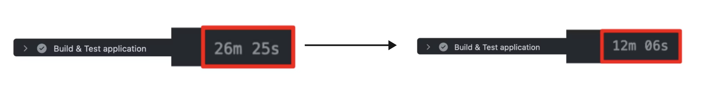
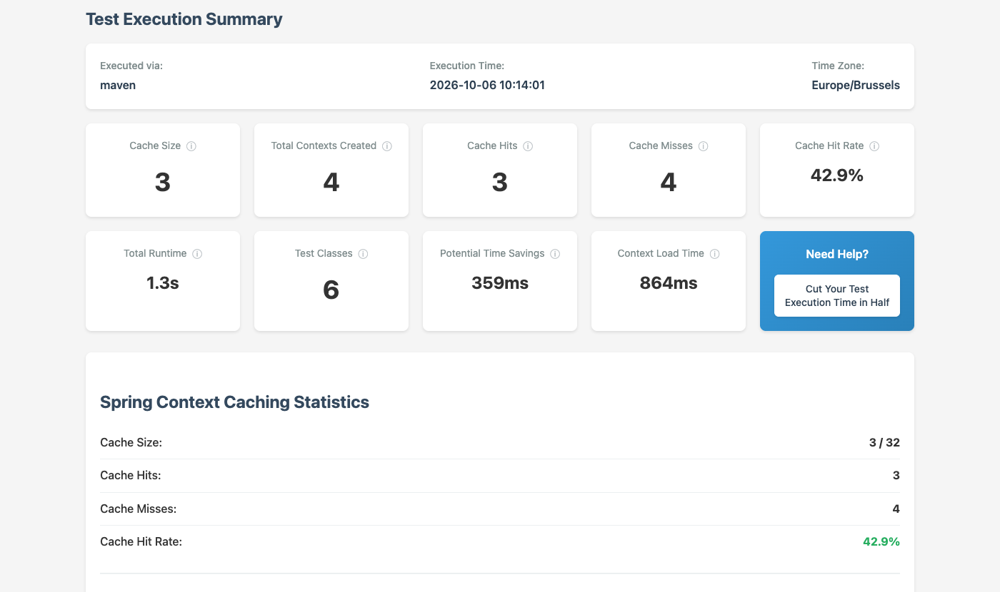
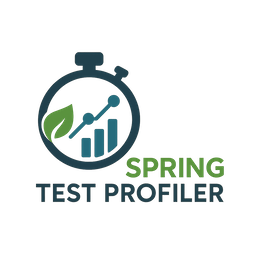

<!-- _paginate: false -->
<!-- _header: '' -->
<!-- _footer: '' -->


---

<!-- _class: light title -->
<!-- _paginate: false -->
<!-- _header: '' -->


# Ship Fast, **Sleep Well**

## Fearless Spring Boot Deployments in the AI Era

DATEV Coding Festival 2026 · 6. Oktober 2026

<!--
Notes:
- TODO: Dauer und Raum eintragen.
-->

---

<!-- _paginate: false -->
<!-- _header: '' -->
<!-- _footer: '' -->

<!--
Notes:
- Bildprompt: visuals/image-prompts.md (Horror-Bild). assets/horror-friday.png ersetzen.
- Geschichte erzählen: Freitag, 16 Uhr, der Pager klingelt, ein kritischer Bug in Production.
-->


---

<!-- _class: light reveal cards3 dark -->

<!--
Notes:
- Eine Box pro Klick (nur im HTML-Deck). Frage in den Raum: Wer kennt mindestens drei davon?
-->

## Freitag, 16 Uhr. Du hast Bereitschaft.

* **Vibe-codierter Hotfix**<small>die KI sagt: sieht gut aus</small>
* **45 Minuten Pipeline**<small>für eine Ein-Zeilen-Änderung</small>
* **Tests, denen keiner traut**<small>was verifizieren sie?</small>
* **Kein Feature Flag**<small>Rollback oder nichts</small>
* **Logs ohne Kontext**<small>welcher User? welcher Request?</small>
* **Kein Runbook**<small>wer weiß, was zu tun ist?</small>

---

<!-- _paginate: false -->
<!-- _header: '' -->
<!-- _footer: '' -->

<!--
Notes:
- Bildprompt: visuals/image-prompts.md (Zielbild). assets/target-state.png ersetzen.
-->


---

<!-- _class: light -->

<!--
Notes:
- Das ist das Ziel des Talks: wie ein Team von Alt nach Zukunft kommt, welche Rolle KI spielt und welche Prozesse wir brauchen.
-->

## Unsere Agenda für heute: von Alt nach Zukunft

<div class="flow nw xl">
  <div class="sketch" style="border-color:#b91c1c;color:#b91c1c">Alt: Hoffen und Heldentum<small>langsam, beängstigend, Bereitschaft</small></div>
  <div class="arrow">→</div>
  <div class="sketch accent">Prozesse<small>build · verify · ship · operate</small></div>
  <div class="arrow">+</div>
  <div class="sketch accent alt">AI<small>Tooling und Skills</small></div>
  <div class="arrow">→</div>
  <div class="sketch">Zukunft: Selbstsicher deployen<small>schnell, ruhig, wiederholbar</small></div>
</div>

<div class="ribbon">KI macht uns schneller. Prozesse machen uns sicher.</div>

---


### Über Philip

- Software Engineer aus Herzogenaurach, direkt neben Nürnberg 🍻
- Fokus auf **Testing** von Java- und Spring-Boot-Anwendungen, Blog und Content 🍃
- Nicht zum ersten Mal bei DATEV: **DATEV Coding Festival 2025** mit einem ganztägigen Workshop zu Spring Boot Testing, und vor zwei Wochen die **DATEV Software Craft Community**, ebenfalls zu Spring Boot Testing

<!--
Notes:
- Herzogenaurach liegt nahe Nürnberg, die DATEV-Leute kennen es. Kurz halten.
-->

---

<!-- _class: light reveal -->

<!--
Notes:
- Eine Zeile pro Klick (nur im HTML-Deck). Erwartung setzen: keine Theorie und kein Framework, sondern was ich in echten Teams funktionieren und scheitern sah, auch in Nächten mit Bereitschaft.
-->

## Was dich erwartet: Best Practices aus der Praxis
* Was ich selbst in **10 Jahren** in mehreren Teams gesehen habe
* Auch aus eigener Erfahrung **on call** bei ImmoScout24, für den zentralen Service mit allen Listings
* Nimm mit, was zu deinem Team passt

---

<!-- _class: light -->

<!--
Notes:
- Dem Raum ein paar Minuten zum Antworten geben. Dann die Live-Ergebnisse gemeinsam ansehen und im Teil zum Softwareentwicklungszyklus aufgreifen.
- TODO: prüfen, ob die drei Fragen im Mentimeter zu dieser Folie passen.
-->


## Hilf mir, euren Prozess zu verstehen

Geh auf [menti.com](https://www.menti.com/) und gib den Code **1354 9993** ein.

Drei anonyme Fragen:

1. Wie lange dauert es von Commit bis Production?
2. Wie stoppt ihr ein kaputtes Feature?
3. Was habt ihr, wenn der Pager klingelt?

---

<!-- _class: light -->
<!-- _header: 'Der Softwareentwicklungszyklus' -->

<!--
Notes:
- Vier Teile, wir gehen sie von links nach rechts durch. KI hilft überall, aber nur mit dem Prozess dahinter.
-->

## Vier Teile des Softwareentwicklungszyklus

<div class="phases">
  <div class="phase"><h3>1 · Build</h3><ul><li>Aussagekräftige, schnelle Testsuite</li><li>Context caching</li><li>Parallelisierung</li><li>Testcontainers</li><li>Mutation testing</li></ul></div>
  <div class="phase"><h3>2 · Verify</h3><ul><li>SonarQube</li><li>Statische Codeanalyse</li><li>Formatting</li><li>Schnelle, reproduzierbare CI/CD</li></ul></div>
  <div class="phase"><h3>3 · Ship</h3><ul><li>Schnelle Deployments</li><li>Rolling · Blue/Green · A/B</li><li>Feature flags</li><li>Kill Switch</li></ul></div>
  <div class="phase"><h3>4 · Operate</h3><ul><li>Structured logging + MDC</li><li>Distributed tracing</li><li>Alerting</li><li>Runbooks</li><li>Canary tests</li></ul></div>
</div>

<div class="ribbon">KI und Skills über alle vier Teile</div>

---

<!-- _class: light section -->
<!-- _header: 'Teil 1: Build' -->

## 01 - Build

# Eine aussagekräftige, schnelle Testsuite

<!--
Notes:
- Die Testsuite ist das Sicherheitsnetz. Ist sie langsam oder bedeutungslos, vertraut ihr keiner.
-->

---

<!-- _class: light statement -->

<!--
Notes:
- Die Testsuite ist das Sicherheitsnetz. Ein Netz mit Löchern oder ein Netz, dessen Prüfung eine Stunde dauert, fängt dich nicht auf. Es muss schnell UND zuverlässig sein.
-->

# Die Testsuite ist dein **Sicherheitsnetz**. Sie muss **schnell** und **zuverlässig** sein.

---

<!--
Notes:
- Quelle: DORA Core Model, zusammengefasst auf pragmatech.digital. Fast Feedback ist eine Capability, die Delivery Performance vorhersagt.
-->

## Belegt durch die DORA-Forschung


Das DORA Core Model stellt **Fast Feedback** neben Fast Flow und ein Klima des Lernens.

- Diese Capabilities sagen die **Software Delivery Performance** voraus
- Delivery Performance sagt die **Organizational Performance** und das Wohlbefinden voraus

---

<!-- _class: light -->

<!--
Notes:
- Schnell: die drei Hebel zeigen wir nur auf hohem Niveau, auf den nächsten Folien. Zuverlässig: das braucht Wissen und Judgment. Was testen, welcher Slice, wie vermeidet man flaky Tests. Diese Best Practices schreibe ich als Skills auf.
-->

## Schnell und zuverlässig

<div class="phases two">
  <div class="phase hot"><h3>Schnell</h3><ul><li>Parallelisierung</li><li>Context caching</li><li>Testcontainers-Optimierungen</li></ul></div>
  <div class="phase"><h3>Zuverlässig</h3><ul><li>Braucht <strong>Wissen</strong> und <strong>Judgment</strong></li><li>Was testen, welcher Slice, keine flaky Tests</li><li>Mutation testing</li><li>Best Practices werden zu <strong>Skills</strong></li></ul></div>
</div>

---

<!-- _class: light -->

<!--
Notes:
- Visuals aus dem Talk Top 5 Spring Boot Testing Mistakes wiederverwendet. Die Ergebnisse stammen von einem meiner Kunden.
-->

## Das Spring-Test-Hidden-Gem Nr. 1

- Den `ApplicationContext` zu starten kostet Testlaufzeit
- Jeder Context-Start (Slice oder voll) dauert mehrere Sekunden
- Spring Test löst das mit: **TestContext Context Caching**

Ergebnisse bei einem meiner Kunden:



---

<!-- _class: light -->

## Context Caching in a Nutshell

```java
// DefaultContextCache.java
private final Map<MergedContextConfiguration, ApplicationContext> contextMap =
  Collections.synchronizedMap(new LinkedHashMap<>(32, 0.75f, true));
```

- Spring Test baut aus Profilen, Properties, Klassen usw. eine eindeutige `ApplicationContext`-Konfiguration (`MergedContextConfiguration`)
- Braucht ein späterer Test exakt dieselbe Konfiguration, übergibt Spring einen "heißen" Context
- Ziel: so wenige Konfigurationsvarianten wie möglich, so viele Cache-Treffer wie möglich

---

<!-- _class: light -->

<!--
Notes:
- Der Report stammt aus dem Demo-Projekt in diesem Repo (6 Testklassen, 4 Contexts, Hit Rate 42,9 Prozent). Zeigen: jeder neue Context kostet Zeit, der Profiler zeigt wo (Property, @MockitoBean, @DirtiesContext).
- Projekt: https://github.com/PragmaTech-GmbH/spring-test-profiler (Version 0.3.0 im Demo-Projekt).
-->



## Spring Test Profiler



- Open-Source-Tool: zeigt, **wie viele Contexts** deine Testsuite startet
- **Cache Hits**, **Misses** und die Zeit für Context-Starts
- Findet die Ursache: Properties, `@MockitoBean`, `@DirtiesContext`

---

<!-- _class: light cards2 -->

<!--
Notes:
- Parallel: JUnit-5-Parallelisierung, Maven-Forks. Container: Singleton pro Image, @ServiceConnection, Wiederverwendung über Testklassen.
-->

## Parallele Tests und schnellere Container

* **Testparallelisierung**<small>Thread-Pool-basierte Parallelisierung mit JUnit oder JVM-Forks mit dem Build Tool</small>
* **Testcontainers**<small>möglichst wenig Container-Starts, Wiederverwendung</small>

---

<!-- _class: light -->

<!--
Notes:
- Hohe Coverage kann ein falsches Sicherheitsgefühl geben. Frage: Würde ein Test fehlschlagen, wenn eine dieser Bedingungen falsch wäre?
-->

## Challenge: Code Coverage

Stell dir Unit Tests für diese isolierte Business-Logik vor:

```java
public Long registerUser(int age, String username) {

  if (age <= 18) {
    throw new IllegalArgumentException("User must be at least 18 years old");
  }

  if ("ADMIN".equalsIgnoreCase(username)) {
    throw new IllegalArgumentException("Username 'ADMIN' is not allowed");
  }

  // ...

}
```

---

<!-- _class: light -->

<!--
Notes:
- PIT verändert den Code (dreht eine Bedingung um, ändert einen Rückgabewert) und führt die Tests aus. Ein fehlschlagender Test tötet den Mutanten. Ein überlebender Mutant ist ein blinder Fleck im Sicherheitsnetz. Super Check für KI-geschriebene Tests. Inkrementell ausführen, nur für geänderten Code.
-->

## Idee: Regressionen einbauen, um die Testqualität zu prüfen


---

<!-- _class: light -->

<!--
Notes:
- Zuverlässige Tests brauchen Judgment. Meines habe ich als Skill-Library für Spring Boot Testing aufgeschrieben, damit ein KI-Agent dieselben Regeln befolgt wie ich. Gleiche Struktur wie im Talk Prompt It Right.
-->

## Meine Skill-Library für Spring Boot Testing

```text
.claude/skills/spring-boot-testing/
├── unit-testing            schnelle Tests ohne Context-Ballast
├── slice-testing           passend große Spring-Context-Slices
├── slice-web-testing       Web-Schicht mit @WebMvcTest
├── integration-testing     Full-Context-Tests, die schnell bleiben
├── testcontainers-setup    echte Infrastruktur, ein Container pro Image
├── e2e-ui-testing          User Journeys gegen die laufende App
└── test-setup-review       erkennt Test-Anti-Patterns für dich
```

Regeln, Best Practices und Anti-Patterns, **einmal** aufgeschrieben. Der Agent folgt **deinem** Judgment.

---

<!-- _class: light -->

<!--
Notes:
- Aus Prompt It Right übernommen. Der Agent erreicht den CI-Stand (GitHub MCP), den Browser (Playwright MCP), die Tests (Shell) und die laufende Anwendung selbst. Kein Copy-and-paste zwischen dir und dem Agenten. Der Mensch prüft jeden Schritt: ein enger Loop, in Sekunden statt Tagen.
-->

## Build mit engem Feedback-Loop: Agent und Mensch

<div class="hub">
  <div class="sketch gh">CI<small>PRs, Pipeline-Läufe, Job-Logs</small></div>
  <div class="link l1"><b>&#8597;</b>GitHub MCP</div>
  <div class="sketch tests">Tests<small>./mvnw test</small></div>
  <div class="link l2"><b>&#8596;</b>shell</div>
  <div class="sketch accent agent">Agent<small>planen, coden, testen, fixen</small></div>
  <div class="link l3"><b>&#8596;</b>Playwright MCP</div>
  <div class="sketch browser">Browser<small>gerenderte Seite, Screenshots</small></div>
  <div class="link l4"><b>&#8597;</b>spring-boot:run</div>
  <div class="sketch alt app">Anwendung, lokal<small>http://localhost:8080</small></div>
</div>

<div class="ribbon">Du prüfst jeden Schritt: ein enger Loop, Sekunden statt Tage</div>

---

<!-- _class: light section -->
<!-- _header: 'Teil 2: Verify' -->

## 02 - Verify

# Alles prüfen, was man vorher prüfen kann

---

<!-- _class: light reveal cards3 -->

<!--
Notes:
- Alles, was eine Maschine prüfen kann, soll eine Maschine prüfen, bei jedem Commit.
-->

## Jeden möglichen Check automatisieren

* **SonarQube**<small>Codequalität und Security Hotspots</small>
* **Statische Analyse**<small>Error Prone · SpotBugs · ArchUnit</small>
* **Formatting**<small>Spotless · Checkstyle</small>
* **Abhängigkeiten**<small>Renovate · Dependabot</small>
* **Secret Scanning**<small>keine Keys in Git</small>
* **Quality Gates**<small>klare Regeln, wann ein Build abgebrochen werden soll</small>

---

<!-- _class: light section -->
<!-- _header: 'Teil 3: Ship' -->

## 03 - Ship

# Deployment ≠ Release

---

<!-- _class: light -->

<!--
Notes:
- Fokus auf ein schnelles Deployment. Rolling Update mit 2-3 Spring-Boot-Containern: neue Version starten, Health Check abwarten, Traffic umschalten, alten Container stoppen, wiederholen. Ziel: der gesamte Rollout in etwa 5-8 Minuten, je schneller desto besser. Langsamer Start kostet hier Zeit. Ebenfalls möglich: Blue/Green (zwei Umgebungen, Traffic umschalten) und Canary oder A/B (erst ein kleiner Teil des Traffics).
-->

## Schnelle Deployments: Rolling Update

<div class="phases three">
  <div class="phase"><h3>1 · v2 starten</h3>
    <div class="flow nw mini"><div class="sketch">v1</div><div class="sketch">v1</div><div class="sketch">v1</div><div class="sketch accent">v2</div></div>
    <p>Neuer Container startet, Health Check wird grün</p></div>
  <div class="phase"><h3>2 · Umschalten</h3>
    <div class="flow nw mini"><div class="sketch">v1</div><div class="sketch">v1</div><div class="sketch accent">v2</div></div>
    <p>Traffic wechselt, ein alter Container stoppt</p></div>
  <div class="phase"><h3>3 · Wiederholen</h3>
    <div class="flow nw mini"><div class="sketch accent">v2</div><div class="sketch accent">v2</div><div class="sketch accent">v2</div></div>
    <p>Alle 2-3 Container laufen mit der neuen Version</p></div>
</div>

<div class="ribbon">Der gesamte Rollout in ~5-8 Minuten. Je schneller, desto besser.</div>

---

<!-- _class: light -->

<!--
Notes:
- Ein schnelles Deployment macht kleine, häufige Deployments günstig. Feature Flags entkoppeln dann das Deployment vom Release: der Code ist in Production, aber ausgeschaltet, und wir veröffentlichen, wenn wir bereit sind.
-->

## Deployment vom Release entkoppeln

<div class="flow nw xl big">
  <div class="sketch">Deployment<small>die Anwendung wird ausgerollt</small></div>
  <div class="arrow">→</div>
  <div class="sketch accent">Release<small>danach wird ein Feature freigegeben</small></div>
</div>

<div class="ribbon">Klein und häufig deployen. Veröffentlichen, wenn du bereit bist.</div>

---

<!-- _class: light -->

<!--
Notes:
- Togglz ist eine Java-Bibliothek mit Spring-Boot-Starter und Admin-Konsole (Dashboard). Features lassen sich zur Laufzeit ein- und ausschalten, mit Aktivierungsstrategien, zum Beispiel nach Username, Rolle oder schrittweisem Rollout. Namen der Strategien vor dem Talk gegen die aktuelle Doku prüfen.
- Fortgeschrittener: LaunchDarkly (Managed Service, Targeting, Experimente).
- Im Demo-Projekt dieses Repos geprüft: Togglz 4.6.4 mit Spring-Boot-Starter und togglz-console läuft auf Spring Boot 4.1.1.
-->

## Feature Flags mit Togglz

```java {4-7}
public enum Features implements Feature {

    @Label("New checkout flow")
    NEW_CHECKOUT;

    public boolean isActive() {
        return FeatureContext.getFeatureManager().isActive(this);
    }
}
```

---

<!-- _class: light -->

<!--
Notes:
- Eigener Screenshot des Demo-Projekts in diesem Repository (Spring Boot 4.1.1, Java 21, Togglz 4.6.4, togglz-console). Gezeigte Strategien: Users by name und Gradual Rollout. Starten mit: JAVA_HOME=<jdk21> ./mvnw spring-boot:run und /togglz-console/index öffnen.
-->

## Die Togglz Admin Console


---

<!-- _class: light -->

<!--
Notes:
- Ein Rollback braucht einen Pipeline-Lauf und ein Deployment. Ein Flag umzuschalten dauert Sekunden.
-->

## Kill Switch: schneller als ein Rollback

<div class="flow nw xl bad">
  <div class="sketch">Rollback<small>Revert · Pipeline · Deploy · Verify</small></div>
  <div class="arrow">=</div>
  <div class="sketch">Minuten</div>
</div>

<div class="flow nw xl">
  <div class="sketch accent">Flag ausschalten<small>ein Klick im Dashboard</small></div>
  <div class="arrow">=</div>
  <div class="sketch accent">Sekunden</div>
</div>

---

<!-- _class: light section -->
<!-- _header: 'Teil 4: Operate' -->

## 04 - Operate

# Sehen, finden, beheben

---

<!-- _class: light -->

<!--
Notes:
- Die Standard-Logzeile von Spring Boot: für Menschen lesbar, für Maschinen schwierig. Welcher User? Welche Bestellung? Welcher Request? Wir greppen und hoffen.
-->

## Standard-Log: lesbar, aber schwer abfragbar

```text
2026-10-06T10:15:32.481+02:00 ERROR 4711 --- [nio-8080-exec-3] d.p.shipfast.CheckoutService : Payment failed
2026-10-06T10:15:32.502+02:00  WARN 4711 --- [nio-8080-exec-7] d.p.shipfast.CheckoutService : Retrying payment
2026-10-06T10:15:33.114+02:00 ERROR 4711 --- [nio-8080-exec-3] d.p.shipfast.CheckoutService : Payment failed
```

Welcher **User**? Welche **Bestellung**? Welcher **Request**?

---

<!-- _class: light -->

<!--
Notes:
- Spring Boot unterstützt strukturiertes Logging direkt (ECS, Logstash, GELF). MDC-Einträge landen als zusätzliche Felder im JSON. Ein Filter legt die User-ID in den MDC, damit jede Logzeile sie trägt. Danach den MDC leeren.
- TODO: Property- und Feldnamen mit der Spring-Boot-Version der Demo prüfen.
-->

## Strukturiertes Logging mit MDC: JSON und Extra-Felder

```java
MDC.put("userId", authentication.getName());
```

```json
{
  "log.level": "ERROR",
  "message": "Payment failed",
  "userId": "u-4711",
  "orderId": "o-815",
  "trace.id": "4bf92f3577b34da6"
}
```

Die Log-Abfrage `userId:u-4711` findet jetzt genau das, was dieser User getan hat.

---

<!-- _class: light -->

<!--
Notes:
- Beispiel-Trace: ein HTTP POST auf unseren Endpunkt, ein HTTP-Call zum Nachbar-Team, dann unser eigener DB-Zugriff. Spans sind nach Verschachtelung eingerückt. Der langsame Span liegt im Service des Nachbar-Teams: ohne Tracing würden wir im eigenen Code suchen. Wenn möglich durch einen echten Screenshot (Grafana Tempo, Jaeger, Zipkin) aus der Demo ersetzen.
-->

## Distributed Tracing: Wo liegt das Problem?

<div class="spans">
  <div class="row"><div class="label">POST /orders</div><div class="track"><div class="bar">480 ms</div></div></div>
  <div class="row"><div class="label">OrderService.placeOrder()</div><div class="track"><div class="bar">465 ms</div></div></div>
  <div class="row"><div class="label">HTTP POST payment-service (Nachbar-Team)</div><div class="track"><div class="bar slow">340 ms</div></div></div>
  <div class="row"><div class="label">POST /payments (deren Endpunkt)</div><div class="track"><div class="bar slow">310 ms</div></div></div>
  <div class="row"><div class="label">INSERT INTO orders (unsere DB)</div><div class="track"><div class="bar">65 ms</div></div></div>
</div>

Ein Trace geht über die **Team-Grenze**: der langsame Span liegt im Service des **Nachbar-Teams**, nicht in unserem Code.

---

<!-- _class: light -->

<!--
Notes:
- Alarme auf Symptome, die User spüren (Fehlerrate, Latenz, fehlgeschlagener Canary), nicht auf jeden CPU-Peak. Die Alert-Nachricht verlinkt direkt aufs Runbook.
-->

## Alerting und Runbooks

<div class="flow nw xl">
  <div class="sketch accent">Alert<small>Fehlerrate · Latenz · Canary</small></div>
  <div class="arrow">→</div>
  <div class="sketch">On-call<small>die richtige Person</small></div>
  <div class="arrow">→</div>
  <div class="sketch accent">Runbook<small>bekannte erste Schritte</small></div>
  <div class="arrow">→</div>
  <div class="sketch">Fix oder Flag aus</div>
</div>

<div class="ribbon">Ein Runbook: Symptom · Auswirkung · erste Checks mit Deep Links zu Logs, Traces und Dashboards · Gegenmaßnahme · Eskalation</div>

---

<!-- _class: light -->

<!--
Notes:
- Ein echtes Beispiel-Runbook aus unserem Buch Stratospheric. Hinweisen auf: Diagnose-Schritte mit Deep Links, und die Maßnahme 'Payment Provider nicht erreichbar: Feature abschalten', also genau ein Feature Flag. Maßnahme bei schlechtem Release: Revert und Redeploy.
-->

## Beispiel-Runbook: ELB-5xx-Alarm

<div class="phases">
  <div class="phase"><h3>Bedeutung</h3><ul><li>User sehen viele HTTP-5xx-Fehler</li></ul></div>
  <div class="phase"><h3>Auswirkung</h3><ul><li>User können nicht mit der App arbeiten</li><li>Clients können nicht synchronisieren</li></ul></div>
  <div class="phase hot"><h3>Diagnose</h3><ul><li>Laufender Plattform-Incident?</li><li>Logs</li><li>Operations-Dashboard</li></ul></div>
  <div class="phase hot"><h3>Gegenmaßnahme</h3><ul><li>Provider down: Feature abschalten</li><li>Schlechtes Release: Revert und Redeploy</li></ul></div>
</div>

---

<!-- _class: light -->

<!--
Notes:
- Wir können nicht alles vor Production testen. Canary-Tests sind End-to-End-Tests, die dauerhaft laufen, idealerweise in Production, mit einem eigenen Testuser. Sie geben echtes Feedback und lösen den Alert aus, bevor ein Kunde anruft.
-->

## Canary-Tests: dauerhaft in Production testen

<div class="flow nw xl">
  <div class="sketch">Scheduler<small>alle paar Minuten</small></div>
  <div class="arrow">→</div>
  <div class="sketch accent">Testuser<small>echte User Journeys</small></div>
  <div class="arrow">→</div>
  <div class="sketch">Production</div>
  <div class="arrow">→</div>
  <div class="sketch accent">Prüfen + Alert<small>bevor User es merken</small></div>
</div>

<div class="ribbon">End-to-End-Tests, die dauerhaft laufen: echtes Feedback aus Production</div>

---

<!-- _class: light section -->
<!-- _header: 'KI und Skills' -->

## 05 - Die Rolle von KI

# KI kontrolliert einsetzen

---

<!-- _class: light reveal cards3 -->

<!--
Notes:
- KI kann Code und Tests schreiben, aber das Urteilsvermögen muss einmal als Skills aufgeschrieben werden: was einen sinnvollen Test ausmacht, wie wir strukturieren, wie wir loggen. Dann folgt der Agent unseren Regeln.
-->

## Skills tragen dein Urteilsvermögen

* **Test-Skill**<small>was einen sinnvollen Test ausmacht</small>
* **Struktur-Skill**<small>wie wir Tests schichten und benennen</small>
* **Logging-Skill**<small>JSON-Logs, MDC, keine Secrets</small>
* **Review-Skill**<small>erkennt Test-Anti-Patterns</small>
* **Runbook-Skill**<small>Entwurf aus Alert und Code</small>
* **Pipeline-Skill**<small>schnell und reproduzierbar halten</small>

---

<!-- _class: light reveal cards4 big -->

<!--
Notes:
- Zusammenfassung: das große Toolkit, eine Box pro Klick (nur im HTML-Deck). Zusammen ergeben sie Vertrauen in jeden Commit.
-->

* **Schnelle Tests**<small>aussagekräftig und gecacht</small>
* **Statische Checks**<small>Sonar · Formatting</small>
* **CI/CD**<small>schnell und reproduzierbar</small>
* **Feature flags**<small>Deployment ist kein Release</small>
* **Logs und Traces**<small>JSON · MDC · Spans</small>
* **Alerting**<small>die richtigen Leute, schnell</small>
* **Runbooks**<small>wissen, was zu tun ist</small>
* **Canary-Tests**<small>echtes Feedback</small>

---

<!-- _class: light statement -->

# Du wirst einen Bug ausliefern. **Entscheidend ist, wie schnell du dich erholst.**

---

<!-- _class: light closing -->
<!-- _paginate: false -->
<!-- _header: '' -->
<!-- _footer: '' -->


# Fearless Shipping!

Danke! Fragen?

Der **Spring Boot Testing Newsletter**: Best Practices, Recipes & Quick Wins direkt in dein Postfach - **rieckpil.de/newsletter**


- [LinkedIn: linkedin.com/in/rieckpil](https://www.linkedin.com/in/rieckpil)
- [Mail: philip@pragmatech.digital](mailto:philip@pragmatech.digital)
