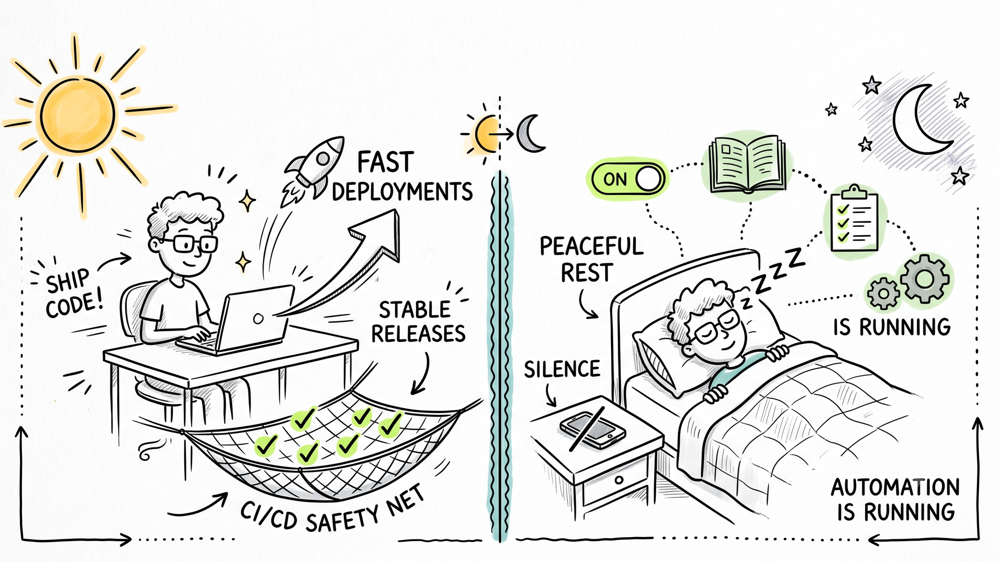
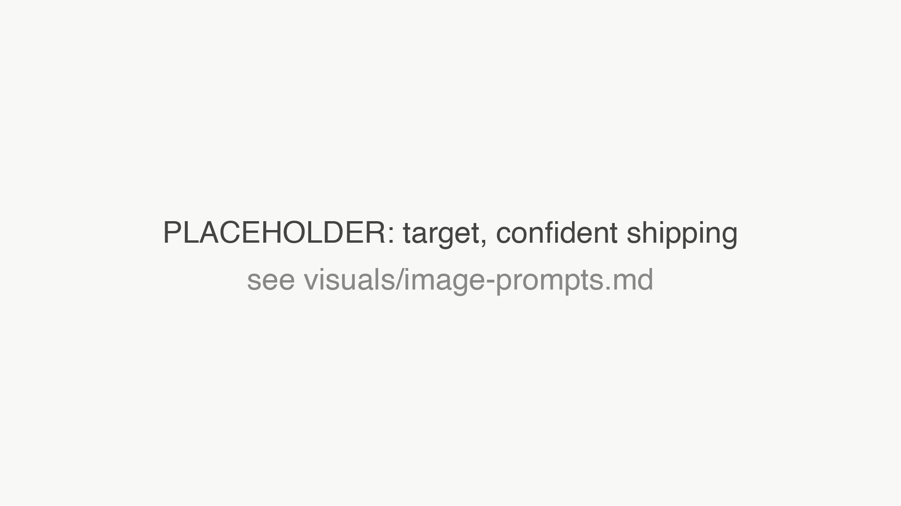
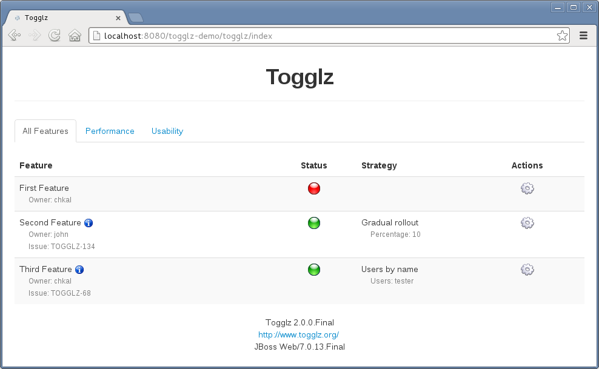
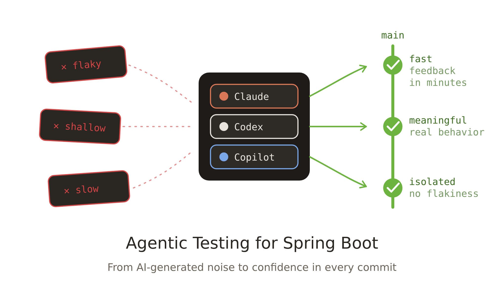

<!-- _paginate: false -->
<!-- _header: '' -->
<!-- _footer: '' -->



---

<!-- _class: light title -->
<!-- _paginate: false -->
<!-- _header: '' -->


# Ship Fast, **Sleep Well**

## Fearless Spring Boot Deployments in the AI Era

DATEV Coding Festival 2026 · 6. Oktober 2026

<!--
Notes:
- TODO: Dauer und Raum eintragen.
-->

---

<!-- _paginate: false -->
<!-- _header: '' -->
<!-- _footer: '' -->

<!--
Notes:
- Bildprompt: visuals/image-prompts.md (Horror-Bild). assets/horror-friday.png ersetzen.
- Geschichte erzählen: Freitag, 16 Uhr, der Pager klingelt, ein kritischer Bug in Production.
-->


---

<!-- _class: light reveal cards3 dark -->

<!--
Notes:
- Eine Box pro Klick (nur im HTML-Deck). Frage in den Raum: Wer kennt mindestens drei davon?
-->

## Freitag, 16 Uhr. Du hast Bereitschaft.

* **Vibe-codierter Hotfix**<small>die KI sagt: sieht gut aus</small>
* **45 Minuten Pipeline**<small>für eine Ein-Zeilen-Änderung</small>
* **Tests, denen keiner traut**<small>was verifizieren sie?</small>
* **Kein Feature Flag**<small>Rollback oder nichts</small>
* **Logs ohne Kontext**<small>welcher User? welcher Request?</small>
* **Kein Runbook**<small>wer weiß, was zu tun ist?</small>

---

<!-- _paginate: false -->
<!-- _header: '' -->
<!-- _footer: '' -->

<!--
Notes:
- Bildprompt: visuals/image-prompts.md (Zielbild). assets/target-state.png ersetzen.
-->



---

<!-- _class: light reveal cards3 -->

<!--
Notes:
- Der gleiche Freitag, ein anderes Team.
-->

## Der gleiche Freitag. Vertrauen in jeden Commit.

* **Schnelle Pipeline**<small>Feedback in Minuten</small>
* **Aussagekräftige Tests**<small>ein echtes Sicherheitsnetz</small>
* **Flag ausschalten**<small>schneller als ein Rollback</small>
* **Strukturierte Logs und Traces**<small>Problem schnell finden</small>
* **Alerts und Runbooks**<small>ruhige, bekannte Schritte</small>
* **Canary-Tests**<small>wir wissen es vor den Usern</small>

---

<!--
Notes:
- Quelle: DORA Core Model, zusammengefasst auf pragmatech.digital. Fast Feedback ist eine Capability, die Delivery Performance vorhersagt.
-->

## Belegt durch die DORA-Forschung


Das DORA Core Model stellt **Fast Feedback** neben Fast Flow und ein Klima des Lernens.

- Diese Capabilities sagen die **Software Delivery Performance** voraus
- Delivery Performance sagt die **Organizational Performance** und das Wohlbefinden voraus

---

<!-- _class: light -->

<!--
Notes:
- Das ist das Ziel des Talks: wie ein Team von A nach B kommt, welche Rolle KI spielt und welche Prozesse wir brauchen.
-->

## Das Ziel: Von A nach B

<div class="flow nw xl">
  <div class="sketch" style="border-color:#b91c1c;color:#b91c1c">A: Hoffen und Heldentum<small>langsam, beängstigend, Bereitschaft</small></div>
  <div class="arrow">→</div>
  <div class="sketch accent">Prozesse<small>build · verify · ship · operate</small></div>
  <div class="arrow">+</div>
  <div class="sketch accent alt">AI<small>Tooling und Skills</small></div>
  <div class="arrow">→</div>
  <div class="sketch">B: Selbstsicher ausliefern<small>schnell, ruhig, wiederholbar</small></div>
</div>

<div class="ribbon">KI macht uns schneller. Prozesse machen uns sicher.</div>

---


### Über Philip

- Software Engineer aus Herzogenaurach (Sitz von adidas & Puma), direkt neben Nürnberg 🍻
- Fokus auf **Testing** von Java- und Spring-Boot-Anwendungen, Blog und Content 🍃
- Gründer der [PragmaTech GmbH](https://pragmatech.digital/) - **Entwickler befähigen, häufig auszuliefern**, mit **mehr Vertrauen**

- Nicht zum ersten Mal bei DATEV: **DATEV Coding Festival 2025** mit einem ganztägigen Workshop zu Spring Boot Testing, und vor zwei Wochen die **DATEV Software Craft Community**, ebenfalls zu Spring Boot Testing

<!--
Notes:
- Herzogenaurach liegt nahe Nürnberg, die DATEV-Leute kennen es. Kurz halten.
-->

---

<!-- _class: light reveal -->

<!--
Notes:
- Eine Zeile pro Klick (nur im HTML-Deck). Erwartung setzen: keine Theorie und kein Framework, sondern was ich in echten Teams funktionieren und scheitern sah, auch in Nächten mit Bereitschaft.
-->

## Was dich erwartet: Best Practices aus der Praxis
* Was ich selbst in **10 Jahren** in mehreren Teams gesehen habe
* Auch aus eigener Erfahrung **on call**
* Nimm mit, was zu deinem Team passt

---

<!-- _class: light -->

<!--
Notes:
- TODO: Mentimeter anlegen, Code und QR-Code (assets/mentimeter-qr-datev.png) eintragen, dann das TODO unten ersetzen.
- Vorgeschlagene Fragen wie auf der Folie. Live-Ergebnisse gemeinsam ansehen und im Lifecycle-Teil aufgreifen.
-->

## Hilf mir, euren Prozess zu verstehen

Geh auf [menti.com](https://www.menti.com/) und gib den Code **TODO** ein. Drei anonyme Fragen:

<div class="flow nw xl big">
  <div class="sketch accent">1<small>Wie lange dauert es von Commit bis Production?</small></div>
  <div class="sketch alt">2<small>Wie stoppt ihr ein kaputtes Feature?</small></div>
  <div class="sketch accent">3<small>Was habt ihr, wenn der Pager klingelt?</small></div>
</div>

---

<!-- _class: light -->
<!-- _header: 'Der Software-Lifecycle' -->

<!--
Notes:
- Vier Teile, wir gehen sie von links nach rechts durch. KI hilft überall, aber nur mit dem Prozess dahinter.
-->

## Vier Teile des Lifecycles

<div class="phases">
  <div class="phase"><h3>1 · Build</h3><ul><li>Aussagekräftige, schnelle Testsuite</li><li>Context caching</li><li>Parallelisierung</li><li>Testcontainers</li><li>Mutation testing</li></ul></div>
  <div class="phase"><h3>2 · Verify</h3><ul><li>SonarQube</li><li>Statische Codeanalyse</li><li>Formatting</li><li>Schnelle, reproduzierbare CI/CD</li></ul></div>
  <div class="phase"><h3>3 · Ship</h3><ul><li>Schnelle Deployments</li><li>Rolling · Blue/Green · A/B</li><li>Feature flags</li><li>Kill Switch</li></ul></div>
  <div class="phase"><h3>4 · Operate</h3><ul><li>Structured logging + MDC</li><li>Distributed tracing</li><li>Alerting</li><li>Runbooks</li><li>Canary tests</li></ul></div>
</div>

<div class="ribbon">KI und Skills über alle vier Teile</div>

---

<!-- _class: light section -->
<!-- _header: 'Teil 1: Build' -->

## 01 - Build

# Eine aussagekräftige, schnelle Testsuite

<!--
Notes:
- Die Testsuite ist das Sicherheitsnetz. Ist sie langsam oder bedeutungslos, vertraut ihr keiner.
-->

---

<!-- _class: light statement -->

<!--
Notes:
- Die Testsuite ist das Sicherheitsnetz. Ein Netz mit Löchern oder ein Netz, dessen Prüfung eine Stunde dauert, fängt dich nicht auf. Es muss schnell UND zuverlässig sein.
-->

# Die Testsuite ist dein **Sicherheitsnetz**. Sie muss **schnell** und **zuverlässig** sein.

---

<!-- _class: light -->

<!--
Notes:
- Schnell: die drei Hebel zeigen wir nur auf hohem Niveau, auf den nächsten Folien. Zuverlässig: das braucht Wissen und Judgment. Was testen, welcher Slice, wie vermeidet man flaky Tests. Diese Best Practices schreibe ich als Skills auf.
-->

## Schnell und zuverlässig

<div class="phases two">
  <div class="phase hot"><h3>Schnell</h3><ul><li>Parallelisierung</li><li>Context caching</li><li>Testcontainers-Optimierungen</li><li><em>high level, nächste Folien</em></li></ul></div>
  <div class="phase"><h3>Zuverlässig</h3><ul><li>Braucht <strong>Wissen</strong> und <strong>Judgment</strong></li><li>Was testen, welcher Slice, keine flaky Tests</li><li>Mutation testing</li><li>Best Practices werden zu <strong>Skills</strong></li></ul></div>
</div>

---

<!-- _class: light -->

<!--
Notes:
- Gleiche Konfiguration bedeutet Cache-Treffer. @MockitoBean, @DirtiesContext, andere Properties oder Profile erzeugen einen neuen Context.
- Der Spring Test Profiler zeigt, wie viele Contexts ihr erzeugt.
-->

## Context Caching: Spring nur einmal starten

<div class="flow nw xl">
  <div class="sketch">Testklasse A</div>
  <div class="sketch">Testklasse B</div>
  <div class="sketch">Testklasse C</div>
  <div class="arrow">→</div>
  <div class="sketch accent">1 gecachter<br>ApplicationContext<small>gleiche Konfig = Cache-Treffer</small></div>
</div>

<div class="flow nw xl bad">
  <div class="sketch">@MockitoBean</div>
  <div class="sketch">@DirtiesContext</div>
  <div class="sketch">@ActiveProfiles / properties</div>
  <div class="arrow">→</div>
  <div class="sketch">neuer Context = langsam<small>jeder neue Context kostet Sekunden</small></div>
</div>

---

<!-- _class: light cards2 -->

<!--
Notes:
- Parallel: JUnit-5-Parallelisierung, Maven-Forks. Container: Singleton pro Image, @ServiceConnection, Wiederverwendung über Testklassen.
-->

## Parallele Tests und schnellere Container

* **Testparallelisierung**<small>JUnit-5-Parallelmodus und Maven-Forks, nur unabhängige Tests</small>
* **Testcontainers**<small>ein Container pro Image, @ServiceConnection, über Klassen geteilt</small>

---

<!-- _class: light -->

<!--
Notes:
- Mutation Testing beantwortet: würden meine Tests einen Bug bemerken? PIT verändert den Code (dreht eine Bedingung um, entfernt einen Aufruf) und führt die Tests aus. Ein überlebender Mutant ist eine Lücke. Super Check für KI-geschriebene Tests.
-->

## Mutation Testing: Bemerken deine Tests Bugs?

<div class="flow nw xl">
  <div class="sketch">Dein Code</div>
  <div class="arrow">→</div>
  <div class="sketch accent">PIT verändert ihn<small>Bedingung umdrehen, Aufruf entfernen</small></div>
  <div class="arrow">→</div>
  <div class="sketch">Tests ausführen</div>
</div>

<div class="flow nw xl">
  <div class="sketch accent">Test schlägt fehl = Mutant getötet<small>der Test hat Zähne</small></div>
  <div class="sketch alt" style="border-color:#b91c1c;color:#b91c1c">Tests grün = Mutant überlebt<small>eine Lücke im Sicherheitsnetz</small></div>
</div>

---

<!-- _class: light -->

<!--
Notes:
- Zuverlässige Tests brauchen Judgment. Meines habe ich als Skill-Library für Spring Boot Testing aufgeschrieben, damit ein KI-Agent dieselben Regeln befolgt wie ich. Gleiche Struktur wie im Talk Prompt It Right.
-->

## Meine Skill-Library für Spring Boot Testing

```text
.claude/skills/spring-boot-testing/
├── unit-testing            schnelle Tests ohne Context-Ballast
├── slice-testing           passend große Spring-Context-Slices
├── slice-web-testing       Web-Schicht mit @WebMvcTest
├── integration-testing     Full-Context-Tests, die schnell bleiben
├── testcontainers-setup    echte Infrastruktur, ein Container pro Image
├── e2e-ui-testing          User Journeys gegen die laufende App
└── test-setup-review       erkennt Test-Anti-Patterns für dich
```

Regeln, Best Practices und Anti-Patterns, **einmal** aufgeschrieben. Der Agent folgt **deinem** Judgment.

---

<!-- _class: light section -->
<!-- _header: 'Teil 2: Verify' -->

## 02 - Verify

# Alles prüfen, was man vorher prüfen kann

---

<!-- _class: light reveal cards3 -->

<!--
Notes:
- Alles, was eine Maschine prüfen kann, soll eine Maschine prüfen, bei jedem Commit.
-->

## Jeden möglichen Check automatisieren

* **SonarQube**<small>Codequalität und Security Hotspots</small>
* **Statische Analyse**<small>Error Prone · SpotBugs · ArchUnit</small>
* **Formatting**<small>Spotless · Checkstyle</small>
* **Abhängigkeiten**<small>Renovate · Dependabot</small>
* **Secret Scanning**<small>keine Keys in Git</small>
* **Quality Gates**<small>den Build brechen, nicht Production</small>

---

<!-- _class: light -->

<!--
Notes:
- Schnell und reproduzierbar: gleiches Ergebnis bei jedem Lauf, kein Snowflake-Build-Server, jederzeit auslösbar, auch freitags.
-->

## CI/CD: schnell, reproduzierbar, jederzeit auslösbar

<div class="flow nw xl">
  <div class="sketch">Commit</div>
  <div class="arrow">→</div>
  <div class="sketch accent">Build</div>
  <div class="arrow">→</div>
  <div class="sketch accent">Test</div>
  <div class="arrow">→</div>
  <div class="sketch accent">Analyse</div>
  <div class="arrow">→</div>
  <div class="sketch accent">Package</div>
  <div class="arrow">→</div>
  <div class="sketch">Deploy</div>
</div>

<div class="flow nw xl">
  <div class="sketch alt">Schnell<small>Minuten, keine Stunde</small></div>
  <div class="sketch">Reproduzierbar<small>gleicher Input, gleiches Ergebnis</small></div>
  <div class="sketch alt">Auf Abruf<small>jederzeit, jeden Tag</small></div>
</div>

---

<!-- _class: light section -->
<!-- _header: 'Teil 3: Ship' -->

## 03 - Ship

# Deployment ist kein Release

---

<!-- _class: light reveal cards3 -->

<!--
Notes:
- Rolling: Instanzen schrittweise ersetzen. Blue/Green: zwei Umgebungen, Traffic umschalten, bei Bedarf zurück. A/B oder Canary Release: ein kleiner Teil des Traffics bekommt zuerst die neue Version.
-->

## Schnelle Deployment-Strategien

* **Rolling update**<small>Instanzen schrittweise ersetzen</small>
* **Blue / Green**<small>zwei Umgebungen, Traffic umschalten</small>
* **A/B und Canary Release**<small>erst ein kleiner Teil des Traffics</small>

---

<!-- _class: light -->

<!--
Notes:
- Togglz ist eine Java-Bibliothek mit Spring-Boot-Starter und Admin-Konsole (Dashboard). Features lassen sich zur Laufzeit ein- und ausschalten, mit Aktivierungsstrategien, zum Beispiel nach Username, Rolle oder schrittweisem Rollout. Namen der Strategien vor dem Talk gegen die aktuelle Doku prüfen.
- Fortgeschrittener: LaunchDarkly (Managed Service, Targeting, Experimente).
- TODO: Togglz-Version und Starter-Koordinaten für Spring Boot 4 prüfen.
-->

## Feature Flags mit Togglz

```java {4-7}
public enum Features implements Feature {

    @Label("New checkout flow")
    NEW_CHECKOUT;

    public boolean isActive() {
        return FeatureContext.getFeatureManager().isActive(this);
    }
}
```

Dashboard: erst für **Key User** oder **Rollen** aktivieren, dann für alle. Fortgeschrittener: **LaunchDarkly**.

---

<!-- _class: light -->

<!--
Notes:
- Offizieller Screenshot von togglz.org (Togglz 2.0, alter Look, die Konsole funktioniert noch gleich). Sichtbare Strategien: Gradual Rollout (10 Prozent) und Users by name. Quelle togglz.org nennen. TODO: bei Zeit durch einen frischen Screenshot der Demo ersetzen.
-->

## Die Togglz Admin Console



- Jedes Feature mit seinem **Status**
- **Strategie** pro Feature: Gradual Rollout, Users by name, Rollen
- **Zur Laufzeit** an- oder ausschalten, ohne Deployment

<small>Screenshot: togglz.org</small>

---

<!-- _class: light -->

<!--
Notes:
- Ein Rollback braucht einen Pipeline-Lauf und ein Deployment. Ein Flag umzuschalten dauert Sekunden.
-->

## Kill Switch: schneller als ein Rollback

<div class="flow nw xl bad">
  <div class="sketch">Rollback<small>Revert · Pipeline · Deploy · Verify</small></div>
  <div class="arrow">=</div>
  <div class="sketch">Minuten</div>
</div>

<div class="flow nw xl">
  <div class="sketch accent">Flag ausschalten<small>ein Klick im Dashboard</small></div>
  <div class="arrow">=</div>
  <div class="sketch accent">Sekunden</div>
</div>

---

<!-- _class: light section -->
<!-- _header: 'Teil 4: Operate' -->

## 04 - Operate

# Sehen, finden, beheben

---

<!-- _class: light -->

<!--
Notes:
- Spring Boot unterstützt strukturiertes Logging direkt (ECS, Logstash, GELF). MDC-Einträge landen im JSON. Ein Filter legt die User-ID in den MDC, damit jede Logzeile sie trägt. Danach den MDC leeren.
- TODO: Property- und Feldnamen mit der Spring-Boot-Version der Demo prüfen.
-->

## Strukturiertes Logging und MDC

```yaml
logging.structured.format.console: ecs
```

```java {1,3}
MDC.put("userId", authentication.getName());
try { chain.doFilter(request, response); }
finally { MDC.clear(); }
```

```json
{"log.level":"ERROR","message":"Payment failed","userId":"u-4711","trace.id":"4bf92f35"}
```

Jetzt findet die Log-Abfrage `userId:u-4711` genau das, was dieser User getan hat.

---

<!-- _class: light -->

<!--
Notes:
- Beispiel-Trace: ein Request über HTTP-Schicht, Service, Datenbank und externen Aufruf. Der langsame Span zeigt, wo das Problem liegt. Durch einen echten Screenshot (Grafana Tempo, Jaeger, Zipkin) aus der Demo ersetzen.
-->

## Distributed Tracing: Wo liegt das Problem?

<div class="spans">
  <div class="row"><div class="label">POST /orders</div><div class="track"><div class="bar" style="width:100%">2.4 s</div></div></div>
  <div class="row"><div class="label">OrderService.place()</div><div class="track"><div class="bar" style="width:92%;margin-left:4%">2.3 s</div></div></div>
  <div class="row"><div class="label">SELECT customer</div><div class="track"><div class="bar" style="width:6%;margin-left:6%"></div></div></div>
  <div class="row"><div class="label">POST payment-service</div><div class="track"><div class="bar slow" style="width:78%;margin-left:14%">2.0 s</div></div></div>
  <div class="row"><div class="label">INSERT order</div><div class="track"><div class="bar" style="width:5%;margin-left:93%"></div></div></div>
</div>

Vom HTTP-Aufruf durch die Services und die Datenbank und zurück: **ein Trace zeigt den langsamen Span**.

---

<!-- _class: light -->

<!--
Notes:
- Alarme auf Symptome, die User spüren (Fehlerrate, Latenz, fehlgeschlagener Canary), nicht auf jeden CPU-Peak. Die Alert-Nachricht verlinkt direkt aufs Runbook.
-->

## Alerting und Runbooks

<div class="flow nw xl">
  <div class="sketch accent">Alert<small>Fehlerrate · Latenz · Canary</small></div>
  <div class="arrow">→</div>
  <div class="sketch">On-call<small>die richtige Person</small></div>
  <div class="arrow">→</div>
  <div class="sketch accent">Runbook<small>bekannte erste Schritte</small></div>
  <div class="arrow">→</div>
  <div class="sketch">Fix oder Flag aus</div>
</div>

<div class="ribbon">Ein Runbook: Symptom · Auswirkung · erste Checks mit Deep Links zu Logs, Traces und Dashboards · Gegenmaßnahme · Eskalation</div>

---

<!-- _class: light -->

<!--
Notes:
- Wir können nicht alles vor Production testen. Canary-Tests sind End-to-End-Tests, die dauerhaft laufen, idealerweise in Production, mit einem eigenen Testuser. Sie geben echtes Feedback und lösen den Alert aus, bevor ein Kunde anruft.
-->

## Canary-Tests: dauerhaft in Production testen

<div class="flow nw xl">
  <div class="sketch">Scheduler<small>alle paar Minuten</small></div>
  <div class="arrow">→</div>
  <div class="sketch accent">Testuser<small>echte User Journeys</small></div>
  <div class="arrow">→</div>
  <div class="sketch">Production</div>
  <div class="arrow">→</div>
  <div class="sketch accent">Prüfen + Alert<small>bevor User es merken</small></div>
</div>

<div class="ribbon">End-to-End-Tests, die dauerhaft laufen: echtes Feedback aus Production</div>

---

<!-- _class: light section -->
<!-- _header: 'KI und Skills' -->

## 05 - Die Rolle von KI

# KI bringt uns schneller ans Ziel

---

<!-- _class: light reveal cards3 -->

<!--
Notes:
- KI kann Code und Tests schreiben, aber das Urteilsvermögen muss einmal als Skills aufgeschrieben werden: was einen sinnvollen Test ausmacht, wie wir strukturieren, wie wir loggen. Dann folgt der Agent unseren Regeln.
-->

## Skills tragen dein Urteilsvermögen

* **Test-Skill**<small>was einen sinnvollen Test ausmacht</small>
* **Struktur-Skill**<small>wie wir Tests schichten und benennen</small>
* **Logging-Skill**<small>JSON-Logs, MDC, keine Secrets</small>
* **Review-Skill**<small>erkennt Test-Anti-Patterns</small>
* **Runbook-Skill**<small>Entwurf aus Alert und Code</small>
* **Pipeline-Skill**<small>schnell und reproduzierbar halten</small>

---

<!-- _class: light reveal cards4 big -->

<!--
Notes:
- Zusammenfassung: das große Toolkit, eine Box pro Klick (nur im HTML-Deck). Zusammen ergeben sie Vertrauen in jeden Commit.
-->

* **Schnelle Tests**<small>aussagekräftig und gecacht</small>
* **Statische Checks**<small>Sonar · Formatting</small>
* **CI/CD**<small>schnell und reproduzierbar</small>
* **Feature flags**<small>Deployment ist kein Release</small>
* **Logs und Traces**<small>JSON · MDC · Spans</small>
* **Alerting**<small>die richtigen Leute, schnell</small>
* **Runbooks**<small>wissen, was zu tun ist</small>
* **Canary-Tests**<small>echtes Feedback</small>

---

<!-- _class: light statement -->

# Du wirst einen Bug ausliefern. **Entscheidend ist, wie schnell du dich erholst.**

---

<!-- _class: light statement reveal -->
<!-- _paginate: false -->

# Das Tippen kannst du delegieren.
* Die Verantwortung nicht.
* **Du** wirst um 3 Uhr nachts angerufen.
* Investiere in die Prozesse, die dir **Vertrauen in jeden Commit** geben.

---

<!-- _class: light -->

<!--
Notes:
- Sanfter Hinweis. Ersetzen oder streichen, was nicht zum DATEV-Publikum passt.
-->

## Mehr lernen



- **Newsletter und Blog** zum Testen von Spring-Boot-Anwendungen: [rieckpil.de](https://rieckpil.de)
- Online-Kurs: **Agentic Testing for Spring Boot**
- Spring Test Profiler für Einblicke ins Context Caching
- TODO: Links zu Togglz, PIT und dem Demo-Repository ergänzen

---

<!-- _class: light closing -->
<!-- _paginate: false -->
<!-- _header: '' -->
<!-- _footer: '' -->


# Fearless Shipping!

Danke! Fragen?

- [LinkedIn: linkedin.com/in/rieckpil](https://www.linkedin.com/in/rieckpil)
- [Mail: philip@pragmatech.digital](mailto:philip@pragmatech.digital)

Spring-Boot-Testing-Newsletter: **rieckpil.de/newsletter**


