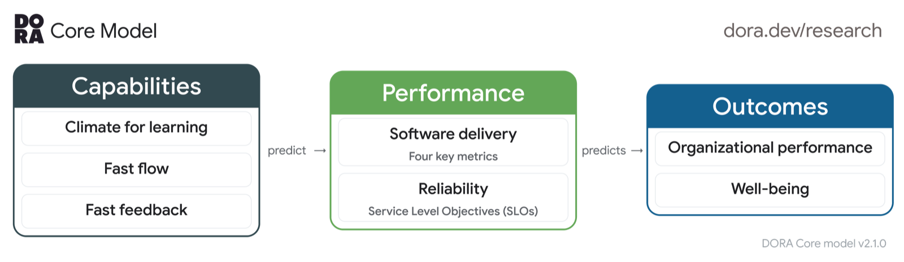

<!-- _paginate: false -->
<!-- _header: '' -->
<!-- _footer: '' -->


---

<!-- _class: light title -->
<!-- _paginate: false -->
<!-- _header: '' -->


# Ship Fast, **Sleep Well**

## Fearless Spring Boot Deployments in the AI Era

DATEV Coding Festival 2026 · October 6, 2026

<!--
Notes:
- TODO: add duration and room.
-->

---

<!-- _paginate: false -->
<!-- _header: '' -->
<!-- _footer: '' -->

<!--
Notes:
- Image prompt: visuals/image-prompts.md (horror picture). Replace assets/horror-friday.png.
- Tell the story: it is Friday, 16:00, the pager rings, a critical bug in production.
-->


---

<!-- _class: light reveal cards3 dark -->

<!--
Notes:
- One box per click (HTML deck only). Ask the room: who knows at least three of these?
-->

## Friday, 4 PM. You are on call.

* **Vibe-coded hotfix**<small>the AI says: looks good</small>
* **45 min pipeline**<small>for a one-line change</small>
* **Tests nobody trusts**<small>what do they verify?</small>
* **No feature flag**<small>rollback or nothing</small>
* **Logs without context**<small>which user? which request?</small>
* **No runbook**<small>who knows what to do?</small>

---

<!-- _paginate: false -->
<!-- _header: '' -->
<!-- _footer: '' -->

<!--
Notes:
- Image prompt: visuals/image-prompts.md (target picture). Replace assets/target-state.png.
-->


---

<!-- _class: light reveal cards3 -->

<!--
Notes:
- The same Friday, a different team.
-->

## Same Friday. Confidence in every commit.

* **Fast pipeline**<small>feedback in minutes</small>
* **Meaningful tests**<small>a real safety net</small>
* **Flag it off**<small>faster than a rollback</small>
* **Structured logs and traces**<small>find the problem fast</small>
* **Alerts and runbooks**<small>calm, known steps</small>
* **Canary tests**<small>we know before users do</small>

---

<!-- _class: light -->

<!--
Notes:
- This is the goal of the talk: how a team moves from A to B, which role AI plays and which processes we need.
-->

## The Goal: From A to B

<div class="flow nw xl">
  <div class="sketch" style="border-color:#b91c1c;color:#b91c1c">A: Hope and heroics<small>slow, scary, on call</small></div>
  <div class="arrow">→</div>
  <div class="sketch accent">Processes<small>build · verify · ship · operate</small></div>
  <div class="arrow">+</div>
  <div class="sketch accent alt">AI<small>tooling and skills</small></div>
  <div class="arrow">→</div>
  <div class="sketch">B: Confident shipping<small>fast, calm, repeatable</small></div>
</div>

<div class="ribbon">AI makes us faster. Processes make us safe.</div>

---


### About Philip

- Software Engineer from Herzogenaurach (HQ of adidas & Puma), right next to Nuremberg 🍻
- Focus on **testing** Java and Spring Boot applications, blogging and content creation 🍃
- Founder of [PragmaTech GmbH](https://pragmatech.digital/) - **Enabling Developers to Frequently Deliver** Software with **More Confidence**

- Here before: **DATEV Coding Festival 2025** with a full-day workshop on Spring Boot testing, and two weeks ago the **DATEV Software Craft Community**, also on Spring Boot testing

<!--
Notes:
- Herzogenaurach is close to Nuremberg, the DATEV crowd knows it. Keep it short.
-->

---

<!-- _class: light reveal -->

<!--
Notes:
- One line per click (HTML deck only). Set expectations: this is not theory and not a framework, it is what I saw work and fail in real teams, including nights on call.
-->

## What to Expect: Best Practices from the Field
* What I have seen myself in **10 years** in multiple teams
* Including **being on call** myself
* Take what fits your team

---

<!-- _class: light -->

<!--
Notes:
- Give the room a few minutes to answer. Then look at the live results together and use them in the lifecycle part.
- TODO: check that the three questions in the Mentimeter match this slide.
-->


## Help Me Understand Your Process

Go to [menti.com](https://www.menti.com/) and enter the code **1354 9993**.

Three anonymous questions:

1. How long from commit to production?
2. How do you stop a broken feature?
3. What do you have when the pager rings?

---

<!-- _class: light -->
<!-- _header: 'The software lifecycle' -->

<!--
Notes:
- Four parts, we walk through them left to right. AI helps in every part, but only with the process in place.
-->

## Four Parts of the Lifecycle

<div class="phases">
  <div class="phase"><h3>1 · Build</h3><ul><li>Meaningful, fast test suite</li><li>Context caching</li><li>Parallelization</li><li>Testcontainers</li><li>Mutation testing</li></ul></div>
  <div class="phase"><h3>2 · Verify</h3><ul><li>SonarQube</li><li>Static code analysis</li><li>Formatting</li><li>Fast, reproducible CI/CD</li></ul></div>
  <div class="phase"><h3>3 · Ship</h3><ul><li>Fast deployments</li><li>Rolling · Blue/Green · A/B</li><li>Feature flags</li><li>Kill switch</li></ul></div>
  <div class="phase"><h3>4 · Operate</h3><ul><li>Structured logging + MDC</li><li>Distributed tracing</li><li>Alerting</li><li>Runbooks</li><li>Canary tests</li></ul></div>
</div>

<div class="ribbon">AI and skills across all four parts</div>

---

<!--
Notes:
- Source: DORA Core Model, as summarized on pragmatech.digital. Fast feedback is a capability that predicts delivery performance.
-->

## Backed by the DORA Research



DORA's core model puts **fast feedback** next to fast flow and a climate for learning.

- These capabilities predict **software delivery performance**
- Delivery performance predicts **organizational performance** and well-being

---

<!-- _class: light section -->
<!-- _header: 'Part 1: Build' -->

## 01 - Build

# A meaningful, fast test suite

<!--
Notes:
- The test suite is the safety net. If it is slow or meaningless, nobody trusts it.
-->

---

<!-- _class: light statement -->

<!--
Notes:
- The test suite is the safety net. A net with holes or a net that takes an hour to check does not catch you. It must be fast AND reliable.
-->

# The test suite is your **safety net**. It must be **fast** and **reliable**.

---

<!-- _class: light -->

<!--
Notes:
- Fast: we only look at the three levers on a high level, in the next slides. Reliable: this needs knowledge and judgment. What to test, which slice, how to avoid flaky tests. I write these best practices down as skills.
-->

## Fast and Reliable

<div class="phases two">
  <div class="phase hot"><h3>Fast</h3><ul><li>Parallelization</li><li>Context caching</li><li>Testcontainers optimizations</li><li><em>high level, next slides</em></li></ul></div>
  <div class="phase"><h3>Reliable</h3><ul><li>Needs <strong>knowledge</strong> and <strong>judgment</strong></li><li>What to test, which slice, no flaky tests</li><li>Mutation testing</li><li>Best practices become <strong>skills</strong></li></ul></div>
</div>

---

<!-- _class: light -->

<!--
Notes:
- Visuals reused from the talk Top 5 Spring Boot Testing Mistakes. Results are from one of my clients.
-->

## The No. #1 Spring Test Hidden Gem

- Starting the `ApplicationContext` costs test execution time
- Every context launch (sliced or full) takes multiple seconds
- Spring Test fixes this with: **TestContext Context Caching**

Results from one of my clients:


---

<!-- _class: light -->

## Context Caching in a Nutshell

```java
// DefaultContextCache.java
private final Map<MergedContextConfiguration, ApplicationContext> contextMap =
  Collections.synchronizedMap(new LinkedHashMap<>(32, 0.75f, true));
```

- Spring Test builds a unique `ApplicationContext` configuration from profiles, properties, classes, etc. (`MergedContextConfiguration`)
- If a later test needs the exact same configuration, Spring hands over a "hot" context
- Goal: as few configuration variants as possible, as many cache hits as possible

---

<!-- _class: light -->

<!--
Notes:
- Same configuration means a cache hit. @MockitoBean, @DirtiesContext, different properties or profiles create a new context.
- Spring Test Profiler shows how many contexts you create.
-->

## Context Caching: Start Spring Once

<div class="flow nw xl">
  <div class="sketch">Test class A</div>
  <div class="sketch">Test class B</div>
  <div class="sketch">Test class C</div>
  <div class="arrow">→</div>
  <div class="sketch accent">1 cached<br>ApplicationContext<small>same config = cache hit</small></div>
</div>

<div class="flow nw xl bad">
  <div class="sketch">@MockitoBean</div>
  <div class="sketch">@DirtiesContext</div>
  <div class="sketch">@ActiveProfiles / properties</div>
  <div class="arrow">→</div>
  <div class="sketch">new context = slow<small>every new context costs seconds</small></div>
</div>

---

<!-- _class: light cards2 -->

<!--
Notes:
- Parallel: JUnit 5 parallel execution, Maven forks. Containers: singleton per image, @ServiceConnection, reuse across test classes.
-->

## Parallel Tests and Faster Containers

* **Test parallelization**<small>JUnit 5 parallel mode and Maven forks, independent tests only</small>
* **Testcontainers**<small>one container per image, @ServiceConnection, shared across classes</small>

---

<!-- _class: light -->

<!--
Notes:
- High coverage can give a false sense of security. Ask: would any test fail if one of these conditions were wrong?
-->

## Let's Challenge Code Coverage

Imagine a set of unit tests for this isolated business logic:

```java
public Long registerUser(int age, String username) {

  if (age <= 18) {
    throw new IllegalArgumentException("User must be at least 18 years old");
  }

  if ("ADMIN".equalsIgnoreCase(username)) {
    throw new IllegalArgumentException("Username 'ADMIN' is not allowed");
  }

  // ...

}
```

---

<!-- _class: light -->

<!--
Notes:
- PIT changes the code (flips a condition, changes a return value) and runs the tests. A failing test kills the mutant. A surviving mutant is a blind spot in the safety net. Great check for AI-written tests. Run it incrementally, only for changed code.
-->

## Idea: Introduce Regressions to Verify Test Quality


---

<!-- _class: light -->

<!--
Notes:
- Reliable tests need judgment. I wrote mine down as a skill library for Spring Boot testing, so an AI agent follows the same rules I would. Same structure as in the Prompt It Right talk.
-->

## My Skill Library for Spring Boot Testing

```text
.claude/skills/spring-boot-testing/
├── unit-testing            fast tests without context bloat
├── slice-testing           right-sized Spring context slices
├── slice-web-testing       web layer with @WebMvcTest
├── integration-testing     full-context tests that stay fast
├── testcontainers-setup    real infrastructure, one container per image
├── e2e-ui-testing          user journeys against the running app
└── test-setup-review       flags test anti-patterns for you
```

Rules, best practices and anti-patterns, written down **once**. The agent follows **your** judgment.

---

<!-- _class: light -->

<!--
Notes:
- Adapted from Prompt It Right. The agent reaches the CI state (GitHub MCP), the browser (Playwright MCP), the tests (shell) and the running application itself. No copy and paste between you and the agent. The human reviews every step: a tight loop, in seconds, not days.
-->

## Build with a Tight Feedback Loop: Agent and Human

<div class="hub">
  <div class="sketch gh">CI<small>PRs, pipeline runs, job logs</small></div>
  <div class="link l1"><b>&#8597;</b>GitHub MCP</div>
  <div class="sketch tests">Tests<small>./mvnw test</small></div>
  <div class="link l2"><b>&#8596;</b>shell</div>
  <div class="sketch accent agent">Agent<small>plan, code, test, fix</small></div>
  <div class="link l3"><b>&#8596;</b>Playwright MCP</div>
  <div class="sketch browser">Browser<small>rendered page, screenshots</small></div>
  <div class="link l4"><b>&#8597;</b>spring-boot:run</div>
  <div class="sketch alt app">Application, local<small>http://localhost:8080</small></div>
</div>

<div class="ribbon">You review every step: a tight loop, seconds instead of days</div>

---

<!-- _class: light section -->
<!-- _header: 'Part 2: Verify' -->

## 02 - Verify

# Check everything you can before it ships

---

<!-- _class: light reveal cards3 -->

<!--
Notes:
- Everything that a machine can check, a machine should check, on every commit.
-->

## Automate Every Check You Can

* **SonarQube**<small>code quality and security hotspots</small>
* **Static analysis**<small>Error Prone · SpotBugs · ArchUnit</small>
* **Formatting**<small>Spotless · Checkstyle</small>
* **Dependencies**<small>Renovate · Dependabot</small>
* **Secret scanning**<small>no keys in Git</small>
* **Quality gates**<small>fail the build, not production</small>

---

<!-- _class: light -->

<!--
Notes:
- Fast and reproducible: same result on every run, no snowflake build server, triggerable at any time, also on Friday.
-->

## CI/CD: Fast, Reproducible, Always Triggerable

<div class="flow nw xl">
  <div class="sketch">Commit</div>
  <div class="arrow">→</div>
  <div class="sketch accent">Build</div>
  <div class="arrow">→</div>
  <div class="sketch accent">Test</div>
  <div class="arrow">→</div>
  <div class="sketch accent">Analyze</div>
  <div class="arrow">→</div>
  <div class="sketch accent">Package</div>
  <div class="arrow">→</div>
  <div class="sketch">Deploy</div>
</div>

<div class="flow nw xl">
  <div class="sketch alt">Fast<small>minutes, not an hour</small></div>
  <div class="sketch">Reproducible<small>same input, same result</small></div>
  <div class="sketch alt">On demand<small>any time, any day</small></div>
</div>

---

<!-- _class: light section -->
<!-- _header: 'Part 3: Ship' -->

## 03 - Ship

# Deploy is not release

---

<!-- _class: light -->

<!--
Notes:
- Focus on a fast deployment. Rolling update with 2-3 Spring Boot containers: start the new version, wait for the health check, shift traffic, stop the old container, repeat. Target: whole rollout in about 5-8 minutes, the faster the better. Slow startup is a cost here: use the context and startup optimizations you know. Also possible: blue/green (two environments, switch traffic) and canary or A/B (small share of traffic first).
-->

## Fast Deployments: Rolling Update

<div class="phases three">
  <div class="phase"><h3>1 · Start v2</h3>
    <div class="flow nw mini"><div class="sketch">v1</div><div class="sketch">v1</div><div class="sketch">v1</div><div class="sketch accent">v2</div></div>
    <p>New container starts, health check turns green</p></div>
  <div class="phase"><h3>2 · Swap</h3>
    <div class="flow nw mini"><div class="sketch">v1</div><div class="sketch">v1</div><div class="sketch accent">v2</div></div>
    <p>Traffic shifts, one old container stops</p></div>
  <div class="phase"><h3>3 · Repeat</h3>
    <div class="flow nw mini"><div class="sketch accent">v2</div><div class="sketch accent">v2</div><div class="sketch accent">v2</div></div>
    <p>All 2-3 containers run the new version</p></div>
</div>

<div class="ribbon">The whole rollout in ~5-8 minutes. The faster, the better.</div>

---

<!-- _class: light -->

<!--
Notes:
- A fast deployment makes small, frequent deployments cheap. Feature flags then decouple the deployment from the release: the code is in production but switched off, and we release when we are ready.
-->

## Decouple Deployment from Release

<div class="flow nw xl">
  <div class="sketch">Deploy<small>new code in production, feature OFF</small></div>
  <div class="arrow">→</div>
  <div class="sketch accent">Release<small>flip the flag: key users first</small></div>
  <div class="arrow">→</div>
  <div class="sketch accent alt">Everyone<small>gradual rollout, kill switch ready</small></div>
</div>

<div class="flow nw xl">
  <div class="sketch">~5-8 min<small>deploy small and often</small></div>
  <div class="sketch alt">seconds<small>release and undo</small></div>
</div>

<div class="ribbon">Deploy small and often. Release when you are ready.</div>

---

<!-- _class: light -->

<!--
Notes:
- Togglz is a Java library with a Spring Boot starter and an admin console (dashboard). You can switch features on and off at runtime and use activation strategies, for example by username, by role or gradual rollout. Verify the exact strategy names against the current docs before the talk.
- More advanced: LaunchDarkly (managed service, targeting, experiments).
- Verified in the demo project of this repo: Togglz 4.6.4 with the Spring Boot starter and togglz-console runs on Spring Boot 4.1.1.
-->

## Feature Flags with Togglz

```java {4-7}
public enum Features implements Feature {

    @Label("New checkout flow")
    NEW_CHECKOUT;

    public boolean isActive() {
        return FeatureContext.getFeatureManager().isActive(this);
    }
}
```

Dashboard: switch on for **key users** or **roles** first, then everyone. More advanced: **LaunchDarkly**.

---

<!-- _class: light -->

<!--
Notes:
- Own screenshot of the demo project in this repository (Spring Boot 4.1.1, Java 21, Togglz 4.6.4, togglz-console). Strategies shown: users by name and gradual rollout. Run it with: JAVA_HOME=<jdk21> ./mvnw spring-boot:run and open /togglz-console/index.
-->

## The Togglz Admin Console


**Status** and **strategy** per feature: key users first, gradual rollout, switch **at runtime** without a deployment.

---

<!-- _class: light -->

<!--
Notes:
- A rollback needs a new pipeline run and a deployment. A flag switch takes seconds.
-->

## Kill Switch: Faster Than a Rollback

<div class="flow nw xl bad">
  <div class="sketch">Rollback<small>revert · pipeline · deploy · verify</small></div>
  <div class="arrow">=</div>
  <div class="sketch">minutes</div>
</div>

<div class="flow nw xl">
  <div class="sketch accent">Flip the flag off<small>one click in the dashboard</small></div>
  <div class="arrow">=</div>
  <div class="sketch accent">seconds</div>
</div>

---

<!-- _class: light section -->
<!-- _header: 'Part 4: Operate' -->

## 04 - Operate

# See it, find it, fix it

---

<!-- _class: light -->

<!--
Notes:
- The default Spring Boot log line: readable for a human, but hard for a machine. Which user? Which order? Which request? We grep and hope.
-->

## Default Log: Readable, but Hard to Query

```text
2026-10-06T10:15:32.481+02:00 ERROR 4711 --- [nio-8080-exec-3] d.p.shipfast.CheckoutService : Payment failed
2026-10-06T10:15:32.502+02:00  WARN 4711 --- [nio-8080-exec-7] d.p.shipfast.CheckoutService : Retrying payment
2026-10-06T10:15:33.114+02:00 ERROR 4711 --- [nio-8080-exec-3] d.p.shipfast.CheckoutService : Payment failed
```

Which **user**? Which **order**? Which **request**? You grep and hope.

---

<!-- _class: light -->

<!--
Notes:
- Spring Boot supports structured logging out of the box (ECS, Logstash, GELF). MDC entries are added to the JSON as extra fields. A filter puts the user ID into the MDC so every log line carries it. Clear the MDC afterwards.
- TODO: verify the property and field names with the Spring Boot version used in the demo.
-->

## Structured Logging with MDC: JSON and Extra Fields

```yaml
logging.structured.format.console: ecs
```

```java {1,3}
MDC.put("userId", authentication.getName());
try { chain.doFilter(request, response); }
finally { MDC.clear(); }
```

```json
{
  "log.level": "ERROR",
  "message": "Payment failed",
  "userId": "u-4711",
  "orderId": "o-815",
  "trace.id": "4bf92f3577b34da6"
}
```

The log query `userId:u-4711` now finds exactly what this user did.

---

<!-- _class: light -->

<!--
Notes:
- Illustrative trace: one HTTP POST on our endpoint, an HTTP call to the neighbor team, then our own DB access. Spans are indented by nesting. The slow span sits in the neighbor team's service: without tracing we would search in our own code. Replace with a real screenshot (Grafana Tempo, Jaeger, Zipkin) from the demo if possible.
-->

## Distributed Tracing: Where Is the Problem?

<div class="spans">
  <div class="row"><div class="label">POST /orders</div><div class="track"><div class="bar">480 ms</div></div></div>
  <div class="row"><div class="label">OrderService.placeOrder()</div><div class="track"><div class="bar">465 ms</div></div></div>
  <div class="row"><div class="label">HTTP POST payment-service (neighbor team)</div><div class="track"><div class="bar slow">340 ms</div></div></div>
  <div class="row"><div class="label">POST /payments (their endpoint)</div><div class="track"><div class="bar slow">310 ms</div></div></div>
  <div class="row"><div class="label">INSERT INTO orders (our DB)</div><div class="track"><div class="bar">65 ms</div></div></div>
</div>

One trace crosses the **team boundary**: the slow span sits in the **neighbor team's** service, not in our code.

---

<!-- _class: light -->

<!--
Notes:
- Alert on symptoms users feel (error rate, latency, failed canary), not on every CPU spike. The alert message links straight to the runbook.
-->

## Alerting and Runbooks

<div class="flow nw xl">
  <div class="sketch accent">Alert<small>error rate · latency · canary</small></div>
  <div class="arrow">→</div>
  <div class="sketch">On-call<small>the right person</small></div>
  <div class="arrow">→</div>
  <div class="sketch accent">Runbook<small>known first steps</small></div>
  <div class="arrow">→</div>
  <div class="sketch">Fix or flag off</div>
</div>

<div class="ribbon">A runbook: symptom · impact · first checks with deep links to logs, traces and dashboards · mitigation · escalation</div>

---

<!-- _class: light -->

<!--
Notes:
- A real sample runbook, from our book Stratospheric. Open the link live. Point out: diagnosis steps with deep links, and the mitigation 'payment provider unavailable: disable the feature' which is exactly a feature flag. Mitigation for a bad release: revert and redeploy.
-->

## Example Runbook: ELB 5xx Alarm

<div class="phases">
  <div class="phase"><h3>Meaning</h3><ul><li>Users see a high rate of HTTP 5xx errors</li></ul></div>
  <div class="phase"><h3>Impact</h3><ul><li>Users cannot work with the app</li><li>Clients cannot sync</li></ul></div>
  <div class="phase hot"><h3>Diagnosis</h3><ul><li>Ongoing platform incident?</li><li>Logs</li><li>Operational dashboard</li></ul></div>
  <div class="phase hot"><h3>Mitigation</h3><ul><li>Provider down: disable the feature</li><li>Bad release: revert and redeploy</li></ul></div>
</div>

[github.com/stratospheric-dev/stratospheric/.../elb5xxAlarm.md](https://github.com/stratospheric-dev/stratospheric/blob/main/docs/runbooks/elb5xxAlarm.md)

---

<!-- _class: light -->

<!--
Notes:
- We cannot test everything before production. Canary tests are end-to-end tests that run all the time, ideally in production, with a dedicated test user. They give true feedback and can trigger the alert before a customer calls.
-->

## Canary Tests: Test in Production, Continuously

<div class="flow nw xl">
  <div class="sketch">Scheduler<small>every few minutes</small></div>
  <div class="arrow">→</div>
  <div class="sketch accent">Test user<small>real user journeys</small></div>
  <div class="arrow">→</div>
  <div class="sketch">Production</div>
  <div class="arrow">→</div>
  <div class="sketch accent">Assert + alert<small>before users notice</small></div>
</div>

<div class="ribbon">End-to-end tests that run all the time: true feedback from production</div>

---

<!-- _class: light section -->
<!-- _header: 'AI and skills' -->

## 05 - The Role of AI

# AI gets us there faster

---

<!-- _class: light reveal cards3 -->

<!--
Notes:
- AI can write code and tests, but the judgment must be written down once as skills: what makes a meaningful test, how we structure it, how we log. Then the agent follows our rules.
-->

## Skills Carry Your Judgment

* **Test skill**<small>what makes a meaningful test</small>
* **Structure skill**<small>how we layer and name tests</small>
* **Logging skill**<small>JSON logs, MDC, no secrets</small>
* **Review skill**<small>flags test anti-patterns</small>
* **Runbook skill**<small>draft from alert and code</small>
* **Pipeline skill**<small>keep it fast and reproducible</small>

---

<!-- _class: light reveal cards4 big -->

<!--
Notes:
- Summary: the big toolkit, one box per click (HTML deck only). Together they give confidence in every commit.
-->

* **Fast tests**<small>meaningful and cached</small>
* **Static checks**<small>Sonar · formatting</small>
* **CI/CD**<small>fast and reproducible</small>
* **Feature flags**<small>deploy is not release</small>
* **Logs and traces**<small>JSON · MDC · spans</small>
* **Alerting**<small>the right people, fast</small>
* **Runbooks**<small>know what to do</small>
* **Canary tests**<small>true feedback</small>

---

<!-- _class: light statement -->

# You will ship a bug. **How fast you recover is what counts.**

---

<!-- _class: light closing -->
<!-- _paginate: false -->
<!-- _header: '' -->
<!-- _footer: '' -->


# Fearless Shipping!

Thank you! Questions?

The **Spring Boot Testing Newsletter**: best practices, recipes and quick wins in your inbox - **rieckpil.de/newsletter**


- [LinkedIn: linkedin.com/in/rieckpil](https://www.linkedin.com/in/rieckpil)
- [Mail: philip@pragmatech.digital](mailto:philip@pragmatech.digital)
