<!-- header: "" -->
<!-- footer: ""-->

---
<!--

Notes:

- Despite having AI, who still wirtes test by hand
- and who enjoys it? -> I do and hope I can change that for some of you today

-->
<!-- _class: title -->


# Stop Fighting Your Spring Boot Tests

## Patterns für zuverlässige & schnelle Builds

_Nürnberger Versicherung 03.12.2025_

Philip Riecks - [PragmaTech GmbH](https://pragmatech.digital/) - [@rieckpil](https://x.com/rieckpil)

---


## Interaktive Teilnahme


Gehe auf [menti.com](https://www.menti.com/) und verwende den Code **2578 7937**, um **anonym** Antworten zu den Quizfragen einzureichen und während des Vortrags Fragen zu stellen.

Starte mit den ersten beiden Fragen:
- Schreibst du deine Tests trotz LLMs und Code Agents noch von Hand?
- Macht dir das Schreiben von automatisierten Tests Spaß?

---

<!-- paginate: false -->

<!-- header: '' -->
<!-- footer: '' -->
<!--


-->

<!-- header: 'Nürnberger Versicherung 03.12.2025 - Fragen & FAQ @ menti.com Code: <strong>2578 7937</strong>' -->
<!-- footer: '' -->
## Spring Boot Testing - The Bad & Ugly


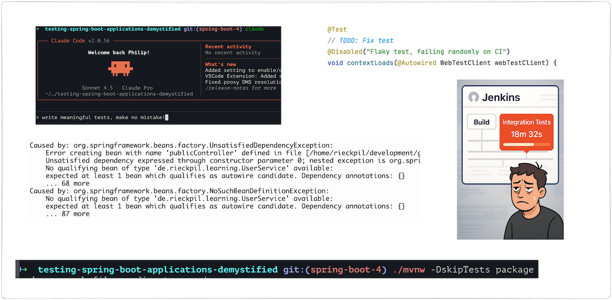

---

<!--
- Automatisiertes Testen macht es uns nicht leicht
- Langsame & flaky tests
- Spring Boot komplexität, auto-configuration, neues Framework
- Die Versuchung alles mit AI zu lösen


-->

## Spring Boot Testing - The Good

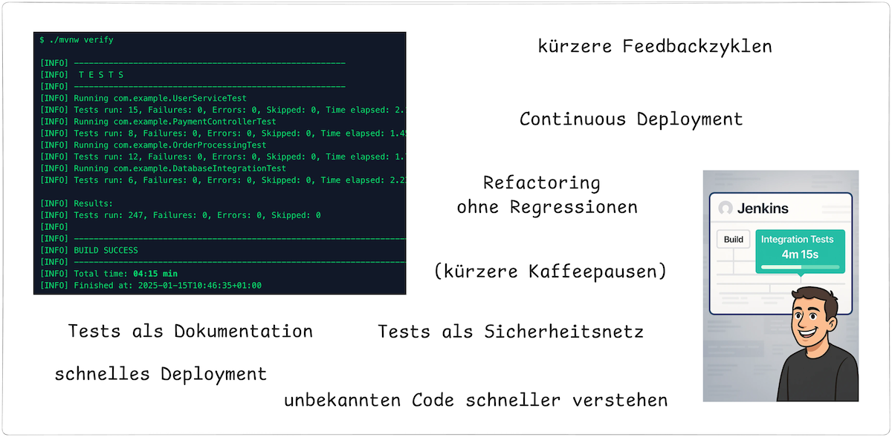

<!--
- Es geht aber auch anders

-->

---


## Mein Nordstern

Stell dir vor, du siehst diesen Pull Request an einem Freitagnachmittag:


Wie zuversichtlich bist du, dieses Spring Boot Upgrade zu mergen und in Produktion zu deployen, sobald die Pipeline grün ist?

Gute Tests finden nicht nur Bugs – sie geben dir das Vertrauen, ohne Zögern zu deployen.

---

## Ziele für die nächsten 45 Minuten


- Das Fundament für erfolgreiches Testen von Spring Boot Anwendungen legen
- Einführung in Spring Boots hervorragende Test-Unterstützung
- Spring Boot Testing Best Practices und häufige Pitfalls
- Hands-On Tipps zur Optimierung von Build-Zeiten


---


## Über Philip

- Selbstständiger Entwickler aus Herzogenaurach 🍻
- Blogging & Content-Erstellung mit Fokus auf das Testen von Java und speziell Spring Boot Anwendungen 🍃
- Gründer der PragmaTech GmbH - Entwickler befähigen, Software häufiger und mit mehr Vertrauen zu deployen 🚤

---


## Agenda


- Einführung
- Testen mit Spring Boot
  - Part 1: Die Spring Boot Test Pyramide
  - Part 2: Geschwindigkeit & Stabilität für deine Spring Boot Test Suite
  - Part 3: Warum Spring Boot Tests Probleme machen
- Zusammenfassung & Ausblick
- FAQ

---

<!--

Notes:
- Not because a definition of done says "all tests must pass"
- Not to reach a coverage goal


-->


# Part 1: Die Spring Boot Test Pyramide

---


## Testing - Pyramid, Honeycomb, Diamond, Trophy?

- Die klassische Testpyramide ist ein guter Ausgangspunkt, aber kein Dogma
- Nicht 1:1 auf jedes Projekt übertragbar
- Viele alternative Modelle: Testing Trophy, Testing Honeycomb, Testing Diamond, etc.
- Die richtige Teststrategie hängt stark vom Projektkontext ab
- Schwer messbar, aber entscheidend: das subjektive Selbstvertrauen bei der Entwicklung & Deployment

---

## Spring Boot Testarten

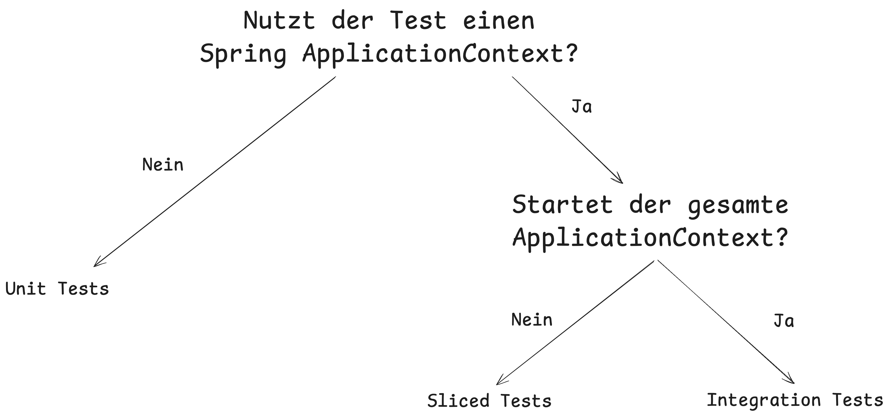

---

## Unit Testing mit Spring Boot

- Spring Boot Starter Test ("Testing Schweizertaschenmesser"): Bringt notwendige Test-Bibliotheken mit (JUnit, Mockito, AssertJ, etc.)
- B
- C

---

## Sliced Testing mit Spring Boot

- A
- B
- C

---

## Integration Testing mit Spring Boot

- A
- B
- C

---


# Part 2: Geschwindigkeit & Stabilität für deine Spring Boot Test Suite

---

## The Need for Speed - Reducing Build Times (Problem #3)

- **The** **problem**: Integration tests require a started & initialized Spring `ApplicationContext`, which takes time to start
- **The** **solution**: Spring Test `TestContext` caching, caches an already started Spring `ApplicationContext` for later reuse
- This feature is part of Spring Test (part of every Spring Boot project via `spring-boot-starter-test`)

Speed improvement example:

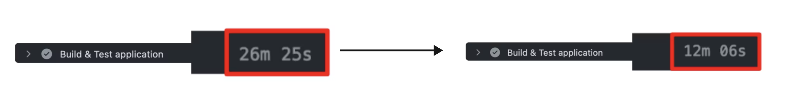

---

## Caching is King

How the caching mechanism works:

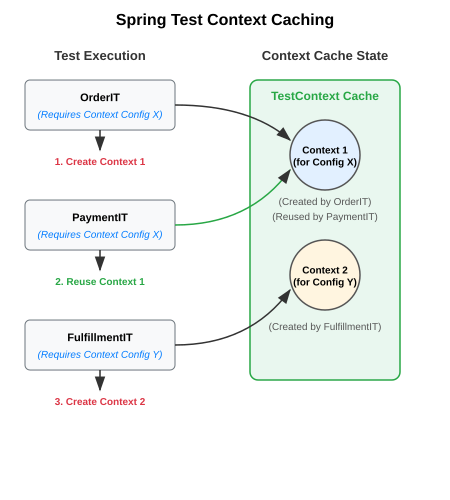

---

## How the Cache Key is Built

```java
// DefaultContextCache.java
private final Map<MergedContextConfiguration, ApplicationContext> contextMap =
  Collections.synchronizedMap(new LruCache(32, 0.75f));
```

This goes into the cache key (`MergedContextConfiguration`):

- activeProfiles (`@ActiveProfiles`)
- contextInitializersClasses (`@ContextConfiguration`)
- propertySourceLocations (`@TestPropertySource`)
- propertySourceProperties (`@TestPropertySource`)
- contextCustomizer (`@MockitoBean`, `@MockBean`, `@DynamicPropertySource`, ...)
- etc.

---
## Identify Context Restarts - Visually


---

## Identify Context Restarts - with Logs


---

## Identify Context Restarts - with Tools


An [open-source Spring Test utility](https://github.com/PragmaTech-GmbH/spring-test-profiler) that provides visualization and insights for Spring Test execution, with a focus on Spring context caching statistics.

**Overall goal**: Identify optimization opportunities in your Spring Test suite to speed up your builds and ship to production faster and with more confidence.

---


## The Final Boss

Developers tend to consult AI/StackOverflow for integration test issues and often copy advice from the internet without knowing the implications:

```java
@SpringBootTest
@DirtiesContext
// this instructs Spring to remove the context from the cache
// and rebuild a new context on every request
public abstract class AbstractIntegrationTest {

}
```

The setup above will **disable** the context caching feature and slow down the builds significantly!


---

## Spot the Issues for Context Caching

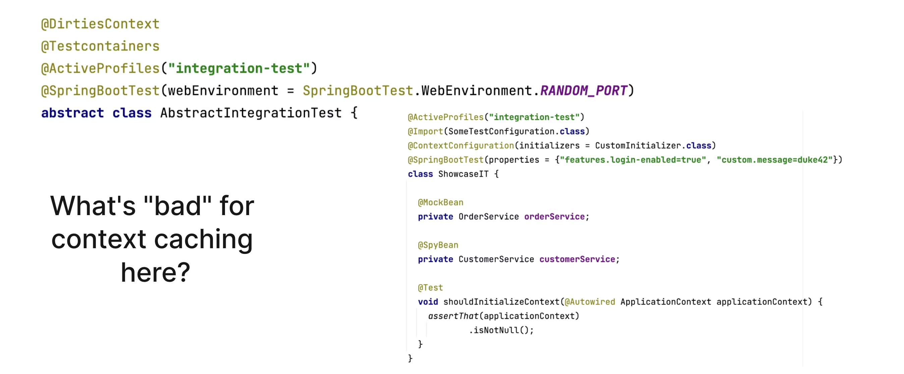


---


## Outlook to Spring Framework 7: Pausing of Test Contexts

See the release notes of [Spring Framework 7.0.0 M7](https://spring.io/blog/2025/07/17/spring-framework-7-0-0-M7-available-now).

> Pausing of Test Application Contexts
>
> The Spring TestContext framework is caching application context instances within test suites for faster runs. As of Spring Framework 7.0, we now pause test application contexts when
> they're not used.
>
> This means an application context stored in the context cache will be stopped when it is no longer actively in use and automatically restarted the next time the
> context is retrieved from the cache.
>
> Specifically, the latter will restart all auto-startup beans in the application context, effectively restoring the lifecycle state.


---

## Make the Most of the Caching Feature


- Avoid `@DirtiesContext` when possible, especially central places
- Understand how the cache key is built
- Monitor and investigate the context restarts
- Align the number of unique context configurations for your test suite


---

### Best Practice 1: Test Parallelization

**Goal**: Reduce build time and get faster feedback

Requirements:
- No shared state
- No dependency between tests and their execution order
- No mutation of global state

Two ways to achieve this:
- Fork a new JVM with Surefire/Failsafe and let it run in parallel -> more resources but isolated execution
- Use JUnit Jupiter's parallelization mode and let it run in the same JVM with multiple threads

---

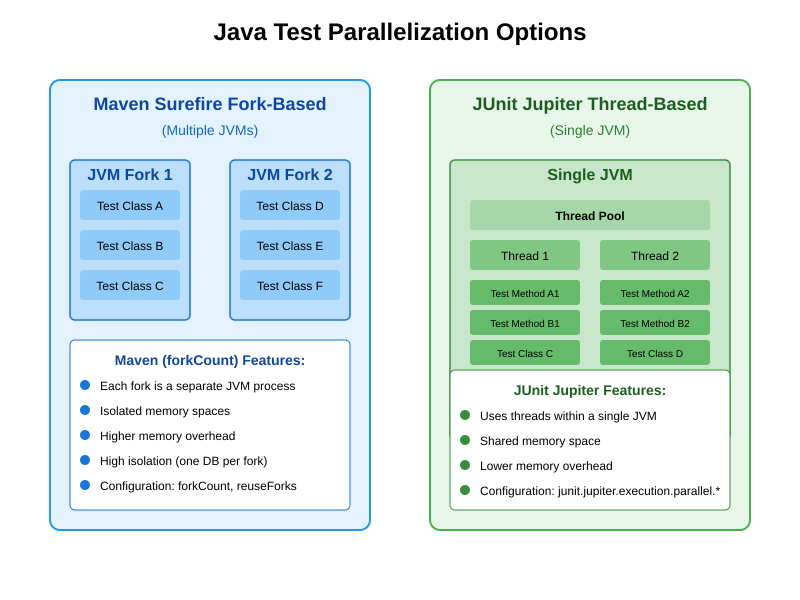

---

<!--

Notes:
- Useful to get started
- Boilerplate and skeleton help
- LLM very usueful for boilerplate setup, test data, test migration (e.g. Kotlin -> Java)
- ChatBots might not produce compilable/working test code, agents are better
-->

### Best Practice 2: Get Help from AI & Automation Tools

- [Diffblue Cover](https://www.diffblue.com/): AI Agent for unit testing complex (Spring Boot) Java code at scale
- My go-to CLI code agent: Claude Code
- TDD with an LLM?
- (Not AI but still useful) OpenRewrite for [automatic code migrations](https://docs.openrewrite.org/recipes/java/testing) (e.g. JUnit 4 -> JUnit 5)
- Clearly define your requirements in e.g. `claude.md` or Cursor rule files to adopt a common test structure

---


# Part 3: Warum & wann Spring Boot Tests Probleme machen

---

## Maven Build Lifecycle

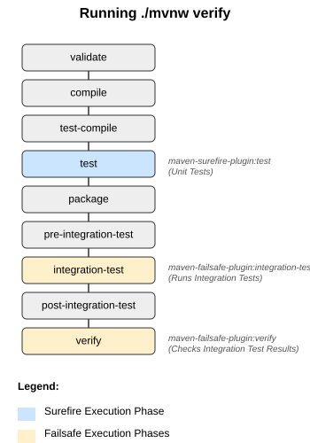

- **Maven Surefire Plugin** for unit tests: default postfix  `*Test` (e.g. `CustomerTest`)
- **Maven Failsafe Plugin** for integration tests: default postfix `*IT` (e.g. `CheckoutIT`)
- Reason for splitting: fail fast, configure different **parallelization** options, better **organisation**

---


### Gradle Build Lifecycle

- Unit tests are run during the `test` task
- To separate integration tests, we need a custom Gradle task, as this structure is **not part** of default Gradle lifecycle
- We [need to configure](https://docs.gradle.org/current/userguide/java_testing.html#sec:configuring_java_integration_tests) the `integrationTest` task manually in our `build.gradle`:

```groovy
// Sample configuration from the Gradle docs
tasks.register('integrationTest', Test) {
  description = 'Runs integration tests.'
  group = 'verification'

  // ...
  shouldRunAfter test

  useJUnitPlatform()
}
```


---

## Spring Boot Starter Test

<!--

Notes:

- Show the `spring-boot-starter-test` dependency and Maven dependency tree
- Show manual overriden


-->


- aka. "Testing Swiss Army Knife"


```xml
<dependency>
  <groupId>org.springframework.boot</groupId>
  <artifactId>spring-boot-starter-test</artifactId>
  <scope>test</scope>
</dependency>
```

- Batteries-included for testing by transitively including popular testing libraries
  - JUnit
  - Mockito
  - Assertion libraries: AssertJ, Hamcrest, XMLUnit, JSONAssert, Awaitility
---
<!--
Notes:
- Go to IDE to show the start
- Navigate to the parent pom to see the management
- Show the sample test to have seen the libraries at least once

Tips:
- Favor JUnit 5 over JUnit 4
- Pick one assertion library or at least not mix it within the same test class
-->

```shell {4-6,12,14,15-16,23,27,32}
./mvnw dependency:tree
[INFO] ...
[INFO] +- org.springframework.boot:spring-boot-starter-test:jar:3.5.6:test
[INFO] |  +- org.springframework.boot:spring-boot-test:jar:3.5.6:test
[INFO] |  +- org.springframework.boot:spring-boot-test-autoconfigure:jar:3.5.6:test
[INFO] |  +- com.jayway.jsonpath:json-path:jar:2.9.0:test
[INFO] |  +- jakarta.xml.bind:jakarta.xml.bind-api:jar:4.0.2:test
[INFO] |  |  \- jakarta.activation:jakarta.activation-api:jar:2.1.4:test
[INFO] |  +- net.minidev:json-smart:jar:2.5.2:test
[INFO] |  |  \- net.minidev:accessors-smart:jar:2.5.2:test
[INFO] |  |     \- org.ow2.asm:asm:jar:9.7.1:test
[INFO] |  +- org.assertj:assertj-core:jar:3.27.4:test
[INFO] |  |  \- net.bytebuddy:byte-buddy:jar:1.17.7:test
[INFO] |  +- org.awaitility:awaitility:jar:4.3.0:test
[INFO] |  +- org.hamcrest:hamcrest:jar:3.0:test
[INFO] |  +- org.junit.jupiter:junit-jupiter:jar:5.12.2:test
[INFO] |  |  +- org.junit.jupiter:junit-jupiter-api:jar:5.12.2:test
[INFO] |  |  |  +- org.junit.platform:junit-platform-commons:jar:1.12.2:test
[INFO] |  |  |  \- org.apiguardian:apiguardian-api:jar:1.1.2:test
[INFO] |  |  +- org.junit.jupiter:junit-jupiter-params:jar:5.12.2:test
[INFO] |  |  \- org.junit.jupiter:junit-jupiter-engine:jar:5.12.2:test
[INFO] |  |     \- org.junit.platform:junit-platform-engine:jar:1.12.2:test
[INFO] |  +- org.mockito:mockito-core:jar:5.16.0:test
[INFO] |  |  +- net.bytebuddy:byte-buddy-agent:jar:1.17.7:test
[INFO] |  |  \- org.objenesis:objenesis:jar:3.3:test
[INFO] |  +- org.mockito:mockito-junit-jupiter:jar:5.16.0:test
[INFO] |  +- org.skyscreamer:jsonassert:jar:1.5.3:test
[INFO] |  |  \- com.vaadin.external.google:android-json:jar:0.0.20131108.vaadin1:test
[INFO] |  +- org.springframework:spring-core:jar:6.2.11:compile
[INFO] |  |  \- org.springframework:spring-jcl:jar:6.2.11:compile
[INFO] |  +- org.springframework:spring-test:jar:6.2.11:test
[INFO] |  \- org.xmlunit:xmlunit-core:jar:2.10.4:test
```

---


## What's Inside the Testing Swiss Army Knife?

- **JUnit** (currently 5, later 6): Java's de-facto standard testing framework and foundation.
- **Mockito**: Creating mock objects to simulate dependencies and verify interactions.
- **AssertJ**: Provides fluent, chainable, and readable assertions.
- **Hamcrest**: Offers flexible matchers for creating custom assertions.
- **JSONAssert**: Compares JSON strings with flexible matching options.
- **JsonPath**: Extracts and queries data from JSON similar to XPath.
- **XMLUnit**: Compares and validates XML documents.
- **Awaitility**: Handles asynchronous testing with fluent conditions.

---

## Unit Testing Spring Boot Applications 101

- **Core Concept**: Test individual components (classes, methods) in complete isolation from their dependencies.

- **Confidence Gained**: Provides logarithmic verifications, ensuring that the smallest parts of your code work as expected under various conditions.

- **Best Practices**: Focus on a single unit of work.

- **Pitfalls**: Requires a well-thought-out class design. Poor design can lead to testing overly complex "god classes," making tests difficult to write and maintain.

- **Tools**: JUnit (or Spock, TestNG, etc.), Mockito and assertion libraries like AssertJ or Hamcrest.

---

## Unit Testing Has Limits

Consider this sample REST controller, what could we verify with a unit test?

```java
@RestController
@RequestMapping("/api/customers")
public class CustomerController {

  private final CustomerService customerService;

  public CustomerController(CustomerService customerService) {
    this.customerService = customerService;
  }

  @PostMapping
  public ResponseEntity<Void> createNewCustomer(@Validated CustomerCreationRequest payload, UriComponentsBuilder uriBuilder) {

    String customerId = customerService.createNewCustomer(payload.firstName());

    UriComponents uriComponents = uriBuilder
      .path("/api/customers/{id}")
      .buildAndExpand(customerId);

    return ResponseEntity.created(uriComponents.toUri()).build();
  }
}
```

---

```java {15-18}
@ExtendWith(MockitoExtension.class)
class CustomerControllerUnitTests {

  @Mock
  private CustomerService customerService;

  @InjectMocks
  private CustomerController customerController;

  @Test
  void shouldCreateCustomerWhenPayloadRequestIsValid() {
    when(customerService.createNewCustomer(anyString()))
      .thenReturn("42");

    ResponseEntity<Void> result = customerController.createNewCustomer(
      new CustomerCreationRequest("Java", "Duke", "duke@jug.ch"),
      UriComponentsBuilder.newInstance()
    );

    assertThat(result.getStatusCode().value())
      .isEqualTo(201);
    assertThat(result.getHeaders().getLocation().toString())
      .isEqualTo("/api/customers/42");
  }
}
```

---

## Things We Can't Cover with a Unit Test

- **Request Mapping**: Does HTTP GET `/api/customers/{id}` actually resolve to our desired method?
- **Validation**: Will incomplete request bodys result in a 400 bad request or return an accidental 201?
- **Serialization**: Are we JSON objects serialized and deserialized correctly?
- **Headers**: Are we setting `Content-Type` or custom headers correctly?
- **Security**: Are we Spring Security configuration and other authorization checks enforced?

---

# Sliced Testing

A better alternative from some parts of our application compared to unit testing.

<!--

Notes:

- Show the exclude filter in @WebMvcTest

-->


---

## A Typical Spring `ApplicationContext`

Our application context consists of many different components (Spring beans):


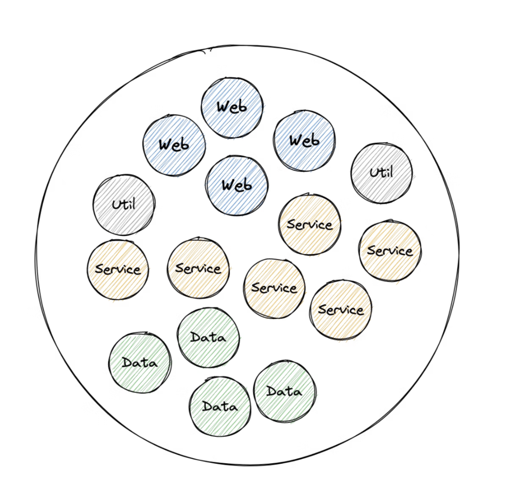

---

## We Can Slice It!

Spring Boot allows to load only specific parts (slices) of the application context:


---
## Slicing in Action

Spring Boot's test slice component scanning will only include relevant beans in the sliced context. We need to provide or mock beans that are not part of the slice:

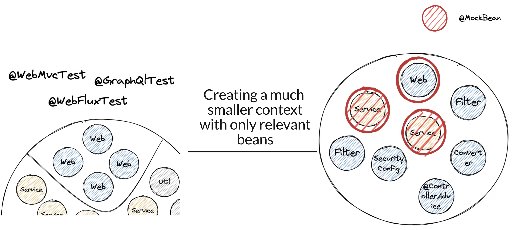

---

## Sliced Testing Spring Boot Applications 101

- **Core Concept**: Test a specific "slice" or layer of your application by loading a minimal, relevant part of the Spring `ApplicationContext`.

- **Confidence Gained**: Helps validate parts of your application where pure unit testing is insufficient, like the web, messaging, or data layer.

- **Prominent Examples:** Web layer (`@WebMvcTest`) and database layer (`@DataJpaTest`)

- **Pitfalls**: Requires careful configuration to ensure only the necessary slice of the context is loaded.

- **Tools**: JUnit, Mockito, Spring Test, Spring Boot, Testcontainers

---

## Slicing Example: `@WebMvcTest`

- Testing the web layer in isolation and only load the beans we need
- `MockMvc`: Mocked servlet environment with HTTP semantics
- See `WebMvcTypeExcludeFilter` for included Spring beans

```java
@WebMvcTest(CustomerController.class)
class CustomerControllerTest {

  @Autowired
  private MockMvc mockMvc;

  @MockitoBean
  private CustomerService customerService;

}
```

---

## Common Test Slices

- `@WebMvcTest`/`@WebFluxTest` - Controller layer
- `@DataJpaTest`/`@JdbcTest` - Persistence layer
- `@JsonTest` - JSON serialization/deserialization
- `@RestClientTest` - RestTemplate testing
- etc.

---


---

# Integration Testing

Writing tests against the whole `ApplicationContext`.


---

<!--

Notes:

- Ask who is using Testcontainers?

-->


---

## Integration Testing Spring Boot Applications 101

- **Core Concept**: Start the entire Spring application context, often on a random local port, and test the application through its external interfaces (e.g., REST API).

- **Confidence Gained**: Validates the integration of all internal components working together as a complete application.

- **Best Practices**: Use `@SpringBootTest` to run the app on a local port.

- **Pitfalls**: Slower to run than unit or sliced tests. Managing the lifecycle of dependent services can be complex.

- **Tools**: JUnit, Mockito, Spring Test, Spring Boot, Testcontainers, WireMock (for mocking external HTTP services), Selenium (for browser-based UI testing)

---

## Starting the Entire `ApplicationContext`

- **Problem #1**: How to ensure surrounding infrastructure (e.g. database, queues, etc.) is present?
- **Problem #2**: How to handle HTTP communication from our application to remote services?
- **Problem #3**: How to keep our build time at a reasonable duration?

---

## Provide External Infrastructure with Testcontainers (Problem #1)

Running infrastructure components (databases, message brokers, etc.) in Docker containers for our tests becomes a breeze with [Testcontainers](https://testcontainers.com/):

```java
@Container
@ServiceConnection
static PostgreSQLContainer<?> postgres = new PostgreSQLContainer<>("postgres:16-alpine")
  .withDatabaseName("testdb")
  .withUsername("test")
  .withPassword("test")
  .withInitScript("init-postgres.sql");
```

This gives us an ephemeral PostgreSQL database for our tests:

```shell {3}
$ docker ps
CONTAINER ID   IMAGE                        COMMAND                  CREATED          STATUS         PORTS                                           NAMES
a958ee2887c6   postgres:16-alpine           "docker-entrypoint.s…"   10 seconds ago   Up 9 seconds   0.0.0.0:32776->5432/tcp, [::]:32776->5432/tcp   affectionate_cannon
ad0f804068dc   testcontainers/ryuk:0.12.0   "/bin/ryuk"              10 seconds ago   Up 9 seconds   0.0.0.0:32775->8080/tcp, [::]:32775->8080/tcp   testcontainers-ryuk-1f9f76a6-46d4-4e19-85c1-e8364da12804
```

---

## Stub External HTTP Services with WireMock (Problem #2)

Consider [WireMock](http://wiremock.org/) to stub external HTTP services during tests.

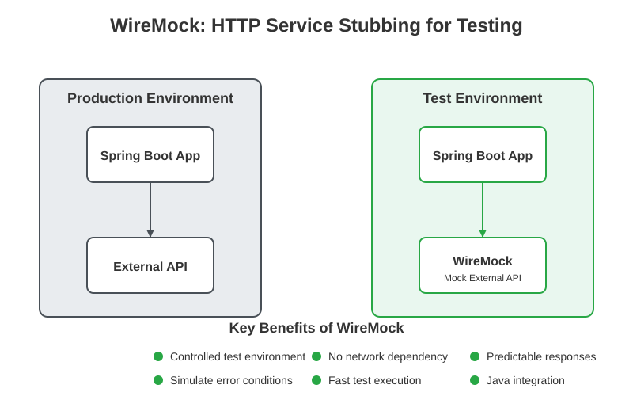

---

## Using WireMock for Integration Tests

- Run as in-memory service or Docker container to simulate connected HTTP services
- Override HTTP clients to connect to the WireMock server during tests

```java
TestPropertyValues.of(
  "clients.open-library.base-url=http://localhost:"+ wireMockServer.port())
  .applyTo(applicationContext);
```

```java
wireMockServer.stubFor(
  get(urlPathEqualTo("/api/books/" + isbn))
    .willReturn(aResponse()
      .withHeader(HttpHeaders.CONTENT_TYPE, MediaType.APPLICATION_JSON_VALUE)
      .withBodyFile("book-response-success.json"))
);
```

---

## Starting the Entire Spring Context - Version 1


- We access the application over HTTP like a user, the test and context run in separate threads (no `@Transactional` rollback), requires HTTP authentication

```java {1}
@SpringBootTest(webEnvironment = SpringBootTest.WebEnvironment.RANDOM_PORT)
class ApplicationServletContainerIT {

  @LocalServerPort
  private int port; // <-- we're running on a real port

  @Test
  void contextLoads(@Autowired WebTestClient webTestClient) {
    webTestClient
      .get()
      .uri("/api/customers")
      .header("Authorization", "Basic " + Base64.getEncoder().encodeToString("user:dummy".getBytes()))
      .exchange()
      .expectStatus()
      .isOk();
  }
}
```

---

## Starting the Entire Spring Context - Version 2

- The test and the context run in the same thread, hence we can rollback with `@Transactional` and simply override the security context with `@WithMockUser`


```java {1,3}
@SpringBootTest
// which is @SpringBootTest(webEnvironment = SpringBootTest.WebEnvironment.MOCK)
@AutoConfigureMockMvc
class ApplicationMockWebIT {

  // @LocalServerPort
  // private int port; <-- this would fail the test, there is no local port occupied

  @Test
  @WithMockUser
  void givenCustomersThenReturnListForAuthenticatedUser(@Autowired MockMvc mockMvc) throws Exception {
    mockMvc
      .perform(get("/api/customers")
        .header(ACCEPT, APPLICATION_JSON))
      .andExpect(status().is(200))
      .andExpect(content().contentType(APPLICATION_JSON))
      .andExpect(jsonPath("$.size()", is(1)));
  }
}
```


---
<!--

- Go to `DefaultContextCache` to show the cache

-->


### Best Practice 3: Try Mutation Testing

- Having high code coverage might give you a **false sense of security**
- Mutation Testing with [PIT](https://pitest.org/quickstart/)
- Beyond Line Coverage: Traditional tools like JaCoCo show which code runs during tests, but PIT verifies if our tests actually detect when code behaves incorrectly by introducing "**mutations**" to our source code.
- Quality Guarantee: PIT automatically **modifies our code** (changing conditionals, return values, etc.) to ensure our tests fail when they should, **revealing blind spots** in seemingly comprehensive test suites.

---

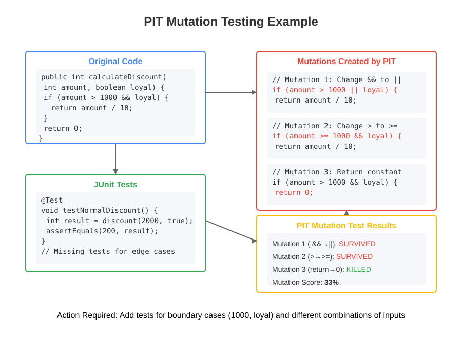

---

# Common Spring Boot Testing Pitfalls to Avoid


---

## Testing Pitfall 1: `@SpringBootTest` Obsession

- The name could apply it's a one size fits all solution, but it isn't
- It comes with costs: starting the (entire) application context
- Useful for integration tests that verify the whole application but not for testing a single service in isolation
- Start with unit tests, see if sliced tests are applicable and only then use `@SpringBootTest`

---

## @SpringBootTest Obsession Visualized

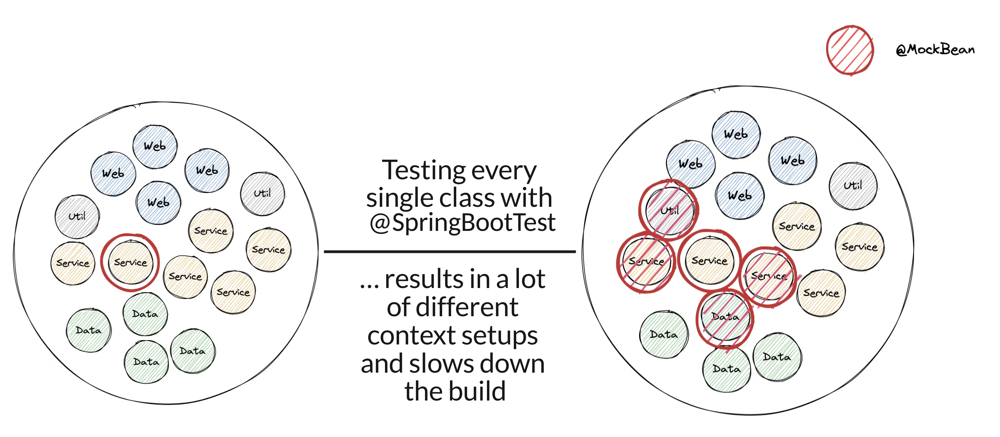

---

## Testing Pitfall 2: @MockitoBean vs. @MockBean vs. @Mock

- `@MockBean` is a Spring Boot specific annotation that replaces a bean in the application context with a Mockito mock
- `@MockBean` is deprecated in favor of the new `@MockitoBean` annotation
- `@Mock` is a Mockito annotation, only for unit tests

- Golden Mockito Rules:
  - Do not mock types you don't own
  - Don't mock value objects
  - Don't mock everything
  - Show some love with your tests

---

## Testing Pitfall 3: JUnit 4 vs. JUnit 5


- You can mix both versions in the same project but not in the same test class
- Browsing through the internet (aka. StackOverflow/blogs/LLMs) for solutions, you might find test setups that are still for JUnit 4
- Easily import the wrong `@Test` and you end up wasting one hour because the Spring context does not work as expected

---

<center>

| JUnit 4              | JUnit 5                            |
|----------------------|------------------------------------|
| @Test from org.junit | @Test from org.junit.jupiter.api   |
| @RunWith             | @ExtendWith/@RegisterExtension     |
| @ClassRule/@Rule     | -                                  |
| @Before              | @BeforeEach                        |
| @Ignore              | @Disabled                          |
| @Category            | @Tag                               |

</center>

---

## Zusammenfassung & Ausblick

- Spring Boot Anwendungen kommen mit allem Nötigen zum Testen ausgestattet
- Spring und Spring Boot bieten viele hervorragende Testing-Features
- Java bietet ein ausgereiftes & umfangreiches Testing-Ökosystem
- Das Context-Caching-Feature für schnelle Builds berücksichtigen
- Sliced Testing hilft, isolierte Tests mit minimalem Kontext zu schreiben
- Viele neue Testing-Features sind Teil neuer Releases: Pausieren eines TestContext, @ServiceConnection, Testcontainers-Unterstützung, Docker Compose-Unterstützung, mehr AssertJ-Integrationen, etc.

---

## Weitere Spring Boot Testing Angebote


- Online Kurs: [Testing Spring Boot Applications Masterclass](https://rieckpil.de/testing-spring-boot-applications-masterclass/) (on-demand, 12 Stunden, 130+ Module)
- eBook: [30 Testing Tools and Libraries Every Java Developer Must Know](https://leanpub.com/java-testing-toolbox)
- eBook: [Stratospheric - From Zero to Production with AWS](https://leanpub.com/stratospheric)
- Spring Boot [testing workshops](https://pragmatech.digital/workshops/) (vor Ort/remote/hybrid)
- [Consulting Angebote](https://pragmatech.digital/consulting/), z.B. das Test Maturity Assessment für Projekte/Teams

---

## Don't Leave Empty-Handed

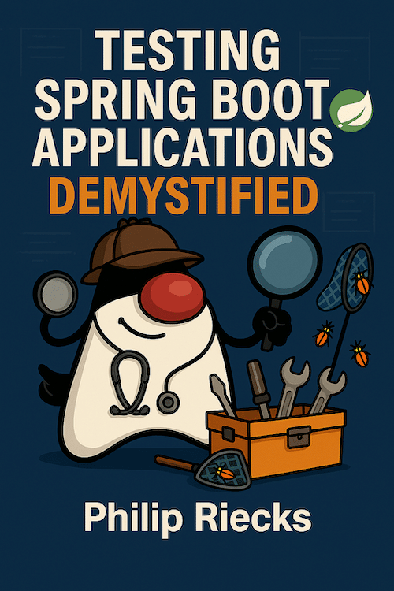

- Hol dir das ergänzende Spring Boot Testing eBook kostenlos (statt $9)
- 120+ Seiten mit praktischen Hands-on-Tipps, um Code mit Vertrauen zu deployen
- Hol dir das eBook, indem du dich über den QR-Code auf der nächsten & letzten Folie für unseren [Newsletter](https://rieckpil.de/book) anmeldest


---

<!-- paginate: false -->

## Joyful Testing!

Hol dir dein kostenloses Spring Boot Testing eBook:


Reach out any time via:
- [LinkedIn](https://www.linkedin.com/in/rieckpil) (Philip Riecks)
- [X](https://x.com/rieckpil) (@rieckpil)
- [Mail](mailto:philip@pragmatech.digital) (philip@pragmatech.digital)
