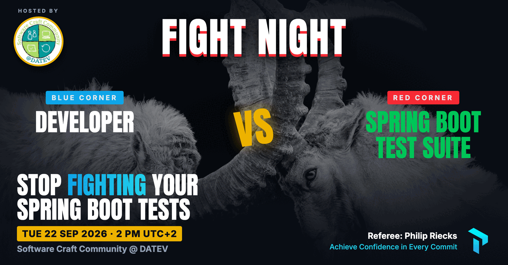
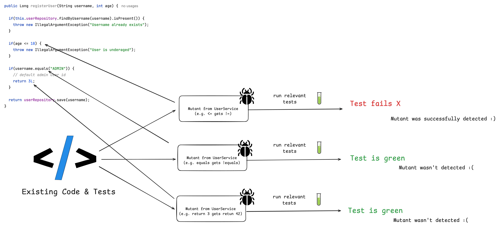

<!-- _paginate: false -->
<!-- _header: '' -->
<!-- _footer: '' -->
<!-- _backgroundColor: '#090d14' -->



---


<!-- _class: light title -->
<!-- _paginate: false -->
<!-- _header: '' -->


# Stop **Fighting** Your Spring Boot Tests

## Why your tests fight back - and how to make them fight for you

Software Craft Community @ DATEV · September 22, 2026

---

<!-- _paginate: false -->


## About Philip

- Self-employed developer from **Herzogenaurach**, Germany (close to Nuremberg) 🍻
- Met Sven Hansen during the **Spring I/O** conference in Barcelona this year 🇪🇸
- Blogging & content creation with a focus on testing Java and specifically Spring Boot applications 🍃
- Founder of **PragmaTech GmbH** - We Help Developers to Frequently Deliver Software with More Confidence 🚤

---

## Participate During the Talk

Go to [menti.com](https://www.menti.com/) and use the code **7735 0833** to **anonymously** submit answers:


Please answer the **first three questions**:

- Who wrote your tests last week?
- How long does your test suite take end to end?
- How confident are you deploying on a Friday afternoon (0 to 10)?

---

<!-- header: 'Software Craft Community @ DATEV · September 22, 2026 · Questions @ menti.com Code: <strong>7735 0833</strong>' -->
<!-- _paginate: false -->


# Why Test Software?

---

<!-- _class: light statement -->

# In 2026, most of our code is **not written by us**.

---

<!--
Notes:
- The joke lands, then the point: we ship code we did not type.
- The test suite is the only thing that still reads every line.
-->


---

<!-- _paginate: false -->


### My Overall Northstar for Engineering Excellence

Imagine seeing this pull request on a Friday afternoon:


How confident are you to merge this major Spring Boot upgrade and deploy it to production once the pipeline turns green?

---

<!-- _class: light statement -->

# Good tests don't just catch bugs - they give you **fast feedback** and **confident deployments**.

---

<!--
Notes:
- Ask the room which of these they recognize. Hands go up on all four.
- Name the feeling first, then promise the diagnosis.
-->


## When Your **Spring Boot Tests** Fight Back

- The suite takes > 30 minutes, so nobody runs it before pushing
- A test goes red and you cannot tell whether the code or the test is broken
- You reach for `@SpringBootTest` because it is the only thing that works
- The pipeline is green and you still do not want to deploy on a Friday

---

<!-- _class: light statement -->

# It is almost never the framework. It&nbsp;is **three myths** we keep repeating.

---

<!-- _class: light agenda -->

## The Three Myths We Bust Today

1. "I need @SpringBootTest for that."
2. "Spring Boot tests are slow."
3. "It is green, so it works."

---

<!-- _class: light section -->
<!-- _paginate: false -->


## Myth #1

# "Every test needs the full context."

_Spoiler: you don't always need `@SpringBootTest`._

---

<!--
Notes:
- Looks fine. Passes. Green. Everybody copies it.
- Ask the room: what does this test actually need?
-->

## The `@SpringBootTest` Obsession


---

## Two Families of Tests

**Without a Spring context** - plain JUnit and Mockito. Milliseconds per test. Your business logic, your algorithms, your edge cases.

**With a Spring context** - Spring wires the beans for you. Seconds per context start. Needed when the framework itself is part of the behaviour you verify.

The second family splits again:

- **Sliced context** - only the layer under test (`@WebMvcTest`, `@DataJpaTest`, ...)
- **Full context** - the whole application (`@SpringBootTest`)

---

## A Typical Spring `ApplicationContext`


---

## You Don't Always Need the Entire Context


---

## Family 1: No Context At All - Milliseconds

```java
@ExtendWith(MockitoExtension.class)
class CustomerServiceTest {

  @Mock
  private CustomerRepository customerRepository;

  @InjectMocks
  private CustomerService customerService;

  @Test
  void shouldCreateNewCustomerWhenNameDoesNotExist() {
    when(customerRepository.findByCustomerName("duke")).thenReturn(empty());

    String customerId = customerService.createNewCustomer("duke");

    assertThat(customerId).isEqualTo("42");
  }
}
```

---

## Things We Can't Cover Without a Context

- **Request Mapping**: Does HTTP GET `/api/customers/{id}` actually resolve to our desired method?
- **Validation**: Will an incomplete request body result in a 400 Bad Request or an accidental 201?
- **Serialization**: Are our JSON objects serialized and deserialized correctly?
- **Headers**: Are we setting `Content-Type` or custom headers correctly?
- **Security**: Are our Spring Security configuration and authorization checks enforced?

**This** is where a context earns its cost - and a sliced one is usually enough.

---

## Family 2: A Sliced Context

```java
@WebMvcTest(CustomerController.class)
@Import(SecurityConfig.class)
class CustomerControllerTest {

  @Autowired
  private MockMvc mockMvc;

  @MockitoBean
  private CustomerService customerService;

  @Test
  @WithMockUser
  void shouldReturnLocationOfNewlyCreatedCustomer() throws Exception {
    // web layer only: mapping, validation, serialization, security
  }
}
```

---

## Decision Paralysis: When to Include a Context

A simplified decision table:

| Question                                        | Tool                                             |
|-------------------------------------------------|--------------------------------------------------|
| Does my business logic work?                    | Plain JUnit + Mockito, no Spring                 |
| Does my HTTP layer map, validate, serialize?    | `@WebMvcTest`                                    |
| Does my query return what I think?              | `@DataJpaTest`                                   |
| Does my client talk to the remote API?          | `@RestClientTest` (including a mock HTTP server) |
| Does the whole thing start and work end to end? | `@SpringBootTest`                                |

---

<!-- _class: light statement -->

# Start at the level that answers your question. **Climb only when the test forces you to.**

---

<!-- _class: light section -->
<!-- _paginate: false -->


## Myth #2

# "Spring Boot tests are slow."

_You are not paying for tests. You are paying for context starts._

---

<!--
Notes:
- Reframe: nobody complains about a slow test. They complain about slow feedback.
- Four angles, and we have already used the first one in part 1.
-->

## Slow Tests Are Not the Problem. Slow **Feedback** Is.

Attack it from four angles:

1. **Right test level** - the cheapest test that answers the question (Myth #1)
2. **Fewer context starts** - Spring already caches contexts, if you let it
3. **Parallel execution** - use the cores you are paying for
4. **Reused infrastructure** - stop restarting Docker containers (Myth #3)

---

## Angle 2: Spring Context Caching

- **The problem**: integration tests need a started and initialized `ApplicationContext`, which takes time
- **The solution**: the Spring TestContext framework caches a started context for later reuse
- Part of every Spring Boot project already, via `spring-boot-starter-test`

Speed improvement example:


---

## How the Cache Key is Built

```java
// DefaultContextCache.java
private final Map<MergedContextConfiguration, ApplicationContext> contextMap =
  Collections.synchronizedMap(new LruCache(32, 0.75f));
```

This goes into the cache key (`MergedContextConfiguration`):

- activeProfiles (`@ActiveProfiles`)
- propertySourceProperties (`@TestPropertySource`)
- contextCustomizer (`@MockitoBean`, `@MockBean`, `@DynamicPropertySource`, ...)
- etc.

**Every unique combination is a new context start.**

---

<!--
Notes:
- This is the single most copied line from StackOverflow and LLM answers.
- Ask: who has this in an abstract base class right now?
-->

## The Final Boss

Developers consult AI and StackOverflow for integration test issues and copy advice without knowing the implications:

```java
@SpringBootTest
@DirtiesContext
// this instructs Spring to remove the context from the cache
// and rebuild a new context on every request
public abstract class AbstractIntegrationTest {

}
```

The setup above **disables** context caching and slows the build down significantly.

---

## Identify Context Restarts


- **Visually**: watch for repeated Spring banners and startup logs in your build output
- **With logs**: set `logging.level.org.springframework.test.context.cache=DEBUG`
- **With tools**: [spring-test-profiler](https://github.com/PragmaTech-GmbH/spring-test-profiler), our open-source utility that visualizes context caching statistics for your suite

**Goal**: find the few test classes that force an extra context, and align them.

---

<!-- _class: light quote -->

## New in Spring Framework 7: Pausing of Test Contexts

> As of Spring Framework 7.0, we now pause test application contexts when they are not used.
>
> An application context stored in the context cache will be stopped when it is no longer actively in use and automatically restarted the next time the context is retrieved from the cache.

---

## Angle 3: Test Parallelization

**Goal**: use the cores you already pay for.

Requirements:

- No shared state
- No dependency between tests or their execution order
- No mutation of global state

Two ways to get there:

- Fork a new JVM with Maven/Gradle - more resources, fully isolated
- Use JUnit Jupiter's parallel execution mode - same JVM, multiple threads

---


---

## Make the Most of Both

- Avoid `@DirtiesContext`, especially in central base classes
- Understand how the cache key is built before you add another annotation
- Monitor and investigate context restarts instead of guessing
- Align the number of unique context configurations across the suite
- Then, and only then, turn on parallel execution

---

<!-- _class: light section -->
<!-- _paginate: false -->


## Myth #3

# "It is green, so it works."

_Green proves your tests ran. Not that they would have caught anything._

---

## Where Tests Drift Away From Production

- **The database**: H2 in tests, PostgreSQL in production. Different SQL dialect, different constraints, different behaviour.
- **Remote services**: mocked away with Mockito, so the HTTP layer, the serialization and the error handling are never exercised.
- **The test itself**: it asserts that the code ran, not that the code is right.

Each gap is a place where a green build still ships a bug.

---

## Must-Have #1: Testcontainers (Real Infrastructure)

**Use case**: your test needs the real database, broker or cache - not an in-memory stand-in.

```java
@Container // <-- Testcontainers manages the lifecycle of the container
@ServiceConnection // <-- automatically configures Spring Boot datasource properties
static PostgreSQLContainer<?> postgres = new PostgreSQLContainer<>("postgres:16-alpine")
  .withDatabaseName("testdb")
  .withInitScript("init-postgres.sql");
```

Same engine, same version, same dialect as production. Thrown away after the run.

---

## Keep Testcontainers Fast

- Enable container reuse where possible: `.withReuse(true)`
- Prefer a singleton container per test run over `@Testcontainers` (which starts one per test class)
- Speed up startup with prebuilt images that already contain your schema and seed data

```java
private static PostgreSQLContainer<?> postgres =
  new PostgreSQLContainer<>("myteampostgres:42");

static {
  postgres.start(); // started once, shared by every test that needs it
}
```

---

## Must-Have #2: WireMock (Real HTTP)

**Use case**: your application calls a remote API. You want to exercise your own HTTP client, serialization and error handling - without depending on someone else's uptime.

Mocking the client with Mockito skips exactly the part that breaks in production:

- Wrong URL or query parameter
- Unexpected response shape
- Timeouts, 500s, and retry behaviour

---


---

## Must-Have #3: Mutation Testing (Real Assertions)

- High code coverage gives you a **false sense of security**: it shows which lines ran, not which bugs you would catch
- [PIT](https://pitest.org/quickstart/) **mutates your source code** - flips conditionals, changes return values - and re-runs your tests
- If a mutation survives, no test noticed the change. That is a **blind spot** with high line coverage on top of it
- A mutation score threshold in CI is a quality gate that coverage can never be

---



---


<!-- _class: light agenda -->

## The Three Myths, Busted

1. Most tests need no Spring context - climb only when forced to
2. Your suite is not slow, it is restarting contexts - cache, align, parallelize
3. Green is not proof - real infrastructure, real HTTP, real assertions

---

<!-- _class: light metrics -->

## Coming Up: **Ship Fast, Sleep Well**

_Fearless Spring Boot Deployments in the AI Era_ - my next talk at the **DATEV Coding Festival**. We pick up where today stops: shipping the code an agent wrote, without losing sleep over it.

Come and join:

- **Oct 6** 2026
- **14:30** to 15:15
- **DATEV** Coding Festival


---


## What I Do to Build Confidence in the Agentic Coding Era

- **Review generated tests** like a pull request from a new hire
- **Make the rules executable**: ArchUnit rules, testing conventions in `CLAUDE.md` / `AGENTS.md`, mutation score thresholds in CI
- **Custom skills**: define once per project how testing is tackled, with best practices and antipatterns
- **Keep the feedback loop tight**: fast, trustworthy tests let the agent iterate without me watching every step

---

## My Agentic Testing Setup for Spring Boot

Define a **skillset** for fast and comprehensive tests, including a **test strategy** for the given project:

```text
.claude/skills/
├── unit-testing            fast tests without context bloat
├── slice-testing           right-sized Spring context slices
├── slice-testing-webmvc    web layer with @WebMvcTest
├── integration-testing     full-context tests that stay fast
├── e2e-testing             user journeys against the running app
├── testcontainers-setup    real infrastructure, reused containers
└── test-setup-reviewer     flags test anti-patterns for you
```

Each skill carries rules, references, best practices and antipatterns, described as code and text.

---

<!-- _class: light statement reveal -->
<!-- _paginate: false -->

<!--
Notes:
- One line per click (fragmented list, HTML deck only).
- The agent can write the code and the tests, but the pager still rings for you.
-->

# You can delegate the typing.
* You can't delegate the ownership.
* **You** get paged at 3 AM.
* Invest in a test suite that gives you **confidence in every commit**.

---

## Get Notified

I am building an **agentic Spring Boot testing course**: how to make code agents produce tests you would have written yourself.

<center>

 &nbsp; 

</center>


---

<!-- _class: light closing -->
<!-- _paginate: false -->
<!-- _header: '' -->


# Joyful Testing!

Get notified for Agentic Testing for Spring Boot:


- [LinkedIn](https://www.linkedin.com/in/rieckpil) (Philip Riecks)
- [Mail](mailto:philip@pragmatech.digital) (philip@pragmatech.digital)
