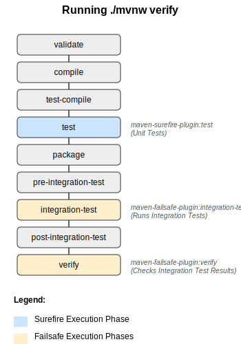

<!-- header: "" -->
<!-- footer: ""-->


---

<!-- _class: title -->


# Testing Spring Boot Applications Demystified

## Best Practices, Common Pitfalls, and Real-World Strategies

_Java User Group Hamburg 14.05.2025_

Philip Riecks - [PragmaTech GmbH](https://pragmatech.digital/) - [@rieckpil](https://x.com/rieckpil)

---
<!-- paginate: true -->

<!-- header: '' -->
<!-- footer: '' -->
<!--


Notes:

- Raise hands if you enjoy writing tests -> I do and hope I can change that for some of you today
-->


# Getting Started with Testing

## How It Started

---

<!-- header: 'Testing Spring Boot Applications Demystified @ JUG Hamburg 14.05.2025' -->
<!-- footer: '' -->

<!--
- My story towards testing
- What I mean with testing: automated tests written by a developer
- Shifting left
- How much confidence do I have to deploy on a friday afternoon to prod on a dependabot update?
- Don't work towards 100% code coverage
- Fast feedback loops
- Quicker development, errors pop up more early, wouldn't say bugs, but sometimes we are overconfident only to realize after the deployment we missed a parameter or misspelled it. Avoid friction


-->

### Getting Used To Testing At Work


---

# Goals For This Talk


- Lay the foundation for your Spring Boot testing success
- Introduction to Spring Boot’s excellent test support
- Showcase a mix of best practices and early pitfalls
- Convince you that testing is not an afterthought


---


## About

- Self-employed IT consultant from Herzogenaurach, Germany (Bavaria) 🍻
- Blogging & content creation for more than five years. Since three years with a focus on testing Java and specifically Spring Boot applications 🍃
- Founder of PragmaTech GmbH - Enabling Developers to Frequently Deliver Software with More Confidence 🚤
- Enjoys writing tests 🧪
- @rieckpil on various platforms

---


## Agenda


- Introduction
- Testing with Spring Boot
  - Spring Boot Testing 101
  - Unit Testing
  - Sliced Testing
  - Integration Testing
- Spring Boot Testing Best Practices
- Common Spring Boot Testing Pitfalls to Avoid
- Summary & Outlook

---


# Spring Boot Testing 101

---

<style>
img[alt~="center"] {
  display: block;
  margin: 0 auto;
}
</style>

### Naming Things Is Hard


---

### My Pragmatic Test Name Approach

1. **Unit Tests**: Tests that verify the functionality of a single, isolated component (like a method or class) by mocking or stubbing all external dependencies.
2. **Integration Tests**: Tests that verify interactions between two or more components work correctly together, with real implementations replacing some mocks.
3. **E2E**: Tests that validate the entire application workflow from start to finish, simulating real user scenarios across all components and external dependencies.

---

## Maven Build Lifecycle



- Maven Surfire Plugin for unit tests: default postfix  `*Test` (e.g. `CustomerTest`)
- Maven Failsafe Plugin for integration tests: default postfix `*IT` (e.g. `CheckoutIT`)
- Reason for splitting: parallelize, better grouping

---

### Spring Boot Starter Test

<!--

Notes:

- Show the `spring-boot-starter-test` dependency and Maven dependency tree
- Show manual overriden


-->


- aka. "Testing Swiss Army Knife"
- Batteries-included for testing
- Dependency management for:
  - JUnit Jupiter
  - Mockito
  - AssertJ
  - Awaitility
  - etc.
- We can manually override the dependency versions

---

<!--
Notes:
- Go to IDE to show the start
- Navigate to the parent pom to see the management
- Show the sample test to have seen the libraries at least once

Tips:
- Favor JUnit 5 over JUnit 4
- Pick one assertion library or at least not mix it within the same test class
-->

```shell
[INFO] +- org.springframework.boot:spring-boot-starter-test:jar:3.4.5:test
[INFO] |  +- org.springframework.boot:spring-boot-test:jar:3.4.5:test
[INFO] |  +- org.springframework.boot:spring-boot-test-autoconfigure:jar:3.4.5:test
[INFO] |  +- com.jayway.jsonpath:json-path:jar:2.9.0:test
[INFO] |  +- jakarta.xml.bind:jakarta.xml.bind-api:jar:4.0.2:test
[INFO] |  |  \- jakarta.activation:jakarta.activation-api:jar:2.1.3:test
[INFO] |  +- net.minidev:json-smart:jar:2.5.2:test
[INFO] |  |  \- net.minidev:accessors-smart:jar:2.5.2:test
[INFO] |  |     \- org.ow2.asm:asm:jar:9.7.1:test
[INFO] |  +- org.assertj:assertj-core:jar:3.26.3:test
[INFO] |  |  \- net.bytebuddy:byte-buddy:jar:1.15.11:test
[INFO] |  +- org.awaitility:awaitility:jar:4.3.0:test
[INFO] |  +- org.hamcrest:hamcrest:jar:2.2:test
[INFO] |  +- org.junit.jupiter:junit-jupiter:jar:5.11.4:test
[INFO] |  |  +- org.junit.jupiter:junit-jupiter-api:jar:5.11.4:test
[INFO] |  |  |  +- org.junit.platform:junit-platform-commons:jar:1.11.4:test
[INFO] |  |  |  \- org.apiguardian:apiguardian-api:jar:1.1.2:test
[INFO] |  |  +- org.junit.jupiter:junit-jupiter-params:jar:5.11.4:test
[INFO] |  |  \- org.junit.jupiter:junit-jupiter-engine:jar:5.11.4:test
[INFO] |  |     \- org.junit.platform:junit-platform-engine:jar:1.11.4:test
[INFO] |  +- org.mockito:mockito-core:jar:5.17.0:test
[INFO] |  |  +- net.bytebuddy:byte-buddy-agent:jar:1.15.11:test
[INFO] |  |  \- org.objenesis:objenesis:jar:3.3:test
[INFO] |  +- org.mockito:mockito-junit-jupiter:jar:5.17.0:test
[INFO] |  +- org.skyscreamer:jsonassert:jar:1.5.3:test
[INFO] |  |  \- com.vaadin.external.google:android-json:jar:0.0.20131108.vaadin1:test
[INFO] |  +- org.springframework:spring-core:jar:6.2.6:compile
[INFO] |  |  \- org.springframework:spring-jcl:jar:6.2.6:compile
[INFO] |  +- org.springframework:spring-test:jar:6.2.6:test
[INFO] |  \- org.xmlunit:xmlunit-core:jar:2.10.0:test
```

---

## Unit Testing with Spring Boot

- Provide collaborators from outside (dependency injection) -> no `new` inside your code
- Develop small, single responsibility classes
- Test only the public API of your class
- Verify behavior not implementation details

---
### Avoid Static Method Access

```java
@Service
public class BirthdayService {

  public boolean isTodayBirthday(LocalDate birthday) {
    LocalDate today = LocalDate.now();

    return today.getMonth() == birthday.getMonth()
      && today.getDayOfMonth() == birthday.getDayOfMonth();
  }
}
```

---

### Better Alternative

```java
@Service
public class BirthdayServiceWithClock {

  private final Clock clock;

  public BirthdayServiceWithClock(Clock clock) {
    this.clock = clock;
  }

  public boolean isTodayBirthday(LocalDate birthday) {
    LocalDate today = LocalDate.now(clock);

    return today.getMonth() == birthday.getMonth()
      && today.getDayOfMonth() == birthday.getDayOfMonth();
  }
}
```

---

```java
@Test
void shouldReturnTrueWhenTodayIsBirthday() {
  // Arrange
  LocalDate fixedDate = LocalDate.of(2025, 5, 15);
  Clock fixedClock = Clock.fixed(
    fixedDate.atStartOfDay(ZONE_ID).toInstant(),
    ZONE_ID
  );

  BirthdayServiceWithClock cut = new BirthdayServiceWithClock(fixedClock);
  LocalDate birthday = LocalDate.of(1990, 5, 15); // Same month and day

  // Act
  boolean result = cut.isTodayBirthday(birthday);

  // Assert
  assertThat(result).isTrue();
}
```

---

### Check Your Imports

- Nothing Spring-related here
- Rely only on JUnit, Mockito and an assertion library

```java
import org.junit.jupiter.api.DisplayName;
import org.junit.jupiter.api.Nested;
import org.junit.jupiter.api.Test;
import org.junit.jupiter.api.extension.ExtendWith;
import org.junit.jupiter.params.ParameterizedTest;
import org.junit.jupiter.params.provider.CsvSource;
import org.mockito.Mock;
import org.mockito.junit.jupiter.MockitoExtension;

import static org.assertj.core.api.Assertions.assertThat;
```

---

## Unify Test Structure

- Use a consistent test method naming: givenWhenThen, shouldWhen, etc.
- Structure test for the Arrange/Act/Assert test setup

```java
@Test
void should_When_() {

  // Arrange
  // ... setting up objects, data, collaborators, etc.

  // Act
  // ... performing the action to be tested on the class under test

  // Assert
  // ... verifying the expected outcome
}
```

---

## Unit Testing Has Limits

- Unit test comes to break when e.g. controller
- Request Mapping: Does /api/users/{id} actually resolve to your method?
- Status Codes: Will a bad request return a 400 or an accidental 200?
- Headers: Are you setting Content-Type or custom headers correctly?
- Security: Is your @PreAuthorize rule enforced?

---

## Sliced Testing with Spring Boot

<!--

Notes:

- Show the exclude filter in @WebMvcTest

-->


- For some application parts it will become not beneficial
- best use cases web layer: show how we don't get far with a plain unit test -> validation, security, status code, mapping
- Same is true for DataJapTest
- There are more slices available
- You can write your own slice
- See `WebMvcTypeExcludeFilter`

---

## Integration Testing with Spring Boot

<!--

Notes:

- Ask who is using Testcontainers?

-->

- Start everything up
- BUto how? Testcontainers to the resuce
- Difference with PORT to start tomcat or not
- Difference between MockMvc and WebTestClient!
- Context Caching!

- Tips to make the most of context caching
  - avoid many different context setups
  - avoid @DirtiesContext
  - Measure the time it takes to start the context

---

<!--

- Go to `DefaultContextCache` to show the cache

-->

## Context Caching

- Part of Spring Test (automatically part of every Spring Boot project via `spring-boot-starter-test`)
- Spring TestContext Framework: caches an already started Spring context for later reuse
- Configurable cache size (default is 32) with LRU (least recently used) strategy

Speed up your build:


---

## How the Cache Key is Built

This goes into the cache key (`MergedContextConfiguration`):

- activeProfiles (`@ActiveProfiles`)
- contextInitializersClasses (`@ContextConfiguration`)
- propertySourceLocations (`@TestPropertySource`)
- propertySourceProperties (`@TestPropertySource`)
- contextCustomizer (`@MockitoBean`, `@MockBean`, `@DynamicPropertySource`, ...)

---

## Spot Context Restarts


---

## Investigate the Logs


---

## Spot the issues for Context Caching


---

### Make the Most of the Caching Feature


- Avoid `@DirtiesContext` when possible, especially at `AbstractIntegrationTest` classes
- Understand how the cache key is built
- Monitor and investigate the context restarts
- Align the number of unique context configurations for your test suite


---

# Spring Boot Testing Best Practices


---

### Best Practice 1: Test Parallelization

- Goal: reduce build time and get faster feedback

- Requirements:
  - No shared state
  - No dependency between tests and their execution order
  - No mutation of global state

Two ways to achieve this:
- Fork new JVM with Surefire/Failsafe and let it run in parallel -> more resources but isolated execution
- Use JUnit Jupiter's parallelization mode and let it run in the same JVM with multiple threads, more fine-grained parallelization possible, define how to parallelize test classes and method, e.g. parallelize test class exection but within the same class run the test in sequence
- Parallel access to shared resources like database? Cleanup after each test to not pollute the next test
- Might not work out of the box, but worth investing
- Combine both approaches, multiple JVM and witin the JVM run in parallel

---

### Best Practice 2: Use the help of AI

- Show Diffblue, a niche AI tool that generates unit tests for Java code: `dcover create de.rieckpil.talks.CustomerContr
oller`
- TDD with an LLM? Example: following my TDD instructions, implement a Spring Boot
  Web REST API to fetch the stock price from a given
  company using their ticker symbol (e.g. MSTR), use the
  Spring WebClient and implement meaningful unit and
  integration tests in a test-driven manner

- LLM very usueful for boilerplate setup, test data, test migration (e.g. Kotlin -> Java)
- ChatBots might not produce compilable/working test code, agents are better
- Take a look at OpenRewrite for migrations (not AI but super useful)
- Clearly define your test requirements in your copiolot instructions, claude.md or cursor rule
- Showcase Claude Code and my `CLAUDE.md` file
- GitHub Copilot in IDEA not sooo good (much filtering, UX could be improved) but in VSCode it should be better
- OpenRewrite byy Moderne recipes:
  - https://docs.openrewrite.org/recipes/java/spring/boot3/replacemockbeanandspybean
  - https://docs.openrewrite.org/recipes/java/testing/junit5
---

### Best Practice 3: Use Mutation Testing If You Are Keen on Code Coverage

- aka. your tests may give you a false sense of security
- Having code coverage but not testing the right things
- introduction:  Mutation Testing with e.g. PIT
- Show example where it makes sense
- Considerations for bigger projects: only run on the new diffs, not on the whole codebase
- Beyond Line Coverage: Traditional tools like JaCoCo show which code runs during tests, but PIT verifies if your tests actually detect when code behaves incorrectly by introducing "mutations" to your source code.
- Quality Guarantee: PIT automatically modifies your code (changing conditionals, return values, etc.) to ensure your tests fail when they should, revealing blind spots in seemingly comprehensive test suites.
- Business Logic Protection: For Spring Boot services with complex business workflows, PIT helps identify untested edge cases that could lead to critical production bugs in your application.
- Easy Integration: PIT seamlessly integrates with Maven/Gradle build processes, with minimal configuration required to start testing your Spring Boot application.
- Prioritize Improvements: PIT's HTML reports clearly identify which parts of your codebase have mutations that survived testing, helping teams focus their testing efforts where they'll have the most impact.
- Production Confidence: While requiring more computational resources than basic unit tests, the enhanced detection of subtle logic errors provides significantly greater confidence in mission-critical Spring Boot components.

---

# Common Spring Boot Testing Pitfalls to Avoid


---

## Testing Pitfall 1: Using @SpringBootTest for Everything


- The name could apply it's a one size fits all solution, but it isn't
- It comes with costs: the application context
- Useful for integration tests that verify the whole application but not for testing a time manipulation service class works as expected
- Start with unit tests, see if sliced tests are applicable and only then use @SpringBootTest

---

## @SpringBootTest Obsession


---


## Testing Pitfall 2: @MockitoBean vs. @MockBean vs. @Mock

- `@MockBean` is a Spring Boot specific annotation that replaces a bean in the application context with a Mockito mock
- `@MockBean` is deprecated in favor of the new `@MockitoBean` annotation
- `@Mock` is a Mockito annotation, only for unit tests

- Golden Mockito Rules:
  - Do not mock types you don't own
  - Don't mock value objects
  - Don't mock everything
  - Show some love with your tests

---

## Testing Pitfall 3: JUnit 4 vs. JUnit 5 Pitfall


- You can mix both versions in the same project but not in the same test class
- Browsing through the internet (aka. StackOverflow/blogs/LLMs) for solutions, you might find test setups that are still for JUnit 4
- Easily import the wrong `@Test` and you end up wasting one hour because the Spring context does not work as expected

---

<center>

| JUnit 4              | JUnit 5                            |
|----------------------|------------------------------------|
| @Test from org.junit | @Test from org.junit.jupiter.api   |
| @RunWith             | @ExtendWith/@RegisterExtension     |
| @ClassRule/@Rule     | -                                  |
| @Before              | @BeforeEach                        |
| @Ignore              | @Disabled                          |
| @Category            | @Tag                               |

</center>

---

## Summary & Outlook

- Spring Boot applications come with batteries-included for testing
- Spring and Spring Boot provides many excellent testing features
- the Java testing ecosystem is huge
- Consider the context caching feature for fast builds
- Get help from AI
- Still many new features are coming: `@ServiceConnection`, Testcontainers support, Docker Compose support, more AssertJ integrations, etc.

---

## What's Next?


- Online Course: **Testing Spring Boot Applications Masterclass** (on-demand, 12 hours, 130+ modules)
- eBook: **30 Testing Tools and Libraries Every Java Developer Must Know**
- eBook: **Stratospheric - From Zero to Production with AWS**
- Spring Boot testing workshops (in-house/remote/hybrid)
- Consulting offerings, e.g. the Test Maturity Assessment

---

## Joyful Testing!


Reach out any time via:
- LinkedIn (Philip Riecks)
- X (@rieckpil)
- Mail (philip@pragmatech.digital)
