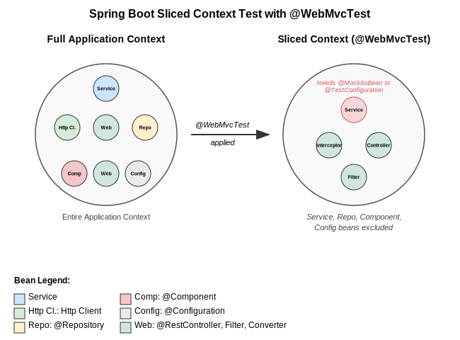

<!-- _class: title -->


# Testing Spring Boot Applications Demystified

## Best Practices, Common Pitfalls, and Real-World Strategies

<footer>
Philip Riecks | PragmaTech Digital | JUG Munich 2025
</footer>

---

## About Me

- Philip Riecks, Self-employed Consultant & Founder of PragmaTech Digital
- Specialized in Build Pipeline Acceleration & Test Automation
- Spring Boot Enthusiast
- Author of Technical Books & Courses
- Java Champion
- [philip@pragmatech.digital](mailto:philip@pragmatech.digital)

---

## Agenda

- Spring Boot Testing Fundamentals
- Testing Layers & Approaches
  - Unit Tests
  - Sliced Tests with @WebMvcTest & Friends
  - Integration Tests with @SpringBootTest
- Best Practices:
  - Test Parallelization
  - Leveraging AI for Test Creation
  - Mutation Testing
- Common Pitfalls to Avoid
- Q&A

---

## Intro: Why Testing Matters

- **Shifting left**: Find bugs early in the development process
- **Confidence**: Can you deploy a Friday afternoon dependabot update?
- **Fast feedback loops**: Fail fast, learn fast
- **Developer productivity**: Avoid friction and context switching
- **Quality**: Tests are documentation that never lies

---

## Spring Boot Testing 101

```java
@SpringBootTest
class ApplicationTests {
    @Test
    void contextLoads() {
    }
}
```

- Maven Surefire Plugin for unit tests
- Maven Failsafe Plugin for integration tests
- Naming conventions:
  - `*Test.java` - Unit and slice tests (Surefire)
  - `*IT.java`/`*WT.java` - Integration and web tests (Failsafe)

---

## Test Types in Spring Boot

| Test Type | Framework | Focus | Speed | Complexity |
|-----------|-----------|-------|-------|------------|
| Unit Test | JUnit & Mockito | Single class/method | Very Fast | Low |
| Slice Test | Spring Test | One layer | Fast | Medium |
| Integration Test | @SpringBootTest | Multiple components | Slow | High |
| E2E Test | Selenide/TestContainers | Full application | Very Slow | Very High |

---

## Spring Boot Starter Test

```xml
<dependency>
    <groupId>org.springframework.boot</groupId>
    <artifactId>spring-boot-starter-test</artifactId>
    <scope>test</scope>
</dependency>
```

Your testing Swiss Army knife includes:
- JUnit Jupiter
- AssertJ & Hamcrest
- MockMvc & WebTestClient
- Mockito
- JSONAssert & JsonPath
- And more!

---

## Unit Testing with Spring Boot

```java
@ExtendWith(MockitoExtension.class)
class CustomerServiceTest {

  @Mock
  private CustomerRepository customerRepository;

  @InjectMocks
  private CustomerService cut;

  @Test
  @DisplayName("Should notify all customers via email")
  void shouldNotifyAllCustomersViaEmail() {
    // Arrange
    when(customerRepository.findAllCustomerIds())
      .thenReturn(List.of("42"));

    // Act
    cut.notifyAllCustomers();

    // Assert
    verify(customerRepository).findAllCustomerIds();
  }
}
```

---

## Sliced Testing with @WebMvcTest

```java
@WebMvcTest(CustomerController.class)
@DisplayName("Customer Controller Tests")
class CustomerControllerTest {

  @Autowired
  private MockMvc mockMvc;

  @MockBean
  private CustomerService customerService;

  @Test
  @DisplayName("Should return location of newly created customer")
  void shouldReturnLocationOfNewlyCreatedCustomer() throws Exception {
    // Arrange, Act, Assert in one fluent API
    this.mockMvc
      .perform(post("/api/customers")
        .contentType(APPLICATION_JSON)
        .content("""
           {
             "first_name": "John",
             "last_name": "Doe",
             "email": "john.doe@example.com"
           }
          """))
      .andExpect(status().isCreated())
      .andExpect(header().string("Location",
        containsString("/api/customers/42")));
  }
}
```

---

## Integration Testing with @SpringBootTest

```java
@SpringBootTest(webEnvironment = WebEnvironment.RANDOM_PORT)
class ApplicationIT {

  @LocalServerPort
  private int port;

  @Autowired
  private TestRestTemplate restTemplate;

  @Autowired
  private WebTestClient webTestClient;

  @Test
  void shouldCreateCustomerAndReturnLocation() {
    // Using WebTestClient for reactive style testing
    webTestClient.post().uri("/api/customers")
      .contentType(MediaType.APPLICATION_JSON)
      .bodyValue("""
        {"first_name": "John", "last_name": "Doe"}
        """)
      .exchange()
      .expectStatus().isCreated()
      .expectHeader().exists("Location");
  }
}
```

---

<!-- _class: image-right -->

## Context Caching

<div>

- Spring creates and caches application contexts
- Identical configurations reuse contexts
- Dramatically improves test performance

```java
// This annotation impacts the context
@SpringBootTest
@ActiveProfiles("test")
class ContextReuseOneIT {
  @Test
  void test1() { ... }
}

// Different configuration = new context
@SpringBootTest
class ContextReuseTwoIT {
  @Test
  void test2() { ... }
}
```
</div>



---

## Best Practice: Test Parallelization

```xml
<plugin>
  <groupId>org.apache.maven.plugins</groupId>
  <artifactId>maven-surefire-plugin</artifactId>
  <configuration>
    <properties>
      <configurationParameters>
        junit.jupiter.execution.parallel.enabled = true
        junit.jupiter.execution.parallel.mode.default = same_thread
        junit.jupiter.execution.parallel.mode.classes.default = concurrent
      </configurationParameters>
    </properties>
  </configuration>
</plugin>
```

- Reduce build time and get faster feedback
- Ensure tests don't have shared/global state
- Avoid `@DirtiesContext` when possible
- Clean up resources after tests

---

<!-- _class: image-left -->

## Best Practice: Leverage AI for Testing

<div>

- Generate test boilerplate
- Create test data fixtures
- Migrate tests between frameworks

**Set guidelines for AI-generated tests:**
```
Test Structure Guidelines:
- Use JUnit 5 for all test classes
- Name test methods using pattern:
  should<ExpectedBehavior>When<Condition>
- Structure with Arrange-Act-Assert
- Use AssertJ for assertions
- Avoid for loops and if statements
- Use @DisplayName for better reports
```
</div>


---

## Best Practice: Mutation Testing

```bash
mvn org.pitest:pitest-maven:mutationCoverage
```

Mutation testing helps find gaps in your tests by:
1. Making small changes to your code (mutations)
2. Running your tests to see if they catch the changes
3. Reporting which mutations "survived"

Better than code coverage alone for measuring test effectiveness.

---

## Pitfall: Using @SpringBootTest for Everything

<div class="box">
Using @SpringBootTest for every test is like using a sledgehammer to crack a nut.
</div>

- Starts the entire application context
- Significantly slower than unit tests
- Higher maintenance cost
- Makes tests more brittle

**Better approach:**
1. Start with unit tests
2. Use sliced tests where appropriate
3. Reserve @SpringBootTest for true integration tests

---

## Pitfall: @MockBean vs. @Mock vs. @MockitoBean

|Annotation|Usage|Context|
|----------|-----|-------|
|@Mock|Plain unit tests|Works with @ExtendWith(MockitoExtension.class)|
|@MockBean|Spring slice tests|Replaces bean in Spring context (deprecated)|
|@MockitoBean|Spring slice tests|New recommended approach|

Golden Rules:
- Don't mock types you don't own
- Don't mock value objects
- Don't mock everything
- Show love with your tests

---

## Pitfall: JUnit 4 vs. JUnit 5 Confusion

- Subtle import differences can cause hours of debugging
- JUnit 4: `org.junit.Test`
- JUnit 5: `org.junit.jupiter.api.Test`

- Spring Boot 3.x uses JUnit 5 by default
- You can mix both in the same project (not in the same class)
- Watch for incorrect imports when copying from the internet

---

## Outlook: What's Next?

- @ServiceConnection for simpler Testcontainers integration
- Better AssertJ integrations
- Enhanced context caching strategies
- Native test support for Spring Native

---

<!-- _class: title -->

# Thank You!

## Questions?

<div class="center">
<p>Philip Riecks<br>
<a href="https://pragmatech.digital">https://pragmatech.digital</a><br>
<a href="mailto:philip@pragmatech.digital">philip@pragmatech.digital</a><br>
<a href="https://twitter.com/rieckpil">@rieckpil</a></p>
</div>

<footer>
Slides available at: https://github.com/rieckpil/talks
</footer>
