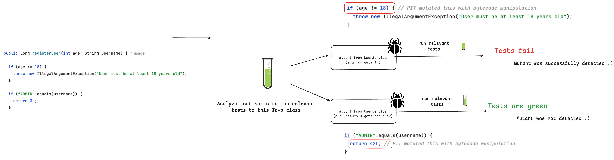
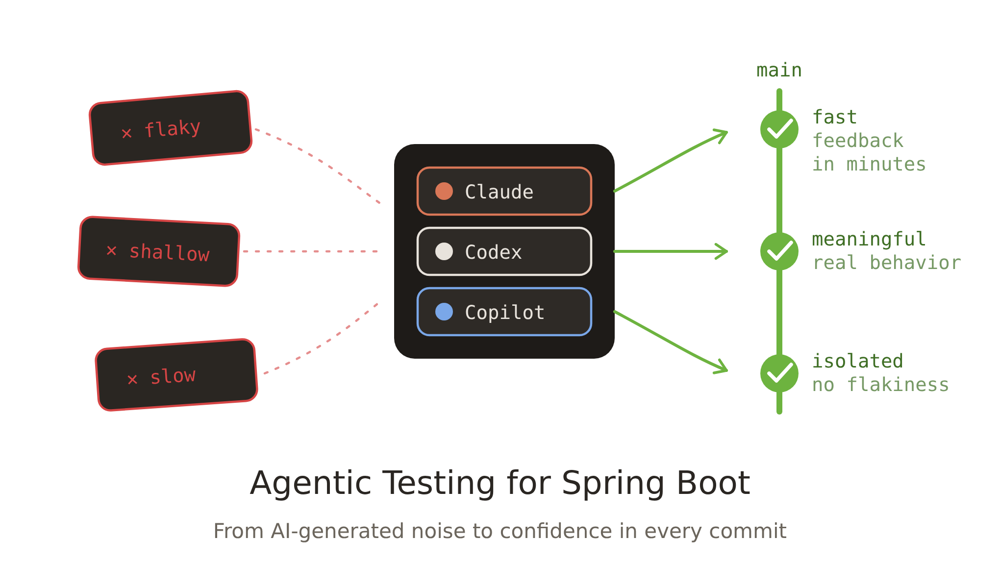
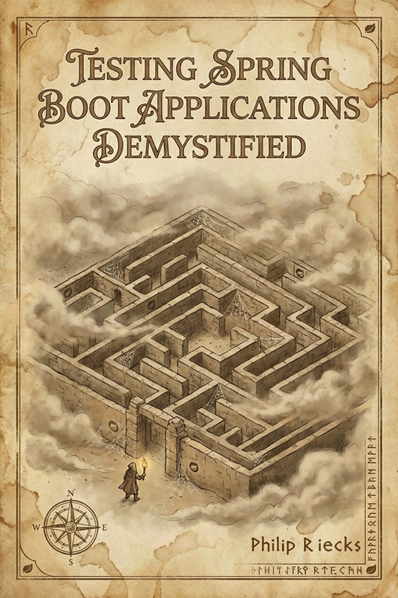

<!--
Menti: https://www.menti.com/ - code 3982 6427
-->

<!-- _paginate: false -->
<!-- _header: '' -->
<!-- _footer: '' -->

<!--  -->


---

<!-- _class: light title -->
<!-- _paginate: false -->
<!-- _header: '' -->

<!--
Notes:

-->


# Testing Spring Boot Applications **Demystified**

## The Hero's Journey Through the Spring Boot Testing Labyrinth

Java User Group Nürnberg · September 10, 2026

---

<!-- footer: '' -->


### About Philip

- Self-employed developer from Herzogenaurach, now living in Erlangen, Germany (Bavaria) 🍻
- Blogging & content creation with a focus on testing Java and specifically Spring Boot applications 🍃
- Founder of [PragmaTech GmbH](https://pragmatech.digital/) - **Enabling Developers to Frequently Deliver** Software with **More Confidence** 🚤

---

## Participate During the Talk

Go to [menti.com](https://www.menti.com/) and use the code **3982 6427** to **anonymously** submit answers for the quizzes and add your questions during the talk.


Please answer the **first three questions**:
- Who wrote your tests this week?
- How would you rate your Spring Boot testing knowledge?
- How confident are you deploying on a Friday afternoon?

---

<!-- header: 'Testing Spring Boot Applications Demystified  @ JUG Nürnberg 10.09.2026 - Questions @ menti.com Code: <strong>3982 6427</strong>' -->
<!-- _paginate: false -->


# Why Test Software?

---

<!-- _class: light statement -->
<!-- _paginate: true -->

# In 2026, most of our code is **not written by us**.

---


---

<!-- _paginate: false -->


### My Overall Northstar for Engineering Excellence

Imagine seeing this pull request on a Friday afternoon:


How **confident** are you to merge this major Spring Boot upgrade and **deploy** it to production once the pipeline turns green?

---

<!-- _class: light statement -->
<!-- _paginate: false -->

# Good tests don't just catch bugs - they give you **fast feedback** and **confident deployments**.

---

[//]: # (## DORA &#40;DevOps Research Assessment&#41;)

[//]: # ()
[//]: # (![center]&#40;assets/dora-core-v2.1.0-summary-raw.png&#41;)

[//]: # ()
[//]: # ()
[//]: # (---)

[//]: # (## More Than a One-Line Prompt)

[//]: # ()
[//]: # (![bg right:40% fit]&#40;assets/ai-judgement-layer.svg&#41;)

[//]: # ()
[//]: # (- You can't just run `claude -p "Write meaningful tests, make no mistakes"` and walk away)

[//]: # (- Effective AI testing needs **judgement** and understanding of the **HOW**: which test, at which level, and proof it actually fails)

[//]: # (- The craft shifts from *writing* tests to *directing and reviewing* them - the goal stays **confidence in every commit**)

[//]: # ()
[//]: # (---)

[//]: # ()
[//]: # (## From Developer to AI-Code Auditor)

[//]: # ()
[//]: # (![bg right:40% fit]&#40;assets/ai-auditor-loop.svg&#41;)

[//]: # ()
[//]: # (- AI writes more code, faster - your job becomes **auditing** it with confidence)

[//]: # (- An auditor lives or dies by **fast feedback**: a slow suite breaks the loop)

[//]: # (- Fast, reliable tests are the auditor's instrument - the foundation for **confidence in every commit**)

[//]: # ()
[//]: # (---)

<!-- _class: light statement -->
<!-- _paginate: false -->

# How do we get there for our **Spring Boot** projects?


---

[//]: # ()
[//]: # ([//]: # &#40;<!-- footer: '![w:32 h:32]&#40;assets/logo.webp&#41;' -->&#41;)
[//]: # (## Spring Boot Testing - The Bad & Ugly)

[//]: # ()
[//]: # ()
[//]: # (![center h:500 w:900]&#40;assets/spring-boot-testing-the-bad.png&#41;)

[//]: # ()
[//]: # (---)

[//]: # ()
[//]: # ()
[//]: # (## Spring Boot Testing - The Good)

[//]: # ()
[//]: # (![center h:500 w:900]&#40;assets/tests-benefit-en.png&#41;)

[//]: # ()
[//]: # ()
[//]: # (---)


## The Hero's Journey aka. Our Agenda

<!--
- Act 1: The Entrance
- Act 2: The Map
- Act 3: The Three Bosses
  - Quest 1: The Unit Testing Guardian
  - Quest 2: The Slice Testing Hydra
  - Quest 3: The Integration Testing Dragon
- Act 4: The Three Quest Items
  - Quest Item 1: The Caching Amulet
  - Quest Item 2: The Lightning Shield
  - Quest Item 3: The Scroll of Truth
- Act 5: The Exit
-->


---

### Goals For This Talk


- **Provide a clear mental map** for choosing between unit, slice, and integration tests
- Get **better judgment** for AI-written tests
- Understand the **testing concepts** to better reason about a test strategy or test failures
- **Build confidence** into your development work to **ship fearlessly**


---


## Act 1: The Grand Entrance


Testing Spring Boot applications can feel like entering a labyrinth blindfolded:

- Copying test configuration from AI/StackOverflow hoping it works
- The paradox of choice: `@SpringBootTest`, `@WebMvcTest`, `@DataJpaTest`, `@MockBean`, etc.
- Struggling with Spring `ApplicationContext` creation during tests
- Uncertainty about what to test and how to test it effectively

---

<!-- _class: light section -->
<!-- _paginate: false -->

<!--

Notes:
- Not because a definition of done says "all tests must pass"
- Not to reach a coverage goal


-->


## Quest 1

# The Unit Testing Guardian

_The Swift Gatekeeper - Blocks Those Who Overcomplicate_

---


## Our Foundation: Spring Boot Starter Test

<!--

Notes:

- Show the `spring-boot-starter-test` dependency and Maven dependency tree
- Show manual overriden


-->


- The "Testing Swiss Army Knife"


```xml
<dependency>
  <groupId>org.springframework.boot</groupId>
  <artifactId>spring-boot-starter-test</artifactId>
  <scope>test</scope>
</dependency>
```

- Batteries-included for testing by transitively including popular testing libraries
- Out-of-the-box dependency management to ensure compatibility

---
<!--
Notes:
- Go to IDE to show the start
- Navigate to the parent pom to see the management
- Show the sample test to have seen the libraries at least once

Tips:
- Favor JUnit 5 over JUnit 4
- Pick one assertion library or at least not mix it within the same test class
-->

```shell {4-6,13,15-16,17,25,29}
./mvnw dependency:tree
[INFO] ...
[INFO] +- org.springframework.boot:spring-boot-starter-test:jar:4.0.2:test
[INFO] |  +- org.springframework.boot:spring-boot-test:jar:4.0.2:test
[INFO] |  +- org.springframework.boot:spring-boot-test-autoconfigure:jar:4.0.2:test
[INFO] |  +- com.jayway.jsonpath:json-path:jar:2.10.0:test
[INFO] |  |  \- org.slf4j:slf4j-api:jar:2.0.17:compile
[INFO] |  +- jakarta.xml.bind:jakarta.xml.bind-api:jar:4.0.4:test
[INFO] |  |  \- jakarta.activation:jakarta.activation-api:jar:2.1.4:test
[INFO] |  +- net.minidev:json-smart:jar:2.6.0:test
[INFO] |  |  \- net.minidev:accessors-smart:jar:2.6.0:test
[INFO] |  |     \- org.ow2.asm:asm:jar:9.7.1:test
[INFO] |  +- org.assertj:assertj-core:jar:3.27.6:test
[INFO] |  |  \- net.bytebuddy:byte-buddy:jar:1.17.8:test
[INFO] |  +- org.awaitility:awaitility:jar:4.3.0:test
[INFO] |  +- org.hamcrest:hamcrest:jar:3.0:test
[INFO] |  +- org.junit.jupiter:junit-jupiter:jar:6.0.2:test
[INFO] |  |  +- org.junit.jupiter:junit-jupiter-api:jar:6.0.2:test
[INFO] |  |  |  +- org.opentest4j:opentest4j:jar:1.3.0:test
[INFO] |  |  |  +- org.junit.platform:junit-platform-commons:jar:6.0.2:test
[INFO] |  |  |  \- org.apiguardian:apiguardian-api:jar:1.1.2:test
[INFO] |  |  +- org.junit.jupiter:junit-jupiter-params:jar:6.0.2:test
[INFO] |  |  \- org.junit.jupiter:junit-jupiter-engine:jar:6.0.2:test
[INFO] |  |     \- org.junit.platform:junit-platform-engine:jar:6.0.2:test
[INFO] |  +- org.mockito:mockito-core:jar:5.5.0:test
[INFO] |  |  +- net.bytebuddy:byte-buddy-agent:jar:1.17.8:test
[INFO] |  |  \- org.objenesis:objenesis:jar:3.3:test
[INFO] |  +- org.mockito:mockito-junit-jupiter:jar:5.5.0:test
[INFO] |  +- org.skyscreamer:jsonassert:jar:1.5.3:test
[INFO] |  |  \- com.vaadin.external.google:android-json:jar:0.0.20131108.vaadin1:test
[INFO] |  +- org.springframework:spring-core:jar:7.0.3:compile
[INFO] |  |  +- commons-logging:commons-logging:jar:1.3.5:compile
[INFO] |  |  \- org.jspecify:jspecify:jar:1.0.0:compile
[INFO] |  +- org.springframework:spring-test:jar:7.0.3:test
[INFO] |  \- org.xmlunit:xmlunit-core:jar:2.10.4:test
```

---

## What's Inside the Testing Swiss Army Knife?


- **JUnit**: Java's de-facto standard testing framework and foundation.

- **Mockito**: Creating mock objects to simulate dependencies and verify interactions.

- **AssertJ**: Provides fluent, chainable, and readable assertions.

- **Hamcrest**: Offers flexible matchers for creating custom assertions.

- **JSONAssert**: Compares JSON strings with flexible matching options.

- **JsonPath**: Extracts and queries data from JSON similar to XPath.

- **XMLUnit**: Compares and validates XML documents.

- **Awaitility**: Handles asynchronous testing with fluent conditions.

[//]: # ()
[//]: # (## JUnit: The Testing Foundation)

[//]: # ()
[//]: # (- Java's de-facto standard testing framework - version **6** with Spring Boot 4 &#40;drop-in upgrade, unlike 4 → 5&#41;)

[//]: # (- More than just `@Test`: **Extension API** &#40;replaces `@RunWith`&#41;, lifecycle hooks, `@ParameterizedTest`, `@Nested`, `@DisplayName`, **Parallel execution**)

[//]: # ()
[//]: # (```java)

[//]: # (@ExtendWith&#40;MockitoExtension.class&#41;)

[//]: # (class DiscountCalculatorTest {)

[//]: # ()
[//]: # (  @ParameterizedTest)

[//]: # (  @CsvSource&#40;{ "0, 0.0", "100, 10.0", "1000, 150.0" }&#41;)

[//]: # (  void shouldApplyDiscountWhenAmountIsValid&#40;int amount, double expected&#41; {)

[//]: # (    // ...)

[//]: # (  })

[//]: # (})

[//]: # (```)

[//]: # ()
[//]: # (---)

[//]: # ()
[//]: # (## Mockito: Stub, Verify, and Beyond)

[//]: # ()
[//]: # (- **Stubbing** with `when&#40;...&#41;.thenReturn&#40;...&#41;` and **verifying** interactions with `verify&#40;...&#41;`)

[//]: # (- **Argument matchers** &#40;`any&#40;&#41;`, `eq&#40;&#41;`, `argThat&#40;...&#41;`&#41; for flexible expectations)

[//]: # (- **Advanced**: deep stubs &#40;`RETURNS_DEEP_STUBS`&#41; and static mocking &#40;`MockedStatic`&#41; for legacy/utility code)

[//]: # ()
[//]: # (```java)

[//]: # (when&#40;customerRepository.findById&#40;42L&#41;&#41;)

[//]: # (  .thenReturn&#40;Optional.of&#40;customer&#41;&#41;;)

[//]: # ()
[//]: # (verify&#40;eventPublisher&#41;.publish&#40;any&#40;CustomerCreated.class&#41;&#41;;)

[//]: # (```)

[//]: # ()
[//]: # (---)

[//]: # ()
[//]: # (## AssertJ & Hamcrest: Readable Assertions)

[//]: # ()
[//]: # (- **AssertJ**: fluent, chainable, IDE-friendly auto-completion)

[//]: # (- **Hamcrest**: composable matchers, useful with matcher-driven APIs like Mockito `argThat&#40;...&#41;`)

[//]: # (- Pick one for general assertions and stick with it within a test class)

[//]: # ()
[//]: # (```java)

[//]: # (// AssertJ - chainable & expressive)

[//]: # (assertThat&#40;customers&#41;)

[//]: # (  .hasSize&#40;3&#41;)

[//]: # (  .extracting&#40;Customer::firstName&#41;)

[//]: # (  .containsExactly&#40;"Alice", "Bob", "Charlie"&#41;;)

[//]: # ()
[//]: # (// Hamcrest - composable matchers)

[//]: # (assertThat&#40;"duke".toUpperCase&#40;&#41;, equalTo&#40;"DUKE"&#41;&#41;;)

[//]: # (```)

[//]: # ()
[//]: # (---)

[//]: # ()
[//]: # (## JsonPath & JSONAssert: Working With JSON)

[//]: # ()
[//]: # (- **JsonPath**: query JSON like XPath - drill into responses without deserializing)

[//]: # (- **JSONAssert**: compare JSON strings with **lenient** or **strict** mode - order-insensitive, ignores extra fields)

[//]: # ()
[//]: # (```java)

[//]: # (String json = "{ ... }";)

[//]: # ()
[//]: # (// JsonPath - query a JSON document directly)

[//]: # (String firstName = JsonPath.parse&#40;json&#41;.read&#40;"$.firstName", String.class&#41;;)

[//]: # (Long tagCount = JsonPath.parse&#40;json&#41;.read&#40;"$.tags.length&#40;&#41;", Long.class&#41;;)

[//]: # ()
[//]: # (// JSONAssert - lenient: extra fields in actual are OK)

[//]: # (String expected = "{ \"name\": \"duke\" }";)

[//]: # (String actual = "{ \"name\": \"duke\", \"age\": 42 }";)

[//]: # ()
[//]: # (JSONAssert.assertEquals&#40;expected, actual, JSONCompareMode.LENIENT&#41;;)

[//]: # (```)

[//]: # ()
[//]: # (---)

[//]: # ()
[//]: # (## XMLUnit: Comparing XML Documents)

[//]: # ()
[//]: # (- Compare and validate XML with **whitespace-aware**, **namespace-aware**, **order-tolerant** diffs)

[//]: # (- Still relevant for SOAP, configuration files, and legacy enterprise integrations)

[//]: # ()
[//]: # (```java)

[//]: # (String control = "<customer>...</customer>";)

[//]: # (String test = "<customer>...</customer>";)

[//]: # ()
[//]: # (Diff diff = DiffBuilder.compare&#40;control&#41;)

[//]: # (  .withTest&#40;test&#41;)

[//]: # (  .ignoreWhitespace&#40;&#41;)

[//]: # (  .checkForSimilar&#40;&#41;)

[//]: # (  .build&#40;&#41;;)

[//]: # ()
[//]: # (assertThat&#40;diff.hasDifferences&#40;&#41;&#41;.isFalse&#40;&#41;;)

[//]: # (```)

[//]: # ()
[//]: # (---)

[//]: # ()
[//]: # (## Awaitility: Taming Asynchronous Tests)

[//]: # ()
[//]: # (- Fluent **polling** for eventually-consistent assertions - message queues, async event handlers, scheduled jobs)

[//]: # (- Replaces brittle `Thread.sleep&#40;...&#41;` with explicit conditions and timeouts)

[//]: # ()
[//]: # (```java)

[//]: # (await&#40;&#41;)

[//]: # (  .atMost&#40;5, SECONDS&#41;)

[//]: # (  .pollInterval&#40;100, MILLISECONDS&#41;)

[//]: # (  .untilAsserted&#40;&#40;&#41; ->)

[//]: # (    assertThat&#40;orderRepository.findAll&#40;&#41;&#41;.hasSize&#40;1&#41;)

[//]: # (  &#41;;)

[//]: # (```)

---

## Unit Testing Java/Spring Boot Applications 101

- **Core Concept**: Test individual components in isolation from dependencies - one unit of work at a time.

- **Confidence Gained**: Fast, high-volume verification that the smallest building blocks behave correctly under various conditions.

- **Pitfall**: Poor class design leads to untestable god classes. Good tests start with good design.

- **Tools**: JUnit, Mockito, AssertJ (or Spock, TestNG, Hamcrest).

---

## Unit Testing has Limits

Consider this sample REST controller, what could we verify with a unit test?

```java
@RestController
@RequestMapping("/api/customers")
public class CustomerController {

  private final CustomerService customerService;

  public CustomerController(CustomerService customerService) {
    this.customerService = customerService;
  }

  @PostMapping
  public ResponseEntity<Void> createNewCustomer(@Validated CustomerCreationRequest payload, UriComponentsBuilder uriBuilder) {

    String customerId = customerService.createNewCustomer(payload.firstName());

    UriComponents uriComponents = uriBuilder
      .path("/api/customers/{id}")
      .buildAndExpand(customerId);

    return ResponseEntity.created(uriComponents.toUri()).build();
  }
}
```

---

```java {1,7,12,13,15-18}
@ExtendWith(MockitoExtension.class)
class CustomerControllerUnitTests {

  @Mock
  private CustomerService customerService;

  @InjectMocks
  private CustomerController customerController;

  @Test
  void shouldCreateCustomerWhenPayloadRequestIsValid() {
    when(customerService.createNewCustomer(anyString()))
      .thenReturn("42");

    ResponseEntity<Void> result = customerController.createNewCustomer(
      new CustomerCreationRequest("Java", "Duke", "duke@spring.io"),
      UriComponentsBuilder.newInstance()
    );

    assertThat(result.getStatusCode().value())
      .isEqualTo(201);
    assertThat(result.getHeaders().getLocation().toString())
      .isEqualTo("/api/customers/42");
  }
}
```

---

## Things We Can't Cover With a Unit Test #0

**Request Mapping**: Does HTTP GET `/api/customers/{id}` actually resolve to our desired method?


```java
@Test
void shouldCreateCustomerWhenPayloadRequestIsValid() {

  // ...

  ResponseEntity<Void> result = customerController.createNewCustomer(
    new CustomerCreationRequest("Java", "Duke", "duke@spring.io"),
    UriComponentsBuilder.newInstance()
  );
}
```

---

## Things We Can't Cover With a Unit Test #1

**Validation**: Will an incomplete request body result in a 400 bad request or return an accidental 201?

```java {7}
@Test
void shouldCreateCustomerWhenPayloadRequestIsValid() {

  // ...

  ResponseEntity<Void> result = customerController.createNewCustomer(
    new CustomerCreationRequest("Java", "Duke", "NOT_AN_EMAIL"),
    UriComponentsBuilder.newInstance()
  );
}
```

---

## Things We Can't Cover With a Unit Test #2

**Serialization**: Are we JSON objects serialized and deserialized correctly?

```java {2}
ResponseEntity<Void> result = customerController.createNewCustomer(
  new CustomerCreationRequest("Java", "Duke", "NOT_AN_EMAIL"),
  UriComponentsBuilder.newInstance());
```

```json
{
  "first-name": "Java",
  "last_Name": "Duke",
  "email": "duke@spring.io"
}
```


---


## Things We Can't Cover With a Unit Test #3

**Security**: Are we Spring Security configuration and other authorization checks enforced?

```java {7}
@Test
void shouldCreateCustomerWhenPayloadRequestIsValid() {

  // ...

  ResponseEntity<Void> result = customerController.createNewCustomer(
    new CustomerCreationRequest("Java", "Duke", "NOT_AN_EMAIL"),
    UriComponentsBuilder.newInstance()
  );
}
```

---

<!-- _class: light section -->
<!-- _paginate: false -->


## Quest 2

# The Slice Testing Hydra

_Multiple Heads, Each Guarding a Layer_

---


---


---


---


---

### Spring Boot Test Slice Example: `@WebMvcTest`


```java {1,12,6}
@WebMvcTest(CustomerController.class)
@Import(SecurityConfig.class)
class CustomerControllerTest {

  @Autowired
  private MockMvc mockMvc;

  @MockitoBean
  private CustomerService customerService;

  @Test
  @WithMockUser
  void shouldReturnLocationOfNewlyCreatedCustomer() throws Exception {
    // ...
  }
}
```

---

## Common Test Slices

- `@WebMvcTest`/`@WebFluxTest` - Controller layer
- `@DataJpaTest`/`@JdbcTest` - Persistence layer
- `@JsonTest` - JSON serialization/deserialization
- `@RestClientTest` - RestTemplate testing
- etc.

---


---

## Sliced Testing Spring Boot Applications 101

- **Core Concept**: Test a specific "slice" or layer of your application by loading a minimal, relevant part of the Spring `ApplicationContext`.

- **Confidence Gained**: Helps validate parts of your application where pure unit testing is insufficient, like the web, messaging, or data layer.

- **Prominent Examples:** Web layer (`@WebMvcTest`) and database layer (`@DataJpaTest`)

- **Pitfalls**: Requires careful configuration to ensure only the necessary slice of the context is loaded.

- **Tools**: JUnit, Mockito, Spring Test, Spring Boot, Testcontainers

---

<!-- _class: light section -->
<!-- _paginate: false -->


## Quest 3

# The Integration Testing Dragon

_Guards the Full Treasure - but Demands Patience_

---

<!--

Notes:

- Ask who is using Testcontainers?

-->


---

## Challenges when Starting the Entire `ApplicationContext`

- **Problem #1**: How to Ensure Surrounding Infrastructure (e.g. database, queues, etc.) is Present?
- **Problem #2**: How to Interact with our Application for Integration Tests?
- **Problem #3**: How to Keep our Build Time at a reasonable Duration?

---

## There's Even More...

- **Problem #4**: How to handle HTTP communication from our application
  to remote services?
- **Problem #5**: How to provide test data and maintain a clean state between tests?
- **Problem #6**: How to handle authentication and security contexts during tests?

---

## Provide External Infrastructure with Testcontainers (Problem #1)

Running infrastructure components (databases, message brokers, etc.) in Docker containers for our tests becomes a breeze with [Testcontainers](https://testcontainers.com/):

```java
@Container
@ServiceConnection
static PostgreSQLContainer postgres = new PostgreSQLContainer("postgres:16-alpine")
  .withDatabaseName("testdb")
  .withUsername("test")
  .withPassword("test")
  .withInitScript("init-postgres.sql");
```

This gives us an ephemeral PostgreSQL database for our tests:

```shell {3}
$ docker ps
CONTAINER ID   IMAGE                        COMMAND                  CREATED          STATUS         PORTS                                           NAMES
a958ee2887c6   postgres:16-alpine           "docker-entrypoint.s…"   10 seconds ago   Up 9 seconds   0.0.0.0:32776->5432/tcp, [::]:32776->5432/tcp   affectionate_cannon
ad0f804068dc   testcontainers/ryuk:0.12.0   "/bin/ryuk"              10 seconds ago   Up 9 seconds   0.0.0.0:32775->8080/tcp, [::]:32775->8080/tcp   testcontainers-ryuk-1f9f76a6-46d4-4e19-85c1-e8364da12804
```

---

[//]: # (## Stub External HTTP Services with WireMock &#40;Problem #2&#41;)

[//]: # ()
[//]: # (Consider [WireMock]&#40;http://wiremock.org/&#41; to stub external HTTP services during tests.)

[//]: # ()
[//]: # (![h:400 center]&#40;assets/wiremock-usage.svg&#41;)

[//]: # ()
[//]: # (---)
[//]: # ()
[//]: # (## Using WireMock for Integration Tests)

[//]: # ()
[//]: # (- Run as in-memory service or Docker container to simulate connected HTTP services)

[//]: # (- Override HTTP clients to connect to the WireMock server during tests)

[//]: # ()
[//]: # (```java)

[//]: # (TestPropertyValues.of&#40;)

[//]: # (  "clients.open-library.base-url=http://localhost:"+ wireMockServer.port&#40;&#41;&#41;)

[//]: # (  .applyTo&#40;applicationContext&#41;;)

[//]: # (```)

[//]: # ()
[//]: # (```java)

[//]: # (wireMockServer.stubFor&#40;)

[//]: # (  get&#40;urlPathEqualTo&#40;"/api/books/" + isbn&#41;&#41;)

[//]: # (    .willReturn&#40;aResponse&#40;&#41;)

[//]: # (      .withHeader&#40;HttpHeaders.CONTENT_TYPE, MediaType.APPLICATION_JSON_VALUE&#41;)

[//]: # (      .withBodyFile&#40;"book-response-success.json"&#41;&#41;)

[//]: # (&#41;;)

[//]: # (```)

## How to Interact with our Application for Integration Tests?

Option #1:

```java {1,3}
@SpringBootTest
// which is @SpringBootTest(webEnvironment = SpringBootTest.WebEnvironment.MOCK)
@AutoConfigureMockMvc
class ApplicationMockWebIT {

  // @LocalServerPort
  // private int port; <-- this would fail the test, there is no local port occupied

  @Test
  @WithMockUser
  void givenCustomersThenReturnListForAuthenticatedUser(@Autowired MockMvc mockMvc) throws Exception {
    mockMvc
      .perform(get("/api/customers")
        .header(ACCEPT, APPLICATION_JSON))
      .andExpect(status().is(200))
      .andExpect(content().contentType(APPLICATION_JSON))
      .andExpect(jsonPath("$.size()", is(1)));
  }
}
```


---

## How to Interact with our Application for Integration Tests?

Option #2:

```java {1,2}
@AutoConfigureWebTestClient // required since Spring Boot 4
@SpringBootTest(webEnvironment = SpringBootTest.WebEnvironment.RANDOM_PORT)
class ApplicationServletContainerIT {

  @Autowired
  WebTestClient webTestClient;

  @Test
  void contextLoads() {
    webTestClient
      .get()
      .uri("/api/customers")
      .header("Authorization", "Basic " + Base64.getEncoder().encodeToString("user:dummy".getBytes()))
      .exchange()
      .expectStatus()
      .isOk();
  }
}
```

---

## Integration Testing Spring Boot Applications 101

- **Core Concept**: Start the entire Spring application context, often on a random local port, and test the application through its external interfaces (e.g., REST API).

- **Confidence Gained**: Validates the integration of all internal components working together as a complete application.

- **Best Practices**: Use `@SpringBootTest` to run the app on a local port.

- **Pitfalls**: Slower to run than unit or sliced tests. Managing the lifecycle of dependent services can be complex.

- **Tools**: JUnit, Mockito, Spring Test, Spring Boot, Testcontainers, WireMock (for mocking external HTTP services), Selenium (for browser-based UI testing)

---

<!-- _class: light statement -->
<!-- _paginate: false -->

# ... but what about **Problem #3**: How to Keep our Build Time at a reasonable Duration?

---

<!-- _class: light section -->
<!-- _paginate: false -->


## Quest Item 1

# The Caching Amulet

_Helps You Reuse What You Already Built_

---

## Integration Testing - The Need for Speed

- **The Problem:** Integration tests require a started & initialized Spring `ApplicationContext`, which slows down the build
- **The Solution:** Spring Test `TestContext` Caching - stores an already started Spring `ApplicationContext` for reuse
- This feature is part of Spring Test (included in every Spring Boot project via `spring-boot-starter-test`)

Example of speed improvement:


---


---


---


---

### How the Cache Key is Built

```java
// DefaultContextCache.java
private final Map<MergedContextConfiguration, ApplicationContext> contextMap =
  Collections.synchronizedMap(new LinkedHashMap<>(32, 0.75f, true));
```

The following information is part of the Cache Key (`MergedContextConfiguration`):

- activeProfiles (`@ActiveProfiles`)
- contextInitializersClasses (`@ContextConfiguration`)
- propertySourceLocations (`@TestPropertySource`)
- propertySourceProperties (`@TestPropertySource`)
- contextCustomizer (`@MockitoBean`, `@MockBean`, `@DynamicPropertySource`, ...)
- etc.

---

```text
Test class
    │
    ▼
MergedContextConfiguration(
  testClass, locations, classes,
  activeProfiles, propertyValues,
  contextInitializers, contextCustomizers   ← every @MockitoBean lands here
  ... etc.
)
    │
    ▼  hashCode() / equals()

Cache hit? → reuse context ✅
Cache miss? → start new context and store it 🆕
```

---

###  Detect Context Restarts - Visually


---

### Detect Context Restarts - with Logs


---

### Detect Context Restarts - with Tooling


An [open-source Spring Test utility](https://github.com/PragmaTech-GmbH/spring-test-profiler) that provides visualization and insights for Spring Test execution, with a focus on Spring context caching statistics.

**Overall goal**: Identify optimization opportunities in your Spring Test suite to speed up your builds and ship to production faster and with more confidence.

---

### The Final Boss

Developers tend to consult AI/StackOverflow for integration test issues and often copy advice from the internet without knowing the implications:

```java
@SpringBootTest
@DirtiesContext
// this instructs Spring to remove the context from the cache
// and rebuild a new context on every request
public abstract class AbstractIntegrationTest {

}
```

The setup above will **disable** the context caching feature and slow down the builds significantly!

[//]: # (### New in Spring Framework 7: Pausing Contexts)

[//]: # ()
[//]: # (See Release Notes von [Spring Framework 7]&#40;https://spring.io/blog/2025/07/17/spring-framework-7-0-0-M7-available-now&#41;.)

[//]: # ()
[//]: # (> Pausing of Test Application Contexts)

[//]: # (>)

[//]: # (> The Spring TestContext framework is caching application context instances within test suites for faster runs. As of Spring Framework 7.0, we now pause test application contexts when)

[//]: # (> they're not used.)

[//]: # (>)

[//]: # (> This means an application context stored in the context cache will be stopped when it is no longer actively in use and automatically restarted the next time the)

[//]: # (> context is retrieved from the cache.)

[//]: # (>)

[//]: # (> Specifically, the latter will restart all auto-startup beans in the application context, effectively restoring the lifecycle state.)

---

<!-- _class: light section -->
<!-- _paginate: false -->


## Quest Item 2

# The Lightning Shield

_Many Cores, One Goal_

---

## Test Parallelization

**Goal**: Reduce build time and get faster feedback

Requirements:
- No shared state
- No dependency between tests and their execution order
- No mutation of global state

Two ways to achieve this:
- Fork a new JVM with Surefire/Failsafe (or for the Gradle test task) and let it run in parallel
- Use JUnit Jupiter's parallelization mode and let it run in the same JVM with multiple threads

---


---

## Test Parallelization 101

Using Surefire/Failsafe:

```xml
<plugin>
  <artifactId>maven-surefire-plugin</artifactId>
  <configuration>
    <forkCount>1C</forkCount> <!-- 1 JVM per CPU core -->
  </configuration>
</plugin>
```

With JUnit Jupiter:

```properties
# src/test/resources/junit-platform.properties
junit.jupiter.execution.parallel.enabled = true
junit.jupiter.execution.parallel.mode.default = same_thread
junit.jupiter.execution.parallel.mode.classes.default = concurrent
```

[//]: # (---)

[//]: # (## Reuse Containers with Testcontainers)

[//]: # ()
[//]: # (- Bootstrapping new containers can take a significant amount of time)

[//]: # (- Enable container reuse in Testcontainers when possible: `.withReuse&#40;true&#41;`)

[//]: # (- Singleton containers per test run are preferable to `@Testcontainers` &#40;container per test class&#41;)

[//]: # (- Speed up container startup with e.g. predefined database snapshots)

[//]: # ()
[//]: # (```java)

[//]: # (private static PostgreSQLContainer<?> postgresModule = new PostgreSQLContainer<>&#40;"myteampostgres:42"&#41;)

[//]: # (  .withDatabaseName&#40;"testdb"&#41;)

[//]: # (  .withUsername&#40;"testuser"&#41;)

[//]: # (  .withPassword&#40;"testpass"&#41;;)

[//]: # ()
[//]: # (static {)

[//]: # (  postgresModule.start&#40;&#41;;)

[//]: # (})

[//]: # (```)

---

<!-- _class: light section -->
<!-- _paginate: false -->


## Quest Item 3

# The Scroll of Truth

_Coverage Lies, Mutants Don't_

---

## Let's Challenge Code Coverage

Imagine a set of unit tests for this isolated business logic:

```java
public Long registerUser(int age, String username) {

  if (age <= 18) {
    throw new IllegalArgumentException("User must be at least 18 years old");
  }

  if ("ADMIN".equalsIgnoreCase(username)) {
    throw new IllegalArgumentException("Username 'ADMIN' is not allowed");
  }

  // ...

}
```

---
## Idea: Introduce Regressions to Verify Test Quality




---

## Introducing: Mutation Testing

- Having high code coverage might give you a **false sense of security**
- Mutation Testing with [PIT](https://pitest.org/quickstart/)
- Beyond Line Coverage: Traditional tools like JaCoCo show which code runs during tests, but PIT verifies if our tests actually detect when code behaves incorrectly by introducing "**mutations**" to our source code.
- Quality Guarantee: PIT automatically **modifies our code** (changing conditionals, return values, etc.) to ensure our tests fail when they should, **revealing blind spots** in seemingly comprehensive test suites.

---

## Act 5: The Triumphant Exit


- Spring Boot applications come with batteries-included and excellent testing support
- We've completed three main quests: Unit testing, Sliced testing, and Integration testing
- Three core quest items help us to speed up and validate our tests:
  - Context Caching
  - Test Parallelization
  - Mutation Testing

---

## Spring Boot 4 - Testing Support Keeps Improving

- **RestTestClient**: Modern, fluent alternative for the `TestRestTemplate`/`WebTestClient`/`RestAssured`.

- **Context pausing**: Cached test contexts are now automatically paused, eliminating resource conflicts from background processes.

- **JUnit 6**: Drop-in upgrade from JUnit 5 - far smoother than the JUnit 4 → 5 migration.

- **Testcontainers 2.0**: New `testcontainers-` prefix for modules, JUnit 4 support removed.

- **Bean overrides for non-singletons**: `@MockitoBean` and `@TestBean` now work with prototype and custom-scoped beans.

[//]: # (---)

[//]: # ()
[//]: # (![bg right:30%]&#40;assets/why-test.jpg&#41;)

[//]: # ()
[//]: # ()
[//]: # (## What's Next?)

[//]: # ()
[//]: # (Testing is a team sport, make sure your whole team levels up together)

[//]: # ()
[//]: # (- Spring Boot [testing workshops]&#40;https://pragmatech.digital/workshops/&#41; &#40;in-house/remote/hybrid&#41;)

[//]: # (- Further Spring Boot testing resources &#40;courses, eBooks, articles&#41; at [rieckpil.de]&#40;https://rieckpil.de/&#41;)

[//]: # (- [Consulting offerings]&#40;https://pragmatech.digital/consulting/&#41;, e.g. the Test Maturity Assessment for projects/teams)

[//]: # (---)

[//]: # (## Bring This Talk to Your Company!)

[//]: # ()
[//]: # (![bg right:23%]&#40;assets/philip-jug-zurich-2025-audience.jpg&#41;)

[//]: # ()
[//]: # (I offer this and similar Spring Boot testing talks **for free** for companies as:)

[//]: # ()
[//]: # (- **Lunch & Learn** sessions)

[//]: # (- **Internal conferences** and developer days)

[//]: # (- **Team training** events)

[//]: # ()
[//]: # (Reach out via LinkedIn or email &#40;philip@pragmatech.digital&#41; to discuss the details and schedule a session for your team.)

[//]: # ()
[//]: # (---)


[//]: # (## My Entire Spring Boot Testing Knowledge Combined)

[//]: # ()
[//]: # ()
[//]: # (... in one on-demand online course.)

[//]: # ()
[//]: # ()
[//]: # (Learn how to test and verify a real-world self-contained system with the [Testing Spring Boot Applications Masterclass]&#40;https://rieckpil.de/testing-spring-boot-applications-masterclass/&#41;)

[//]: # ()
[//]: # ()
[//]: # (![center w:400 h:400]&#40;assets/masterclass-architecture.png&#41;)

[//]: # ()
[//]: # ()
[//]: # ()
[//]: # (---)

[//]: # ()
[//]: # ()
[//]: # (## Covering Unit, Sliced, Integration and E2E Tests)

[//]: # ()
[//]: # ()
[//]: # (... with 130 course lessons and 12h+ of content)

[//]: # ()
[//]: # ()
[//]: # (![center]&#40;assets/tsbam-recording.gif&#41;)

[//]: # ()
[//]: # ()
[//]: # (---)

[//]: # ()
[//]: # ()
[//]: # (![bg h:600 center]&#40;assets/tsbam-testimonials.png&#41;)

[//]: # ()
[//]: # (---)

[//]: # (![bg h:900 right:20%]&#40;assets/offers-w.png&#41;)

[//]: # (## Limited Webinar Offer for the Next 24 Hours)

[//]: # ()
[//]: # ()
[//]: # (Enrolling for the Bundle Edition gives you three additional resources for free:)

[//]: # ()
[//]: # ()
[//]: # (- TDD with Spring Boot Done Right **Online Course**)

[//]: # (- Hands-On Mocking with Mockito **Online Course**)

[//]: # (- 30 Testing Tools and Libraries Every Java Developer Must Know **eBook**)

[//]: # ()
[//]: # ()
[//]: # (All webinar attendees get a **50% discount** on the course price with [this link]&#40;https://rieckpil.de/testing-spring-boot-applications-masterclass/?promo=WEBINAR-2026-03-19&#41; &#40;link will be shared in the chat&#41;.)

[//]: # ()
[//]: # ()
[//]: # (The offer expires on the 20th of March 2026 6 PM CET.)

[//]: # (---)

[//]: # ()
[//]: # (## Bring this Talk to your Company!)

[//]: # ()
[//]: # ()
[//]: # (![bg right:23%]&#40;assets/philip-jug-zurich-2025-audience.jpg&#41;)

[//]: # ()
[//]: # ()
[//]: # (Testing is a team sport, make sure your whole team levels up together.)

[//]: # ()
[//]: # ()
[//]: # (I offer this talk **Testing Spring Boot Applications Demystified** for free during:)

[//]: # ()
[//]: # ()
[//]: # (- **Lunch & Learn** sessions)

[//]: # ()
[//]: # (- **Internal conferences** and developer days)

[//]: # ()
[//]: # (- **Team training** events)

[//]: # ()
[//]: # ()
[//]: # (Reach out via LinkedIn or email &#40;philip@pragmatech.digital&#41; to discuss the details and schedule a session for your team.)


---

[//]: # (## Upcoming Open Online Workshops)

[//]: # ()
[//]: # (**Confidence In Every Commit: Essentials &#40;1 Day&#41;** - Achieve confidence in every commit. Stop fighting your test suite and start mastering it. Covering fast & reliable unit, sliced and integration testing with Spring Boot)

[//]: # ()
[//]: # ()
[//]: # ()
[//]: # (Next dates:)

[//]: # ()
[//]: # (- 🗓️ **Thursday 02.07.2026**: 9 AM - 4 PM CEST)

[//]: # (- 🗓️ **Tuesday 08.09.2026**: 9 AM - 4 PM CEST)

[//]: # ()
[//]: # (See the [detailed agenda and save your spot.]&#40;https://rieckpil.de/workshops&#41;)

[//]: # ()
[//]: # (---)
[//]: # ()
[//]: # (## What we Cover in the Workshop)

[//]: # ()
[//]: # ()
[//]: # (- Section 1: Foundations & The Testing Pyramid 2.0:  Moving)

[//]: # (  beyond "coverage" to "confidence.")

[//]: # (- Section 2: Sliced Contexts & Unit Testing)

[//]: # (- Section 3: Real-World Integration Testing)

[//]: # (- Section 4: Performance & Strategy)

[//]: # (- Section 5: Live Q&A & Implementation)


## Making the Most of Agentic Development

- Invest in a **comprehensive** and **fast test suite**
- Reduce context switches for developers to stay in the loop
- Achieve **operational excellence**: monitoring, alerting, runbooks, A/B testing, feature flags, canary testing etc.
- Use e.g. Playwright MCP to let the AI self-verify features locally
- Provide custom skills to standardize code and tests across the company

---

## Upcoming Online Course



---

## Optimizing AI-written Tests with Skills


Get a **skillset** for fast & comprehensive tests, including a **test strategy** for the given project:

```text
.claude/skills/
├── unit-testing            fast tests without context bloat
├── slice-testing           right-sized Spring context slices
├── slice-testing-webmvc    web layer with @WebMvcTest
├── integration-testing     full-context tests that stay fast
├── e2e-testing             user journeys against the running app
├── testcontainers-setup    real infrastructure, reused containers
└── test-setup-reviewer     flags test anti-patterns for you
```

Each skill includes rules, references, best-practices and antipatterns described as code and text.


---


## Let's Finalize the Menti Survey

Go to [menti.com](https://www.menti.com/) and use the code **3982 6427** to finalize the poll and add your questions for the Q&A.


---

[//]: # (![]&#40;assets/pragmatech-main-offering.png&#41;)

[//]: # ()
[//]: # (---)

## Don't Leave Empty-Handed





- Get the complementary **Testing Spring Boot Applications Demystified** for free (instead of $9)


- 120+ Pages with practical hands-on advice to ship code with confidence


- Get the eBook by joining our [newsletter](https://rieckpil.de/free-spring-boot-testing-book/)

[//]: # (---)

[//]: # ()
[//]: # (## JCON Slido for Q&A and Feedback)

[//]: # ()
[//]: # (Use Slido &#40;or Menti&#41; to ask questions:)

[//]: # ()
[//]: # (![center h:250 w:250]&#40;assets/jcon-slido-2026-qr.png&#41;)

[//]: # (![center w:250]&#40;assets/jcon-rate.png&#41;)

[//]: # ()
[//]: # (Feedback for this session is highly appreciated, please use the JCON schedule.)

---

<!-- _class: light closing -->
<!-- _paginate: false -->
<!-- _header: '' -->


# Joyful Testing!

Get your Spring Boot Testing eBook (120+ pages):


Reach out any time
- [LinkedIn](https://www.linkedin.com/in/rieckpil) (Philip Riecks)
- [Mail](mailto:philip@pragmatech.digital) (philip@pragmatech.digital)
