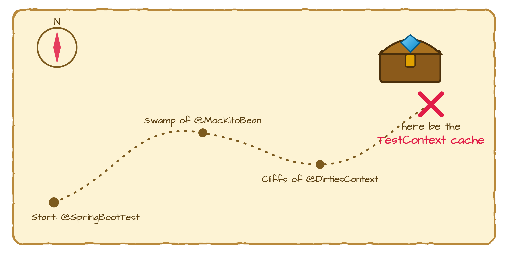
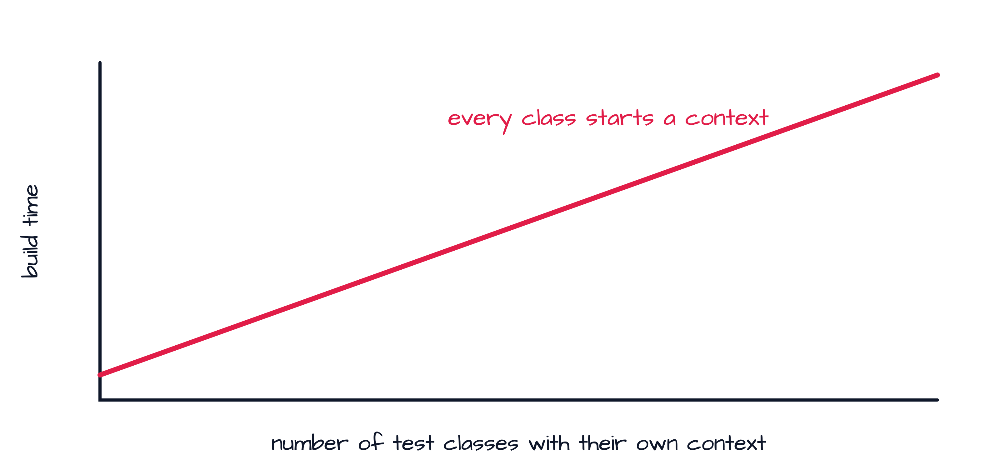
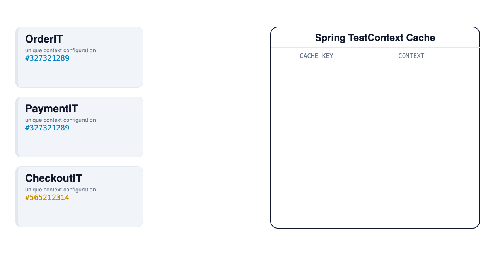
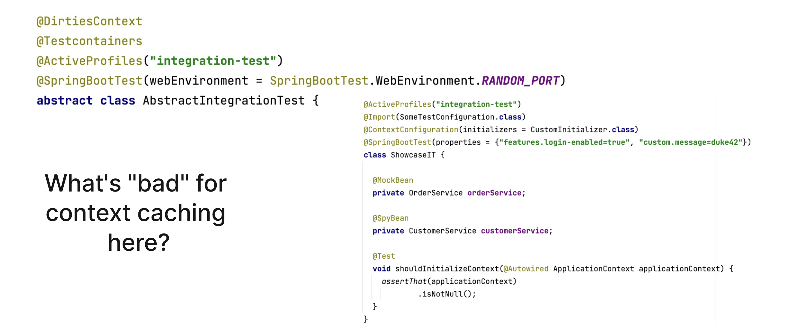
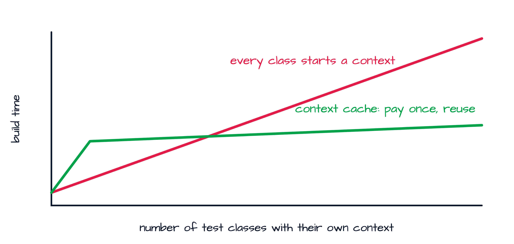
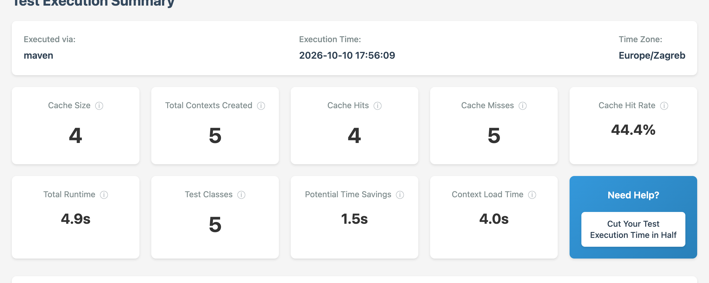
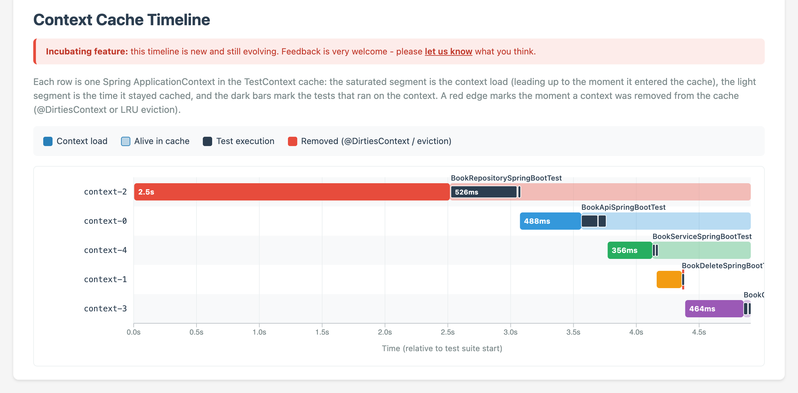
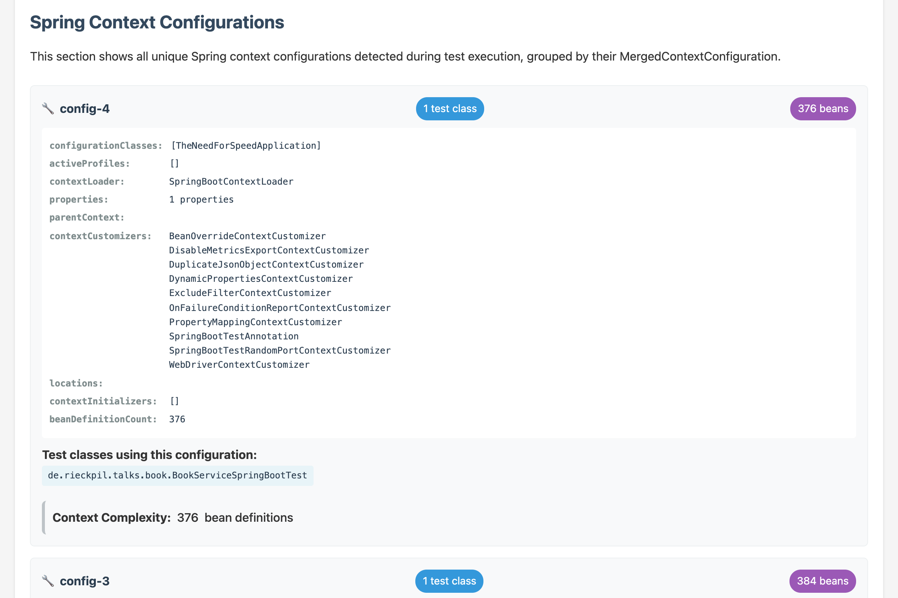
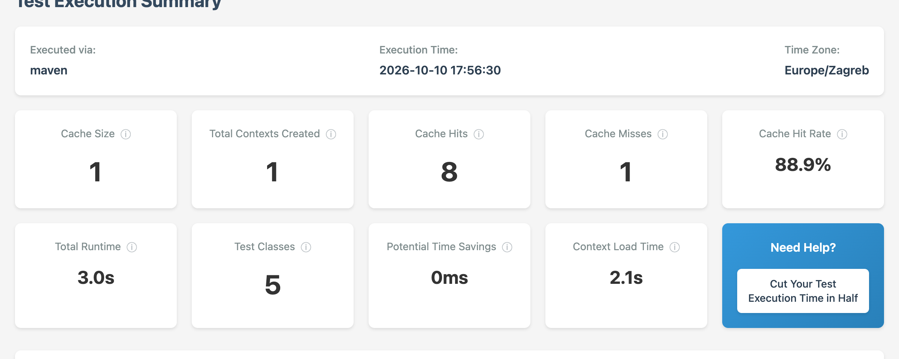

<!-- Menti: add the join URL / code here so it is at hand while presenting -->
<!-- _paginate: false -->
<!-- _header: '' -->
<!-- _footer: '' -->


---

<!-- _class: light title -->
<!-- _paginate: false -->
<!-- _header: '' -->


# The Need for **Speed**: Cut Your Spring Boot Build Times by 70%

## Spring TestContext caching: the hidden gem of Spring Test

Event TBD · Date TBD

<!--
Notes:
- Welcome. Promise: one feature, no new framework, no rewrite.
-->

---

## Participate During the Talk


Go to [menti.com](https://www.menti.com/) and enter the code **0000 0000**.

<!--
Notes:
- Replace the QR image (shared/assets/the-need-for-speed/mentimeter-qr.png) and the code.
- Menti questions: Who writes Spring Boot apps? How long does your build take? Do you know Spring's context caching?
-->

---


### About Philip

- Software Engineer from Herzogenaurach (HQ of adidas & Puma), Germany 🍻
- Blogging and content creation about testing Java and Spring Boot applications 🍃
- Founder of [PragmaTech GmbH](https://pragmatech.digital/) - **Enabling Developers to Frequently Deliver** Software with **More Confidence**

---

<!-- header: 'The Need for Speed · Intro' -->
<!-- _class: light statement -->

# Somewhere in your project, a **treasure** is hidden.

<!--
Notes:
- Hook. Do not name it yet.
-->

---

<!--
Notes:
- Walk the map: you start with @SpringBootTest, you cross the swamp of mocks and the cliffs of @DirtiesContext.
- The treasure: Spring's TestContext cache. Most teams walk right past it.
-->



---

## Quick Check: Who Is in the Room?

Answer on Mentimeter:

- Do you write **Spring Boot** applications?
- How long does your **build** take?
- Have you heard of **context caching** in Spring Test?

<!--
Notes:
- Read the results out loud. Comment on the build times.
- Most hands go up for Spring Boot, few for context caching. That is the gap.
-->

---

<!-- _class: light statement -->

# In 2026, most of our code is **not written by us**.

---

<!--
Notes:
- The joke lands, then the point: we ship code we did not type.
-->


---

<!-- _class: light statement -->

# So **automated tests** matter more than ever.

---

## What Modern Tests Need to Be

- **Fast** - feedback in seconds or minutes, not hours
- **Comprehensive** - they cover what really matters, including the real framework wiring
- **Trustworthy** - green means you can deploy

Today: **fast**.

---

<!-- _class: light reveal -->

## How Do You Get Fast Tests?

* **Option 1:** write no tests 🙈
* **Option 2:** parallelize them 🧵
* **Option 3:** use a hidden gem 💎 - **Spring's context caching**

<!--
Notes:
- Click by click. Option 1 gets the laugh, option 2 is real but needs isolated tests, option 3 is today.
-->

---

<!-- header: 'The Need for Speed · 1 Understand' -->
<!-- _class: light section -->
<!-- _paginate: false -->


## 01 - Understand

# How context caching works

---

## The Culprit: Every Test Starts a Context

Whether sliced or full, a Spring test needs an `ApplicationContext`:

```text
Starting BookApiSpringBootTest using Java 25
Bootstrapping Spring Data JPA repositories in DEFAULT mode
Initialized JPA EntityManagerFactory for persistence unit 'default'
Tomcat started on port 38213 (http)
Started BookApiSpringBootTest in 2.5 seconds
```

The Spring Boot banner means: a lot just happened.

---

## What Happens Behind the Banner

- Classpath scanning and component discovery
- Auto-configuration evaluation
- Bean creation, wiring and post-processing
- JPA, Hibernate and database initialization
- Embedded web server startup

**It takes time. It is expensive. And every test class pays it again.**

---

## Linear Growth: The Bad News



More test classes with their own context means a build time that grows linearly.

---

<!-- _class: light statement -->

# Lucky for us, Spring Test has a **fix** built in.

---

<!--
Notes:
- Part of every Spring Boot project via spring-boot-starter-test. No setup, no dependency.
-->

## Spring TestContext Context Caching

- The **TestContext framework** caches an already started `ApplicationContext`
- A test with the **same configuration** gets the cached context instantly
- Available **out of the box** - nobody has to switch it on
- Part of Spring Framework's test support, so it works for JUnit 4, 5 and every slice

---

<!--
Notes:
- Animated GIF: loops on its own. Let it run one full loop.
- In the exported PDF this shows the first frame only.
-->

## Context Caching in Action



---

## How the Cache Key Is Built

```java
// DefaultContextCache.java
private final Map<MergedContextConfiguration, ApplicationContext> contextMap =
  Collections.synchronizedMap(new LruCache(32, 0.75f));
```

This goes into the cache key (`MergedContextConfiguration`):

- activeProfiles (`@ActiveProfiles`)
- propertySourceProperties (`@TestPropertySource`, `properties = ...`)
- contextCustomizers (`@MockitoBean`, `@MockitoSpyBean`, `@DynamicPropertySource`, ...)
- configuration classes, initializers, web environment, etc.

**Every unique combination is a new context start.**

---

## What Is "Bad" for Context Caching Here?



---

<!-- _class: light split -->

## Hit or Miss?

<div class="yes">

### Cache hit: same key

- Same annotations on the test class
- Same properties and profiles
- Same mocks and spies
- Context is reused, cost close to zero

</div>

<div class="no">

### Cache miss: one tiny difference

- Extra `properties = ...` on one class
- A `@MockitoBean` only in one test
- `@DirtiesContext` closes the context
- New context start, pay full price

</div>

---

## The Gem in One Picture



You pay for a context once per unique configuration, not once per test class.

---

<!-- header: 'The Need for Speed · Demo' -->
<!-- _class: light section -->
<!-- _paginate: false -->

## Demo

# A small Spring Boot CRUD API and its test suite

_Spring Boot 4.1, Java 25, 5 test classes, 9 tests._

---

## The Demo Application

- Book CRUD API: `GET/POST/PUT/DELETE /api/books`
- Spring Web MVC, Spring Data JPA, H2
- 5 test classes, all `@SpringBootTest`, each a little different

| Test class | What is different |
|------------|-------------------|
| `BookApiSpringBootTest` | `RANDOM_PORT` and `TestRestTemplate` |
| `BookControllerSpringBootTest` | `@MockitoBean` and `MockMvc` |
| `BookServiceSpringBootTest` | `@MockitoSpyBean` |
| `BookDeleteSpringBootTest` | `@DirtiesContext` |
| `BookRepositorySpringBootTest` | one extra `property` |

---

<!-- header: 'The Need for Speed · Optimize in 3 steps' -->
<!-- _class: light agenda -->

## Three Steps to Faster Builds

1. **Understand** - measure the context starts with the Spring Test Profiler
2. **Optimize** - align the configurations so contexts get reused
3. **Ensure** - keep it fast, for your team and for your AI agents

---

<!-- _class: light section -->
<!-- _paginate: false -->

## Step 1

# Understand: measure before you guess

---

## Add the Spring Test Profiler

An [open-source Spring Test utility](https://github.com/PragmaTech-GmbH/spring-test-profiler) that visualizes context caching for your test suite:

```xml {2-4}
<dependency>
  <groupId>digital.pragmatech.testing</groupId>
  <artifactId>spring-test-profiler</artifactId>
  <version>0.3.1</version>
  <scope>test</scope>
</dependency>
```

---

## Activate It

`src/test/resources/META-INF/spring.factories`:

```properties
org.springframework.test.context.TestExecutionListener=\
digital.pragmatech.testing.SpringTestProfilerListener
org.springframework.context.ApplicationContextInitializer=\
digital.pragmatech.testing.diagnostic.ContextDiagnosticApplicationInitializer
```

Run the tests, open the report:

```bash
./mvnw verify
open target/spring-test-profiler/latest.html
```

---

<!--
Notes:
- Live demo here: run ./mvnw verify and open the report in the browser.
- Fallback: the screenshots on the next slides.
-->

## The Baseline: 5 Test Classes, 5 Contexts



Cache hit rate 44.4%, **4.0s** of the 4.9s are context startup.

---

## The Timeline: Five Contexts, One per Class



---

## Why Do the Contexts Differ?



---

<!-- _class: light section -->
<!-- _paginate: false -->

## Step 2

# Optimize: from five contexts to one

---

## Three Levers to Reuse Contexts

1. **Abstract integration test class** - one place for all context configuration
2. **Context initializer / `@DynamicPropertySource`** - shared setup, same key for everyone
3. **Fewer mocks and no `@DirtiesContext`** - use real beans and clean up your own data

Align first, then slice only where it really pays off.

---

<!-- _class: light split split-60 -->

## The Fix: One Base Class

```java {1-4}
@SpringBootTest(webEnvironment = RANDOM_PORT)
@AutoConfigureMockMvc
@AutoConfigureTestRestTemplate
abstract class AbstractIntegrationTest {
}

class BookApiSpringBootTest
    extends AbstractIntegrationTest {
  // no own annotations anymore
}
```

- One annotation set for all tests
- No `@MockitoBean` or `@MockitoSpyBean`
- No `@DirtiesContext`
- No extra `properties`

---

<!--
Notes:
- Live demo: git apply optimize-context-caching.patch (or type it), run ./mvnw verify again.
-->

## The Result: 1 Context



Cache hit rate **88.9%**, **1** context created, total runtime 4.9s down to **3.0s**.

---

<!-- _class: light metrics -->

## Demo Result

- **5 → 1** Contexts created
- **44% → 89%** Cache hit rate
- **-39%** Total runtime on a tiny suite

<!--
Notes:
- 4.9s to 3.0s on 9 tests. On a real suite with 50 contexts and heavy startup (databases, containers) the same effect gives the 70% from the title.
-->

---

<!-- _class: light section -->
<!-- _paginate: false -->

## Step 3

# Ensure: keep it fast

---

## Educate Your Team

- Explain the **cache key**: every new annotation combination costs a context start
- Put shared configuration into **one base class**, and review changes to it
- Treat `@DirtiesContext` and a new `@MockitoBean` like a performance decision
- Run the profiler report from time to time, share it in the team

---

## Educate Your AI Agents Too

Agents write most of the tests now. They need the same rules:

```text
.claude/skills/
├── unit-testing            fast tests without context bloat
├── slice-testing           right-sized Spring context slices
├── integration-testing     extend AbstractIntegrationTest, no new context
└── test-setup-reviewer     flags context cache killers
```

Point the skill to your `AbstractIntegrationTest` and name the antipatterns.

---

## Let the Pipeline Guard the Context Count

The profiler writes `target/spring-test-profiler/results.json`:

```bash {3-7}
./mvnw verify

expectedContexts=1
actualContexts=$(jq -r '.contextsCreated' \
  target/spring-test-profiler/results.json)

if [ "$actualContexts" -gt "$expectedContexts" ]; then
  echo "Too many Spring contexts: $actualContexts"
  exit 1
fi
```

A new `@DirtiesContext` or a stray `@MockitoBean` now fails the build.

---

<!-- header: 'The Need for Speed · Summary' -->
<!-- _class: light agenda -->

## Summary

1. Every context start costs time, and the build time grows with every test class
2. Context caching is the hidden gem: same configuration, same context
3. Understand with the profiler, optimize with a base class, ensure with CI and skills

---

<!-- _class: light statement reveal -->
<!-- _paginate: false -->

<!--
Notes:
- One line per click.
-->

# Fast feedback is a **feature**.
* The treasure was in your project all along.
* **Go and find it.**
* Good luck - and reach out if you need a hand.

---

<!-- _class: light closing -->
<!-- _paginate: false -->
<!-- _header: '' -->
<!-- _footer: '' -->


# Thank you!

Questions?

The **Spring Boot Testing Newsletter**: best practices, recipes and quick wins in your inbox - **rieckpil.de/newsletter**


- [LinkedIn: linkedin.com/in/rieckpil](https://www.linkedin.com/in/rieckpil)
- [Mail: philip@pragmatech.digital](mailto:philip@pragmatech.digital)
