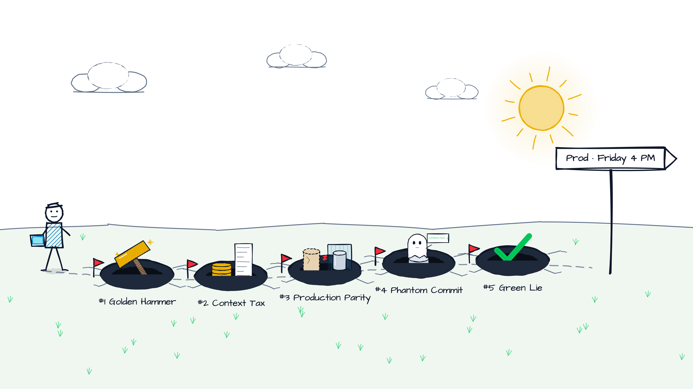
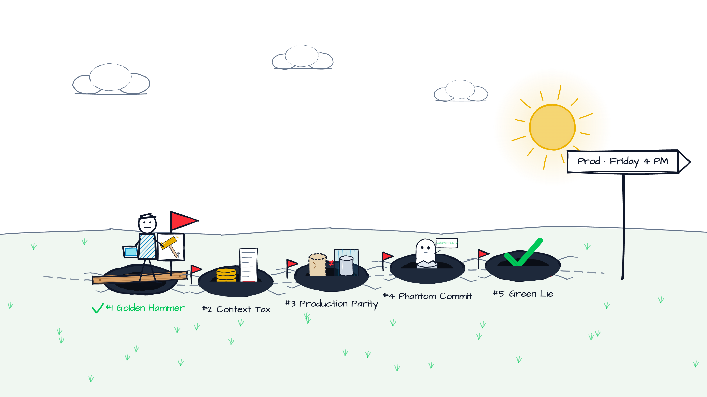
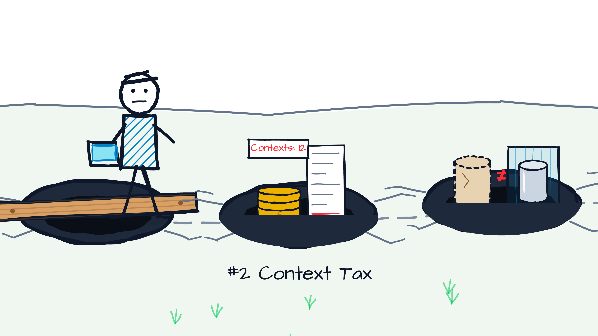
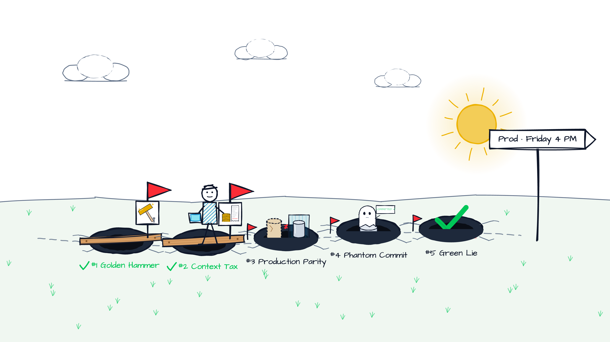
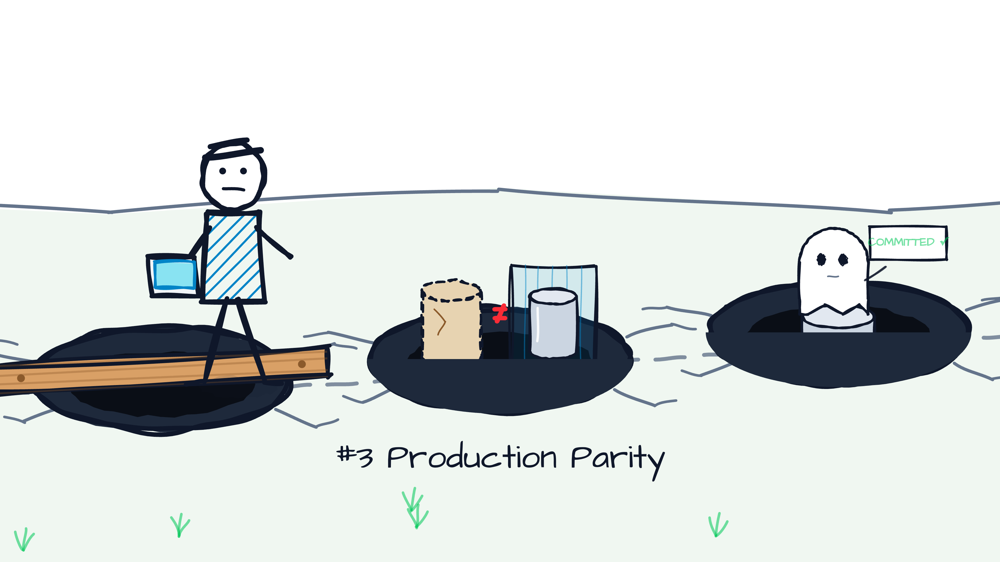
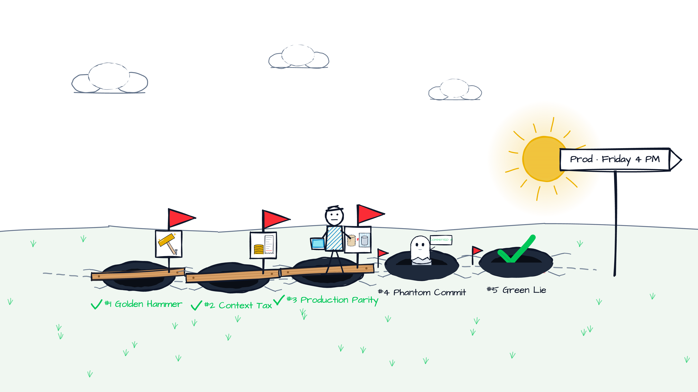
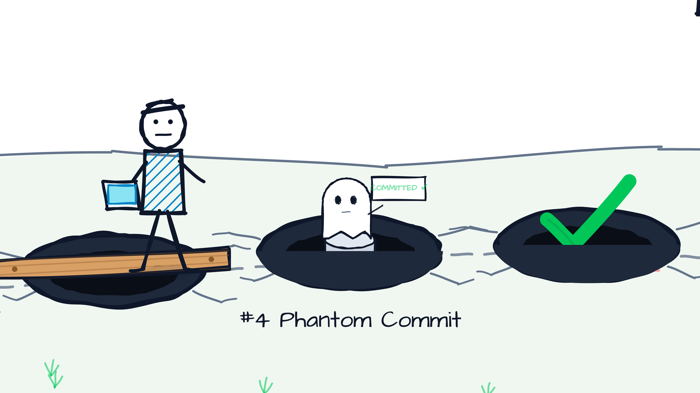
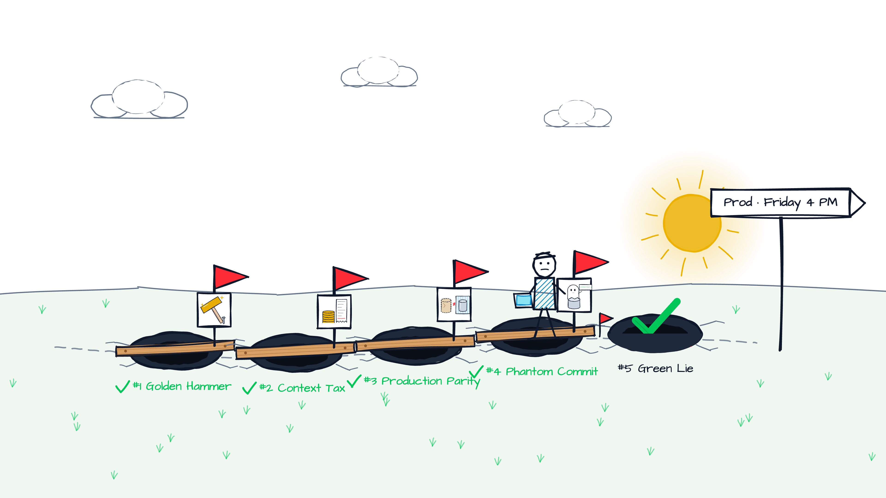
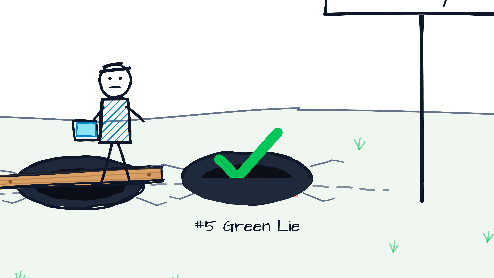
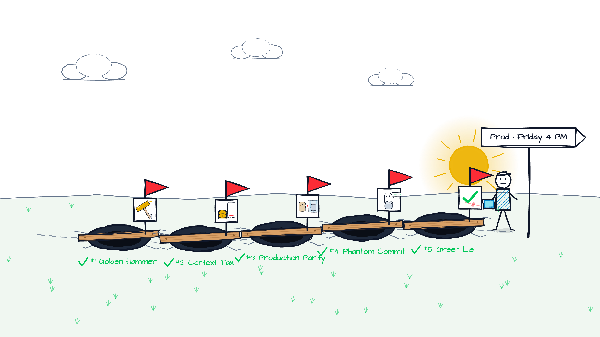

<!--
Light deck (class: light). Layout classes per slide via the _class directive, e.g. "light section".
Trap map visuals: assets/trap-map-N.png (N = traps disarmed), assets/trap-zoom-N.png, assets/cover-green-lie.png
Re-export via: node visuals/export-visuals.mjs
House style: no em dashes, use "-". Bylines use the middle dot.
-->

<!-- _class: light title -->
<!-- _paginate: false -->
<!-- _header: '' -->

<style scoped>
  h1 { font-size: 2.2em; }
</style>


# Top 5 Spring Boot Testing Mistakes **Developers Trap Into**

## Your tests are green. Can you trust them?

Talk @ <Venue> <Date> · Philip Riecks · [PragmaTech GmbH](https://pragmatech.digital/) · [@rieckpil](https://x.com/rieckpil)

---

<!--
Notes:
- Short intro, 30 seconds max
-->


### About Philip

- Self-employed developer from Herzogenaurach (HQ of adidas & Puma), Germany (Bavaria) 🍻
- Blogging & content creation with a focus on testing Java and specifically Spring Boot applications 🍃
- Founder of PragmaTech GmbH - Enabling Developers to Frequently Deliver Software with More Confidence 🚤

---

## Participate During the Talk

Go to [menti.com](https://www.menti.com/) and use the code **XXXX XXXX** to **anonymously** submit answers for the quizzes and add your questions during the talk.

Please answer the **first three questions**:

- Who wrote your tests this week?
- How would you rate your Spring Boot testing knowledge?
- How confident are you deploying on a Friday afternoon (0 to 10)?

---

<!-- _class: light statement -->
<!-- _paginate: false -->

# In 2026, most of your tests are **not written by you**.

---

<!--
Notes:
- You have seen pitfall talks before. Here is what changed.
- Agents write the code and the tests. Fast. Confidently. Sometimes wrong.
- Mistake zero: testing stays an afterthought while the AI writes the code.
-->

## Mistake Zero: Testing as an Afterthought

- Coding agents write **more code per day** than any team ever could
- The tests are the **guardrail** that keeps the agent on the road
- If you do not own the guardrail, you do not own the outcome
- Every trap in this talk gets **worse** when a machine writes tests at scale

> Mistake zero: treating testing as an afterthought while the AI writes the code.

---

<!-- _class: light statement -->
<!-- _paginate: false -->

# My goal for every client: a safe deploy on a **Friday afternoon**.

---

<!--
Notes:
- Reference the Menti answers: where is the room on the 0 to 10 scale?
- Goal for the next 45 minutes: make that number bigger.
-->

## Where Are You Today?

On a scale from **0** ("I deploy on Monday morning with three colleagues watching") to **10** ("I merge the Dependabot PR at 4 PM and go home"):

**Make the number bigger.** A trustworthy test suite lets you:

- **Fix fast** · **Ship small** · **Experiment freely**
- **Stay current** · **Sleep well** · **Trust your agents**

---

<!-- _class: light agenda -->

## Five Traps Between You and Friday 4 PM

1. The Golden Hammer
2. The Context Tax
3. The Production Parity Trap
4. The Phantom Commit
5. The Green Lie

---

<!-- _paginate: false -->
<!-- _header: '' -->
<!-- _footer: '' -->



---

<!-- _class: light section -->
<!-- _paginate: false -->


## Testing Trap #1

# The Golden Hammer

`@SpringBootTest` for everything

---

<!--
Notes:
- Looks fine. Passes. Green. Everybody copies it.
- Ask the room: what does this test actually need?
-->

## Looks Fine, Right?

```java {1,2,7}
@SpringBootTest
@AutoConfigureMockMvc
class CustomerControllerTest {

  @Autowired private MockMvc mockMvc;

  @MockitoBean private CustomerService customerService;

  @Test
  void shouldReturn404WhenCustomerDoesNotExist() throws Exception {
    when(customerService.findById(42L)).thenThrow(new CustomerNotFoundException(42L));

    mockMvc.perform(get("/api/customers/42"))
      .andExpect(status().isNotFound());
  }
}
```

---

## Why It Hurts

- Boots the **whole** application (JPA, security, messaging, schedulers) to test one HTTP mapping
- Slowest possible feedback for the smallest possible question
- Every new test class copies the pattern - the golden hammer becomes the **default**
- Hides design smells: if you cannot test a class without the full context, the class has too many friends

> One annotation to rule them all. And in the darkness, bind them.

---

## Disarm It: Pick the Smallest Slice That Proves the Behavior

```java {1,2}
@WebMvcTest(CustomerController.class)
class CustomerControllerTest {

  @Autowired private MockMvc mockMvc;

  @MockitoBean private CustomerService customerService;

  @Test
  void shouldReturn404WhenCustomerDoesNotExist() throws Exception {
    when(customerService.findById(42L)).thenThrow(new CustomerNotFoundException(42L));

    mockMvc.perform(get("/api/customers/42"))
      .andExpect(status().isNotFound());
  }
}
```

---

## The Toolbox Has More Than One Tool

| Question | Tool |
|---|---|
| Does my logic work? | Plain JUnit 5 + Mockito, no Spring |
| Does my HTTP layer map, validate, serialize? | `@WebMvcTest` |
| Does my query return what I think? | `@DataJpaTest` |
| Does my client talk to the remote API? | `@RestClientTest` + WireMock |
| Does the whole thing start and work end to end? | `@SpringBootTest` (a few of them) |

Rule of thumb: **`@SpringBootTest` is the last tool you reach for, not the first.**

---

<!-- _paginate: false -->
<!-- _header: '' -->
<!-- _footer: '' -->



---

<!-- _class: light section -->
<!-- _paginate: false -->



## Testing Trap #2

# The Context Tax

...and the Context Leak

---

<!--
Notes:
- Three test classes, three different sets of mocks, three contexts.
- The tax is invisible, recurring, and everybody hates it.
-->

## Looks Fine, Right?

```java {2,8,14}
@SpringBootTest
@MockitoBean(types = MailClient.class)
class OrderServiceTest { /* ... */ }
```

```java {2}
@SpringBootTest
@MockitoBean(types = { MailClient.class, PaymentGateway.class })
class CheckoutServiceTest { /* ... */ }
```

```java {2}
@SpringBootTest
@DirtiesContext
class ReportingServiceTest { /* ... */ }
```

---

## Why It Hurts

- Spring caches the `ApplicationContext` by its **configuration key**: every different mock set, property, profile or `@DirtiesContext` means a **new context boot**
- 5 to 15 seconds per boot, times the number of unique keys, on every build
- **"Contexts: 12"** in a mid-sized project is common; the build time grows with every new test class
- The leak: static state, shared mocks and mutable beans **bleed** from one test class into the next, cached context or not

---

## Disarm It: Pay the Tax Once

```java {1,3,4,6}
@SpringBootTest
@Import(IntegrationTestMocks.class)
public abstract class AbstractIntegrationTest { }

@TestConfiguration
class IntegrationTestMocks {
  @Bean @Primary MailClient mailClient() { return Mockito.mock(MailClient.class); }
  @Bean @Primary PaymentGateway paymentGateway() { return Mockito.mock(PaymentGateway.class); }
}
```

- One shared configuration, one context, every integration test reuses it
- Count your contexts: [Spring Test Profiler](https://github.com/PragmaTech-GmbH/spring-test-profiler)
- Reset shared mocks in `@BeforeEach`, treat `@DirtiesContext` as a code smell, never as a fix

---

<!-- _paginate: false -->
<!-- _header: '' -->
<!-- _footer: '' -->



---

<!-- _class: light section -->
<!-- _paginate: false -->



## Testing Trap #3

# The Production Parity Trap

Green on H2, red in prod

---

<!--
Notes:
- The in-memory illusion: H2 in PostgreSQL mode is not PostgreSQL.
- Second flavor: webEnvironment MOCK looks like HTTP but never touches the servlet container.
-->

## Looks Fine, Right?

```properties {1,2}
spring.datasource.url=jdbc:h2:mem:test;MODE=PostgreSQL
spring.jpa.hibernate.ddl-auto=create-drop
```

```java {1,6}
@DataJpaTest
class CustomerRepositoryTest {

  @Test
  void shouldFindCustomersByEmailDomain() {
    var result = customerRepository.findByEmailDomain("pragmatech.digital");

    assertThat(result).hasSize(2);
  }
}
```

---

## Why It Hurts

- Different dialect, different constraints, different `NULL` ordering, different JSON support: **H2 is not your database**
- `ddl-auto=create-drop` hides that your Flyway migrations are broken
- `webEnvironment = MOCK` skips the servlet container: filters, error handling and security behave **differently** than over real HTTP
- The test is green, the first request in production is red

---

## Disarm It: Test Against the Real Thing

```java {1,3,4,5,6}
@DataJpaTest
@AutoConfigureTestDatabase(replace = Replace.NONE)
@Testcontainers
class CustomerRepositoryTest {
  @Container @ServiceConnection
  static PostgreSQLContainer<?> db = new PostgreSQLContainer<>("postgres:17-alpine");
}
```

- Same database engine and version as production, wired with one annotation
- Run your **real migrations** in tests (`ddl-auto=validate`)
- Reevaluate `@SpringBootTest` modes: `RANDOM_PORT` + `RestTestClient` for the real HTTP stack, `MOCK` + `MockMvc` for fast controller checks

---

<!-- _paginate: false -->
<!-- _header: '' -->
<!-- _footer: '' -->



---

<!-- _class: light section -->
<!-- _paginate: false -->



## Testing Trap #4

# The Phantom Commit

Nothing ever happened

---

<!--
Notes:
- The commit you saw was not there. Everything rolls back at the end of the test.
-->

## Looks Fine, Right?

```java {2,9}
@SpringBootTest
@Transactional
class CustomerServiceTest {

  @Test
  void shouldRegisterCustomerAndPublishEvent() {
    customerService.register(new RegistrationRequest("duke@pragmatech.digital"));

    assertThat(customerRepository.count()).isEqualTo(1);
    verify(eventPublisher).publishEvent(any(CustomerRegisteredEvent.class));
  }
}
```

---

## Why It Hurts

- The test transaction **rolls back** at the end: no commit, no constraint check on commit, no visible change
- `@TransactionalEventListener(phase = AFTER_COMMIT)` **never fires** in this test
- Lazy loading works inside the test transaction and throws `LazyInitializationException` in production
- One persistence context for the whole test: Hibernate hands you back the same object you just saved, and the assertion means nothing

---

## Disarm It: Test the Commit Boundary on Purpose

```java {1,4,5,12}
@SpringBootTest
class CustomerServiceTest {

  @AfterEach
  void cleanUp() { customerRepository.deleteAll(); }

  @Test
  void shouldRegisterCustomerAndPublishEvent() {
    customerService.register(new RegistrationRequest("duke@pragmatech.digital"));

    assertThat(customerRepository.count()).isEqualTo(1);
    verify(eventPublisher, timeout(1000)).publishEvent(any(CustomerRegisteredEvent.class));
  }
}
```

- No `@Transactional` on tests; clean up explicitly (`@Sql`, `deleteAll()`, per-test data)
- When you need it: `TestTransaction.flagForCommit()` + `TestTransaction.end()`

---

<!-- _paginate: false -->
<!-- _header: '' -->
<!-- _footer: '' -->



---

<!-- _class: light section -->
<!-- _paginate: false -->



## Testing Trap #5

# The Green Lie

Tests that pass but cannot fail

---

<!--
Notes:
- AI-era peak: the agent generated 40 tests, coverage is 97%, nobody read them.
-->

## Looks Fine, Right?

```java {6,7,15}
@Test
void shouldCalculateDiscount() {
  var order = OrderMother.withTotal(new BigDecimal("120.00"));

  var result = cut.calculateDiscount(order);

  assertThat(result).isNotNull();
}

@Test
void shouldNotifyCustomer() {
  when(mailClient.send(any())).thenReturn(true);

  cut.notify(customer);

  assertThat(mailClient.send(any())).isTrue();
}
```

---

## Why It Hurts

- **100% coverage** and still broken: coverage measures which lines *ran*, not which behavior was *verified*
- A test that asserts the mock proves the mock works
- Tests that cannot fail give you the **feeling** of safety without the safety
- Agents produce these at scale: plausible names, green checks, zero judgment

> Watermelon tests: green on the outside, red on the inside.

---

## Disarm It: Let Mutations Challenge Your Tests

```xml {3,6}
<plugin>
  <groupId>org.pitest</groupId>
  <artifactId>pitest-maven</artifactId>
  <dependencies>
    <dependency>
      <artifactId>pitest-junit5-plugin</artifactId>
    </dependency>
  </dependencies>
</plugin>
```

- PIT mutates your production code (flips `>` to `>=`, removes calls) and expects a test to **fail**
- A surviving mutant is a green lie, caught - ask **"Am I confident to deploy?"** instead of "Is coverage green?"

---

<!-- _paginate: false -->
<!-- _header: '' -->
<!-- _footer: '' -->



---

## Five Traps, Five Bridges

| Trap | Bridge |
|---|---|
| #1 **Golden Hammer** | The smallest slice that proves the behavior |
| #2 **Context Tax** | One shared test configuration, count your contexts |
| #3 **Production Parity** | Testcontainers + `@ServiceConnection`, real migrations, real HTTP |
| #4 **Phantom Commit** | No `@Transactional` on tests, test the commit boundary |
| #5 **Green Lie** | Mutation testing with PIT, review tests like production code |

---

<!-- _class: light statement -->
<!-- _paginate: false -->

# The AI writes the tests. **You own the judgment.**

---

## Guardrails for the Agent

- **Analyze the output**: read generated tests like a pull request from a new hire - fast, confident, unproven
- **Put the bridges in the repo**: test slices, shared test configuration, Testcontainers, no `@Transactional` on tests, PIT in the pipeline
- **Make the rules executable**: ArchUnit rules, a `CLAUDE.md` / `AGENTS.md` with your testing conventions, mutation score thresholds in CI
- **Keep the loop tight**: fast, trustworthy tests are what let the agent iterate without you watching every step

---

<!--
Notes:
- Callback: "Want my bridges?"
-->

## Want My Bridges?

**Agentic Testing Course** - a hands-on course on testing Spring Boot applications in the age of coding agents: guardrails, test strategy, and the judgment to review what the agent produced.

<!-- TODO: add course link + QR code -->

---

<!-- _class: light closing -->
<!-- _paginate: false -->
<!-- _header: '' -->


# Joyful Testing!

Get your Spring Boot Testing eBook (120+ pages):


Reach out any time via [LinkedIn](https://www.linkedin.com/in/rieckpil) (Philip Riecks) or [Mail](mailto:philip@pragmatech.digital) (philip@pragmatech.digital)
