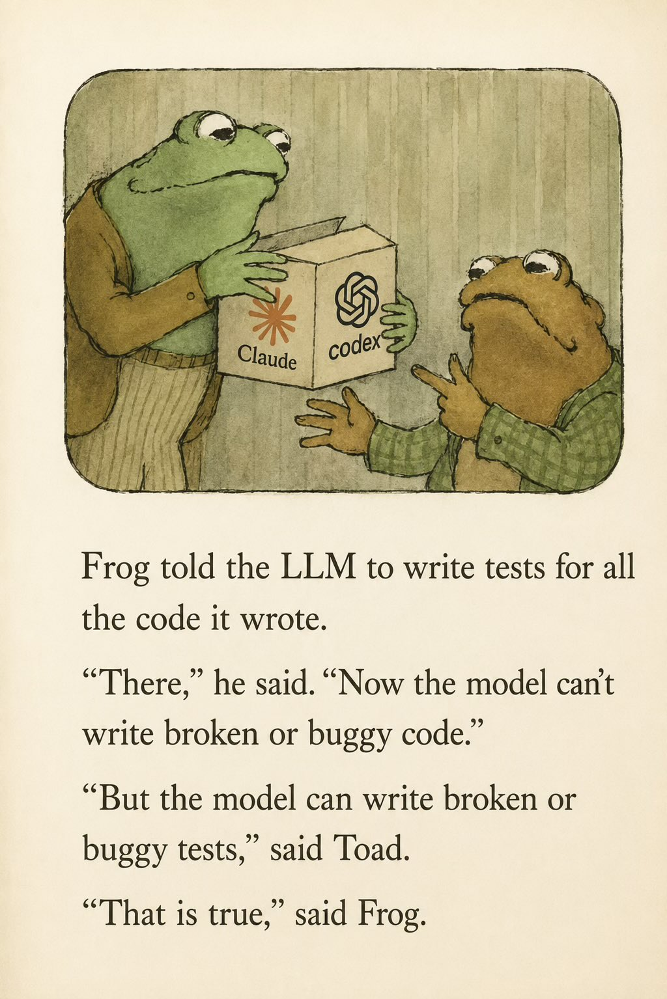
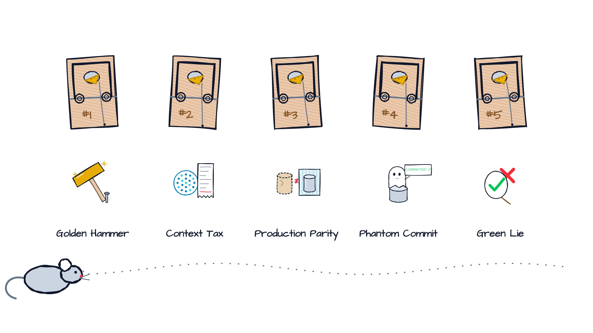
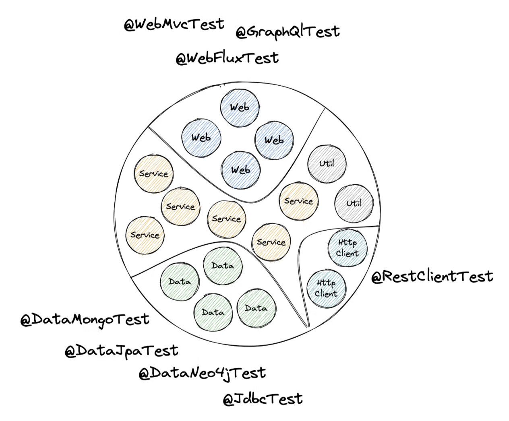
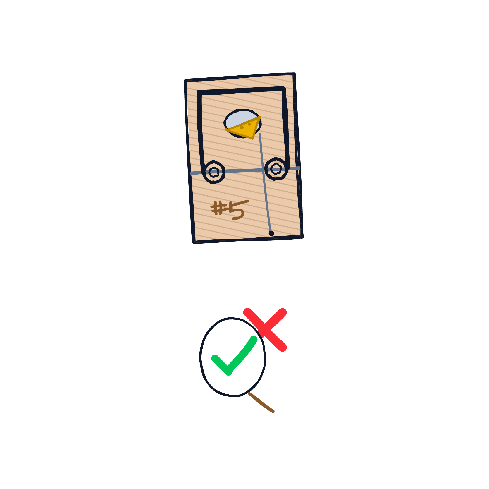
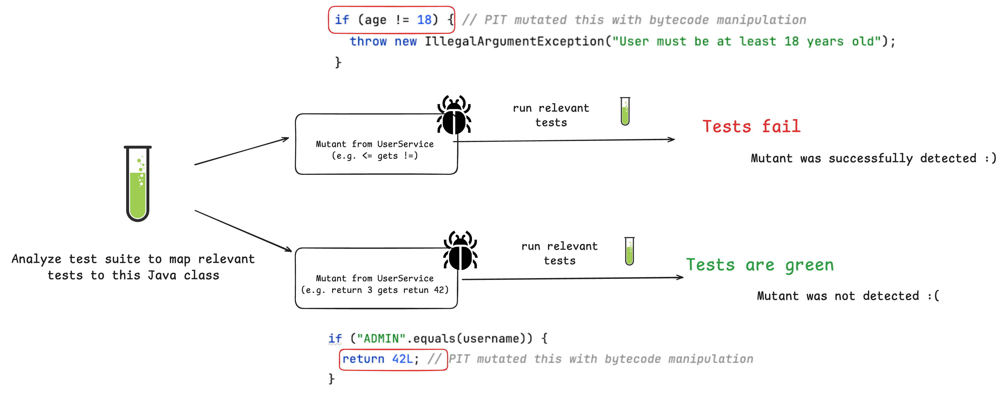
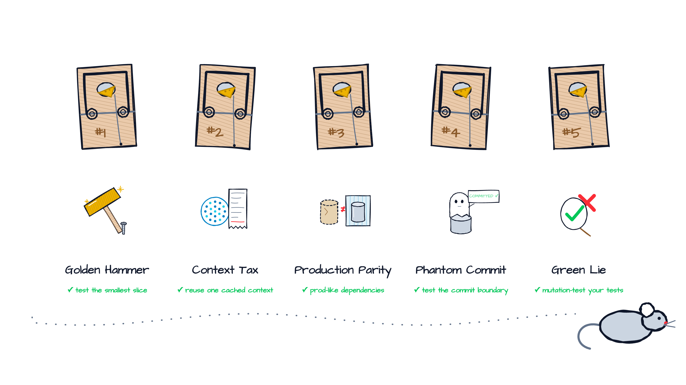
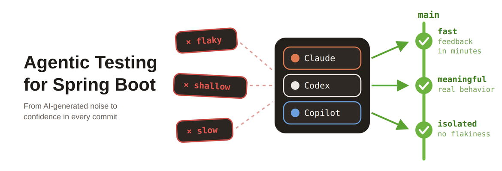

<!--
Light deck (class: light). Layout classes per slide via the _class directive, e.g. "light section".
Trap map visuals: assets/trap-map-N.png (N = traps disarmed), assets/trap-card-N.png (intro cards), assets/agenda-mouse-traps.png, assets/cover-mouse-traps.png
Re-export via: node visuals/export-visuals.mjs
House style: no em dashes, use "-". Bylines use the middle dot.
-->

<!-- _paginate: false -->
<!-- _header: '' -->
<!-- _footer: '' -->

<!--
Notes:
- Opener: Bozen, the town of this talk. Warm welcome before the title slide.
-->


---

<!-- _class: light title -->
<!-- _paginate: false -->
<!-- _header: '' -->


# Top 5 Spring Boot Testing Mistakes **Developers Trap Into**

## Your tests are green. But do you feel confident deploying?

Tech Talks South Tyrol #14 · 8th of September 2026

---

<!-- footer: '' -->


### About Philip

- Software Engineer from Erlangen (Bolzano's partner town since 2018), Germany (Bavaria) 🍻
- Blogging & content creation with a focus on testing Java and specifically Spring Boot applications 🍃
- Founder of PragmaTech GmbH - Enabling Developers to Frequently Deliver Software with More Confidence
- Worked together with Martin & Alex from AboutBits last year

---


## Participate During the Talk

Go to [menti.com](https://www.menti.com/) and use the code **XXXX XXXX** to **anonymously** submit answers for the quizzes and add your questions during the talk.

Please answer the **first three questions**:

- Who wrote your tests this week?
- How would you rate your Spring Boot testing knowledge?
- How confident are you deploying on a Friday afternoon (0 to 10)?

---

<!-- _paginate: false -->


# Why Test Software?

---

<!-- _class: light statement -->
<!-- _paginate: true -->

# In 2026, most of our code is **not written by us**.

---



---

<!-- _paginate: false -->


### My Overall Northstar for Engineering Excellence

Imagine seeing this pull request on a Friday afternoon:


How confident are you to merge this major Spring Boot upgrade and deploy it to production once the pipeline turns green?

---


# Good tests don't just catch bugs - they give you **fast feedback** and **confident deployments**.


---

<!-- _paginate: false -->
<!-- _header: '' -->

<!--
Notes:
- Same five traps, seen from the mouse's point of view.
- Every trap works the same way: the cheese looks free, the snap comes later.
- We are the mouse. The cheese is always a shortcut that feels great today.
-->



---


<!-- _class: light section -->
<!-- _paginate: true -->


## Testing Trap #1

# The Golden Hammer

_If all you have is a hammer, everything looks like a nail._

---

<!--
Notes:
- Looks fine. Passes. Green. Everybody copies it.
- Ask the room: what does this test actually need?
-->

## The `@SpringBootTest` Obsession


---

## You Don't Always Need the Entire Context



---

## Decision Paralysis: When to Include a Context

A simplified decision table:

| Question                                        | Tool |
|-------------------------------------------------|---|
| Does my business logic work?                    | Plain JUnit 5 + Mockito, no Spring |
| Does my HTTP layer map, validate, serialize?    | `@WebMvcTest` |
| Does my query return what I think?              | `@DataJpaTest` |
| Does my client talk to the remote API?          | `@RestClientTest` + WireMock |
| Does the whole thing start and work end to end? | `@SpringBootTest` |

---


<!-- _class: light section -->
<!-- _paginate: true -->


## Testing Trap #2

# The Context Tax

_Every `ApplicationContext` you use for testing, comes with a price._

---

<!--
Notes:
- Three test classes, three different sets of mocks, three contexts.
- The tax is invisible, recurring, and everybody hates it.
-->

## The No. #1 Spring Test Hidden Gem

- Starting the `ApplicationContext` comes with a cost: test execution time
- Every context launch (sliced or full) takes multiple seconds
- Spring Test fixes this with: **TestContext Context Caching**

Results from one of our clients:


---

## Context Caching in a Nutshell

```java
// DefaultContextCache.java
private final Map<MergedContextConfiguration, ApplicationContext> contextMap =
  Collections.synchronizedMap(new LinkedHashMap<>(32, 0.75f, true));
```

- Spring test builds a unique `ApplicationContext` configuration, by determining which profiles, properties, classes, etc. are included in the test context (stored inside `MergedContextConfiguration`)
- If a subsequent test requires the exact same configuration, Spring simply hands over a "hot" context
- The goal is to reduce the context configuration variety to a bare minimum to have as many cache hits as possible -> fast test execution

---

## How to Identify Context Restarts - Simplified


---

## How to Identify Context Restarts - Visualized


An [open-source Spring Test utility](https://github.com/PragmaTech-GmbH/spring-test-profiler) that provides visualization and insights for Spring Test execution, with a focus on Spring context caching statistics.

**Overall goal**: Identify optimization opportunities in your Spring Test suite to speed up your builds and ship to production faster and with more confidence.

---

<!-- _class: light section -->
<!-- _paginate: false -->


## Testing Trap #3

# The Production Parity Trap

_It works on my machine._

---

<!--
Notes:
- The in-memory illusion: H2 in PostgreSQL mode is not PostgreSQL.
- Second flavor: webEnvironment MOCK looks like HTTP but never touches the servlet container.
-->

## Where Tests Drift Away From Production

Every test environment takes shortcuts. Each one is a small drift - and drifts compound:

- **Database**: in-memory H2 instead of the production engine and version
- **Servlet container**: `@SpringBootTest` defaults to a **mocked** servlet environment - `webEnvironment = RANDOM_PORT` starts the real one (Tomcat, etc.)
- **External services**: mocked mail, object storage, message queues, IDPs
- **Schema**: Hibernate `ddl-auto` in tests, Flyway/Liquibase migrations in production
- **Environment**: clock, timezone, locale, JVM flags, OS of the CI runner

---

## The Classic Drift: The In-Memory Database

```java {1,8}
@DataJpaTest
class OrderRepositoryTest {

  @Autowired private OrderRepository orderRepository;

  @Test
  void shouldFindOverdueOrders() {
    // green in two seconds - on an H2 that pretends to be PostgreSQL
  }
}
```

`@DataJpaTest` silently swaps in an embedded database (`replace = Replace.ANY` is the default). H2 in PostgreSQL mode is a **costume, not the engine**.

---

## Disarm It: Close the Gap Step by Step

- **Understand your shortcuts**: know where your test environment drifts from production - and decide which drifts you can live with
- **Use Testcontainers**: run the real database, pinned to the production version (`postgres:17.2`) - `@ServiceConnection` wires it up; LocalStack, Kafka, Keycloak, and friends run as containers too
- **Test the app inside Docker**: start the container image you actually ship and run tests against it (JVM flags, base image, OS-level surprises)
- **Canary-test production continuously**: catch what no test environment can - expired SSL certs, rate limits, lost connectivity to cloud resources


---

<!-- _class: light section -->
<!-- _paginate: false -->


## Testing Trap #4

# The Phantom Commit

_Schrödingers database commit or `LazyInitializationException`._

---

<!--
Notes:
- The commit you saw was not there. Everything rolls back at the end of the test.
-->

## Looks Fine, Right?

```java {2,9}
@SpringBootTest
@Transactional
class CustomerServiceTest {

  @Test
  void shouldRegisterCustomerAndPublishEvent() {
    customerService.register(new RegistrationRequest("duke@pragmatech.digital"));

    assertThat(customerRepository.count()).isEqualTo(1);
    verify(eventPublisher).publishEvent(any(CustomerRegisteredEvent.class));
  }
}
```

---

## Why It Hurts

- The test transaction **rolls back** at the end: no commit, no constraint check on commit, no visible change
- `@TransactionalEventListener(phase = AFTER_COMMIT)` **never fires** in this test
- Lazy loading works inside the test transaction and throws `LazyInitializationException` in production
- One persistence context for the whole test: Hibernate hands you back the same object you just saved, and the assertion means nothing

---

## Disarm It: Test the Commit Boundary on Purpose

```java {1,4,5,12}
@SpringBootTest
class CustomerServiceTest {

  @AfterEach
  void cleanUp() { customerRepository.deleteAll(); }

  @Test
  void shouldRegisterCustomerAndPublishEvent() {
    customerService.register(new RegistrationRequest("duke@pragmatech.digital"));

    assertThat(customerRepository.count()).isEqualTo(1);
    verify(eventPublisher, timeout(1000)).publishEvent(any(CustomerRegisteredEvent.class));
  }
}
```

- No `@Transactional` on tests; clean up explicitly (`@Sql`, `deleteAll()`, per-test data)
- When you need it: `TestTransaction.flagForCommit()` + `TestTransaction.end()`


---

<!-- _class: light section -->
<!-- _paginate: false -->



## Testing Trap #5

# The Green Lie

_Never trust a test you haven't seen failing._

---

<!--
Notes:
- AI-era peak: the agent generated 40 tests, coverage is 97%, nobody read them.
-->

## Watermelon Tests


... green on the outside, red on the inside.

- **100% coverage** and still broken: coverage measures which lines *ran*, not which behavior was *verified*
- A test that asserts the mock proves the mock works
- Auto-generated tests can give you the **feeling** of safety
- Agents produce these at scale: plausible names, green checks, zero judgment


---

## Let's Challenge Code Coverage

Imagine a set of unit tests for this isolated business logic:

```java
public Long registerUser(int age, String username) {

  if (age <= 18) {
    throw new IllegalArgumentException("User must be at least 18 years old");
  }

  if ("ADMIN".equalsIgnoreCase(username)) {
    throw new IllegalArgumentException("Username 'ADMIN' is not allowed");
  }

  // ...

}
```

---

## Idea: Introduce Regressions to Verify Test Quality


... with the help of PIT:





---



---

<!-- _class: light statement -->
<!-- _paginate: false -->

# AI writes tests in seconds. **Trusting them still takes human judgment.**

---

## What I Do to Build Confidence in the Agentic Coding Era

- **Review generated tests** like a pull request from a new hire - fast, confident, unproven
- **Put the bridges in the repo**: test slices, shared test configuration, Testcontainers, no `@Transactional` on tests
- **Make the rules executable**: ArchUnit rules, my testing conventions in `CLAUDE.md` / `AGENTS.md`, mutation score thresholds (PIT) in CI
- **Keep the feedback loop tight**: fast, trustworthy tests let the agent iterate without me watching every step

---

<!--
Notes:
- Callback: "Want my bridges?"
-->

## My Agentic Testing Setup for Spring Boot

**Agentic Testing Course** - a hands-on course on testing Spring Boot applications in the age of coding agents: guardrails, test strategy, and the judgment to review what the agent produced.



Including 8+ ready to use skills for fast & comprehensive tests.

---

<!-- _class: light closing -->
<!-- _paginate: false -->
<!-- _header: '' -->


# Joyful Testing!

Join the waitlist for _Agentic Testing for Spring Boot_:


Reach out any time via [LinkedIn](https://www.linkedin.com/in/rieckpil) (Philip Riecks) or [Mail](mailto:philip@pragmatech.digital) (philip@pragmatech.digital)
